## Transformation

#### 一、parametric (global) transformation

* 变化T对图像上每个点都相同 $p'=T(p)$
* 只需要有限个参数，通常用一个矩阵表示

$$
\begin{array}{lrl}
translate&\begin{bmatrix}1&0&t_x\\0&1&t_y\\0&0&1\end{bmatrix}\cdot \begin{bmatrix}x\\y\\1\end{bmatrix}
\\
scale&\begin{bmatrix}s_x&0\\0&s_y \end{bmatrix}\cdot \begin{bmatrix}x\\y\end{bmatrix}
\\
mirror(y轴)&\begin{bmatrix}-1&0\\0&1\end{bmatrix}\cdot\begin{bmatrix}x\\y\end{bmatrix}
\\
rotate&\begin{bmatrix}cos(\theta)&-sin(\theta)\\sin(\theta)&cos(\theta) \end{bmatrix}\cdot \begin{bmatrix}x\\y\end{bmatrix}
\\
shear&\begin{bmatrix}1&sh_x\\sh_y&1\end{bmatrix}\cdot\begin{bmatrix}x\\y\end{bmatrix}
\\
\hline 
affine&\begin{bmatrix}a&b&c\\d&e&f\\0&0&1\end{bmatrix}\cdot\begin{bmatrix}x\\y\\w\end{bmatrix}&{综合平移、旋转、缩放和切变，\\不保留原点}&\begin{bmatrix}x\\y\\w\end{bmatrix}表示\begin{bmatrix}\frac xw\\\frac yw\end{bmatrix}的点
\\
\hline 
perspective&\begin{bmatrix}a&b&c\\d&e&f\\g&h&i\end{bmatrix}\cdot\begin{bmatrix}x\\y\\w\end{bmatrix}&不保留原点、平行、比例
\end{array}
$$

#### 二、non-parametric (local)

定义一个向量场Vector-Feld，每个点$(x,y)$==平移==距离由该点值决定

$e.g. F(x,y)=[sin(2\pi\cdot(y/y_n)),0]$


#### 三、Image warping

**1. forward warping**


一个像素点正变换后，如果恰好不在像素网格上，就裂开分到周围4个点

==新图形会有空心点(holes)==

**2. inverse warping**

已经变换后图形大小，从新坐标逆变换到原坐标找像素值，若恰好不在网格上就从附近点插值


$$
\begin{array}{}S=SW\cdot(1-s)+SE\cdot s\\N=NW\cdot(1-s)+NE\cdot s\\V=S\cdot(1-t)+N\cdot t\end{array}
$$
==新图形没有空心点==， 但逆变换有时不可行

## Filtering

消除噪音、抑制瑕疵、图像修复；特征提取、边缘检测、强调结构；为后续图像分离作铺垫

**滤波**：用一个滑动窗口（sliding window, kernel）在原图像上滑动，以周围像素值决定某像素点输出

**噪音**：$\hat I(x,y)=I(x,y)+N(x,y)$ 噪音N为一个概率分布函数，例如$g(n)=e^{-\frac{n^2}{2\sigma^2}}$

#### 一、线性滤波

$$
\begin{split}
&A'(x,y)=A(x,y)*F
\\
=&\sum_{i=-I}^I\sum_{j=-J}^JA(x+i)(y+j)\times F(i,j)
\\
&其中，\sum_i\sum_jF(i,j)=1
\end{split}
$$

* **mean 均值滤波**

$$
\frac19\times
\begin{bmatrix}
1&1&1
\\1&1&1
\\1&1&1
\end{bmatrix}
$$


* **Gaussian **

$$
\large{{\sum_{q\in\Omega}[G_{\sigma}(||p-q||)\times I_q]}\over{\sum_{q\in\Omega}G_{\sigma}(||p-q||)}}
$$

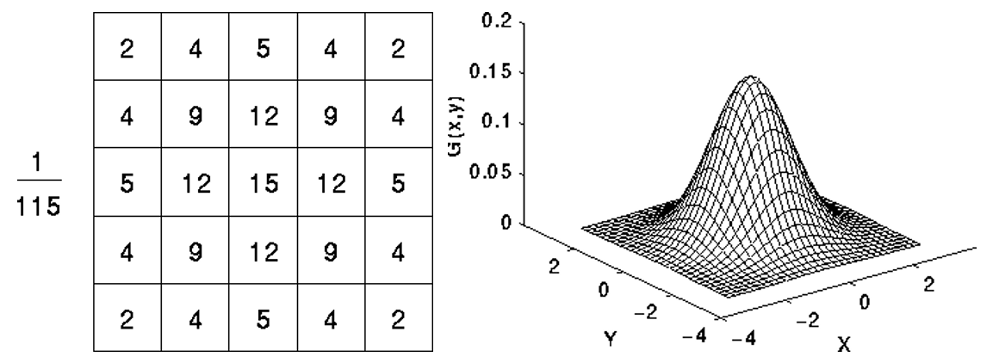

$\because$ 钟型曲线在区间(*μ*−3*σ*,*μ*+3*σ*)范围占99.7%，3*σ*外的数值已接近于0，半径为3*σ*即窗口大小为6*σ*×6*σ*即可，通常取最近的奇数。 因此$\sigma$值越大，窗口也越大，图片越模糊。

* **一阶差分**

$$
{\begin{array}{c|l|c}
水平梯度& M_x=\begin{bmatrix}-1&0&1\end{bmatrix}&容易受噪音影响
\\
垂直梯度& M_y=\begin{bmatrix}-1&0&1\end{bmatrix}^T
\\
\hline 
sobel&M_x=\begin{bmatrix}
1&0&-1
\\2&0&-2
\\1&0&-1
\end{bmatrix}
\\&M_y=M_x^T
\end{array}}
$$

梯度幅值：$||\nabla_l||=\sqrt{G_x^2+G_y^2} =\sqrt{(\frac{\partial l}{\partial x})^2+ (\frac{\partial l}{\partial y})^2}$

梯度辐角：$tan^{-1}(\frac{\partial l}{\partial y}/ \frac{\partial l}{\partial x})$

* **二阶差分**

$$
\begin{array}{l|l}
\Delta I=\frac{\partial^2 I}{\partial x^2}+\frac{\partial^2 I}{\partial y^2}
&近似M=\begin{pmatrix}1&0&1\\ 0&-4&0\\1&0&1\end{pmatrix}
\end{array}
$$

对噪音及其敏感，必须先高斯滤波处理 (LoG: Laplace over Gauss)

#### 二、非线性滤波

* **median 中值滤波**：不受极值影响
* **bilateral**

高斯滤波弊端：处处都用同样的滤波。可以消除噪音但也让图片过于模糊

使滤波器和图像有关$\implies$ 去除噪音又防止模糊边缘


$$
\large{{\sum_{q\in\Omega}[G_{\sigma_s}(||p-q||)\cdot \textcolor{red}{G_{\sigma_r}(||I_p-I_q||)}\times I_q]}\over{\sum_{q\in\Omega}G_{\sigma_s}(||p-q||)\cdot \textcolor{red}{G_{\sigma_r}(||I_p-I_q||)}}}
$$
$\sigma_s$：像素位置方差

$\sigma_r$：像素灰度值方差


## Segmentation

分离物体和背景，比如从一张照片中分离出器官

#### 一、阈值法

人为选定一个阈值，分为超过和低于两类
$$
p(r_k)：灰度为k的点出现频率\approx \frac{n_k：灰度为k的点个数}{所有像素的个数}\in[0,1]
$$
选取一个$[t_1,t_2]\in[0,1]$， 在其中的分为一类，不在其中分为另一类

#### 二、Otsu 阈值法

优化阈值，使得阈值为t时，组内方差 $\sigma_w(t)$（Intra-class variance）最小，或组间方差 $\sigma_b(t)$（between-class variance）最大，即找到 $\mathop{argmax}\limits_{t}\sigma_b^2(t)$
$$
\begin{array}{cc}
分到第1类的概率&w_1(t)=\sum_{i=0}^{t-1}p(i)
\\
分到第2类的概率&w_2(t)=\sum_{i=t}^{L-1}p(i)
\end{array}
$$
最小化 $\begin{array}{}\sigma_w^2(t)&=w_1(t)\cdot\sigma_1^2(t)+w_2(t)\cdot \sigma_2^2(t)\\&=w_1(t)(\mu_1-\mu_T)^2+w_2(\mu_2-\mu_T)^2\end{array}$

最大化 $\sigma_b^2(t)=w_1(t)w_2(t) \left[(\mu_1(t)-\mu_2(t) \right]^2$

==接受高斯分布的图像==

#### 三、已知信息阈值法

知道一些分类目标的特征，可以提取特征后，比较每个像素与该特征的“距离”（相似度），设定阈值
$$
\begin{array}{l}
\overrightarrow\mu=mean(特征区域)\to
\begin{bmatrix}
\mu_{red}
\\ \mu_{green}
\\ \mu_{blue}
\end{bmatrix}
\\
\Sigma=
\begin{pmatrix}
\sigma_R^2&cov_{RG}&cov_{RB}
\\
cov_{GR}&\sigma_G^2&cov_{GB}
\\
cov_{BR}&cov_{BG}&\sigma_B^2
\end{pmatrix}
\end{array}
$$
相似度 = $(x-\mu)^T\cdot\Sigma^{-1}\cdot(x-\mu)$


#### 四、K-means 聚类

1. define a distance 定义一个距离公式
2. update cluster 选定要分k类，把聚类中心附近的点归到这一类
3. update means 组内平均值$\implies$ 更新聚类中心
4. should stop? 直到聚类中心不再有大变化 (比较old_means 和means)

$$
即最小化\ \sum_{i=1}^K\sum_{x_i}(I(x)-\mu_i)^2
$$

聚类中心可以定义为颜色、灰度值等

#### 五、Region growing

从初始点开始增长到邻近的点
$$
I(x)-I(x_0)\le t, \\t\in[0,1]
$$

$$
\begin{array}{cc}
4-connected&不能走斜角
\\
8-connected&可以走斜角
\end{array}
$$

核心算法：定义相邻点

```python
def get_neighbour(rows,cols,x,y):
    ngb=list()
    if x>1:
        ngb.append([x-1,y])
    if y>1:
        ngb.append([x,y-1])
    if x<rows-1:
        ngb.append([x+1,y])
    if y<cols-1:
        ngb.append([x,y+1])
    '''
    如果是三维情况，还需要加一个z轴，z轴维度slices，和对应的if语句
    '''
    if z>1:
        ngb.append([x,y,z-1])
    if z<slices-1:
        ngb.append([x,y,z+1])
    return ngb
```


#### 六、分离算法设计指标

* Degree of Supervision 监督强度
* Reproducibility
* Runtime
* Model Complexity

|                  | Thresholding             | region growing                   | K-means                      |
| ---------------- | ------------------------ | -------------------------------- | ---------------------------- |
| user-interaction | 几乎没有                 | 较少                             | 无监督                       |
| reproducibility  |                          | 非常难重复，因为生成种子是随机的 | 初始聚类中心很重要，难以重复 |
| runtime          | 最快，只做像素层面的操作 | 很快                             | 还算快                       |
| 分离结果         | 不保证连续图像           | 一定是连续，但可能有洞           | 可能有洞                     |

==以上三种方法要得到比较好的结果，待分离物体必须有相似的灰度值(similar intensity, homogeneous region)==

##### 分离结果评价


* True positive rate (TPR) =$\frac{TP}{TP+FN}$
* False positive rate (FPR)=$\frac{FN}{TP+FN}$
* True negatice rate (TNR)=$\frac{TN}{TN+FP}$
* False negative rate (FNR)=$\frac{FP}{TN+FP}$
* positive predictive value (PPV)=$\frac{TP}{TP+FP}$

$$
\begin{array}{}
\small{DICE}&=
\frac{|S_g\cap S_t|}{|S_g|+|S_t|}
\\&=\frac{2TP}{2TP+FP+FN}
\\&=2\cdot \frac{PPV\cdot TPR}{PPV+TPR}=\small{FMS_1}
\\\small{FMS_\beta}&=\frac{\beta^2+1}\cdot \frac{PPV\cdot TPR}{\beta^2\cdot PPV+TPR}
\end{array}
$$

_DICE常用于验证可重复性_

## Intensity-based Image Registration

合成两张不同时刻、不同机器拍的照片（Modalities），综合不同机器的优势，获得更多细节

1. 拍两张照片
2. 评价相似度
3. 将一张照片固定，另一张变化一下与其对齐
4. 再次评价相似度
5. 重复步骤3、4

####　一、相似度

**1. SSD (Sum of Squared Difference) **
$$
SSD=\frac1N\sum_i(x_i-y_i)^2
$$
反映两张照片有多“像”， ==越低越像==

**2. SAD (Sum of Absolute Difference)**
$$
SAD=\frac1N\sum_i|x_i-y_i|
$$
==也是越低越好==

**3. NCC (Normalized Cross Correlation)**
$$
NCC=\frac1N\sum_i\frac{(x_i-\bar x)}{\sigma_x}\cdot\frac{(y_i-\bar y)}{\sigma_y}
$$
z-score 标准化，出来两个正态分布序列。对应位置相乘，==越大说明两张照片越像==

**4. MI (Mutual Information)**
$$
\begin{array}{l|l}
H(x) = -\sum_i p_x(i) \log p_x(i)
&single\ entropy
\\
H(x, y) = -\sum_i \sum_j p_{x,y}(i, j) \log p_{x,y}(i, j)
&Joint\ entropy
\\
MI = H(x) + H(y) - H(x, y)
\end{array}
$$
$p_x(i) $即为图像x中出现灰度为i的像素的概率，如果把概率当做频率，那就是直方图/所有点的个数​

$p_{x,y}(i,j) $是综合直方图，即在图像x中灰度为i，图像y中灰度为j的点出现的概率


将$p_{x,y}(i,j)$ 沿y轴压缩就可以得到$p_x(i) $

==越大越像==

#### 二、 变换方式

1. 刚性变换（只有旋转和平移）

$$
H_{4\times4}=
\begin{pmatrix}
R&T
\\
O&1
\end{pmatrix}
，要确定9+3=12个参数
$$

2. 仿射
   $$
   \begin{pmatrix}
   A&T
   \\
   O&1
   \end{pmatrix}
   ，也是12个参数
   $$
   
3. 投射(Projection)

$$
\begin{pmatrix}
A&T
\\
\bold v^T&\bold v
\end{pmatrix}
，要确定15个参数
$$

4. Deformable， 特别复杂，可能有成千上万个参数

## Feature-Based Registration

Feature 定位：

1. anatonical landmarks，（e.g. 人大脑里特有的结构）
2. extrinsic artifitial marker attached to patient，更容易识别

#### 一、Uneyama 方法

适用于两组点集==个数、相对位置一一对应==，对一张照片中所有的点，只需要做相同的变换$H=\begin{pmatrix}R&t\\O^T&1\end{pmatrix}$ 即可对齐。确定R与t即可，$Y=RX+t$

**步骤：**

1. 中心化X,Y数据：$x_i'=x_i-\bar x,y_i'=y_i-\bar y$，则$Y=RX$
2. SVD分解：$svd(X'\cdot Y^T)=UDV^T$
3. 旋转矩阵$R=VU^T$

> $\because Y=RX, Y^T=X^TR^T,\therefore XY^T=XX^TR^T=UD\underbrace{U^TR^T}_{V^T}$  

4. $t=\bar Y-R\bar X$，（原则上此时$t\equiv0$）

#### 二、ICP

大多数情况下，两组点集之间不存在对应关系：个数（同一条边，X中由3个点构成，而Y中有4个点）、相对位置（存在噪音，不同的点不能共用一个变换）

**步骤：**

1. 初始化变换矩阵$H=I$与待对齐数据$src=src\_init$
2. 计算最近邻居，获得个数、相对位置一一对应的一对点集
3. 计算变换矩阵，此时即可使用Uneyama方法
4. 误差$d_k-d_{k+1}\lt\epsilon$，即误差不再缩小时结束

```python
from sklearn.neighbors import NearestNeighbors
def iCP(dst,src_init,iteration):
    #initialize
	src = src_init
    R_total=np.eye(3)
    #init nearest neighbour with ponits in the fixed image
    nbrs = NearestNeighbors(n_neighbors=1, algorithm='auto').fit(dst.T)
    for i in range(iterations):
        # select nearest neighbors to current point set
        #return: dist - not important here
        #return: indices - the index of the corresponding ponits in the dst 
        distances, indices = nbrs.kneighbors(src.T)
        # use uneyama method between found correspondances
        R = spherical_umeyama(src, dst[:,indices.T[0]])
        
        # apply registration, prepare for next iteration
        src = np.dot(R, src)
        
        # save R to obtain a final transformation in the end
        R_total = np.dot(R, R_total)
```

???forward scan???

## MRI

Magnetic Resonance Image，利用$10^1\sim10^5m$波长，能量低。

#### 一、原理

人体内水原子water proton本来就有自转轴，但方向混乱。不表现磁性。受磁场激发后方向一致，角速度$\omega=\gamma\cdot B,\gamma$量纲为$\frac{MHz}{Tesla}$，对特定原子为定值。绝大多数水原子旋转轴与磁场$B_0$同向，极少数反向。

两次RF冲击：

1. 在上述稳定情况下，给$B_0$垂直方向加一个90°脉冲pulse（即一个冲击磁场，又称射频），让所有水原子转轴旋转90°。在这一瞬间，由于转轴方向相同、各向同性，能产生信号。然而由于这一瞬间还外加了强大的90°磁场，不能测信号强度。此时纵向磁化(longitudinal magnetization)$M_z=0$，横线磁化(transverse ~)$M_{xy}$最大。
2. 由于磁场不均匀，转轴开始以不同角速度旋转，转轴发散，信号消失。纵向磁化开始恢复（时间常数$T_1$），横向磁化开始消失（时间常数$T_2$）。

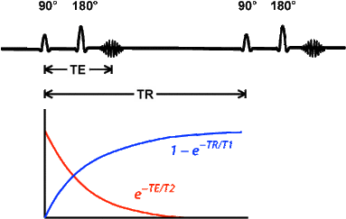

3. 加一个与$B_0$方向相反的180°脉冲，冲击时间比90°pulse更短。因此所有转轴不会直接朝向-180°方向，而仅沿水平面镜像翻转。转轴仍按原来的速度旋转（竖直、水平转速均反向），经过相同时间t，转回原来90°pulse位置，转轴指向重新一致，重新磁化，信号又出现了，称为spin echo。
4. 如果spin echo出现的时刻为$T_E(Echo)$，那么180°脉冲必须在$T_e/2$时刻。而两次90°脉冲间隔称为$T_R(Repetition)$

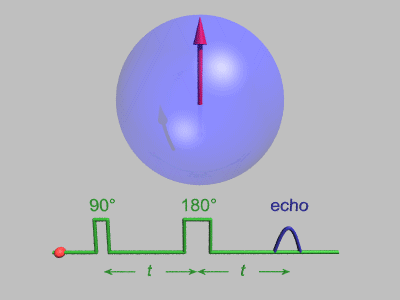

#### 二、信号与图像生成

信号强度$S=K\cdot[H]\cdot(1-e^{-\frac{T_R}{T_1}})\cdot e^{-\frac{T_E}{T_2}}$，K为系数，[H]为水分子密度（转轴密度）

$T_1$与$T_2$：不同身体组织$T_1,T_2$常数不同，信号恢复/衰减速度有区别。

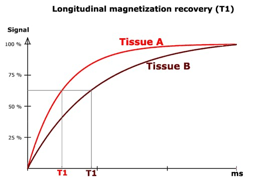 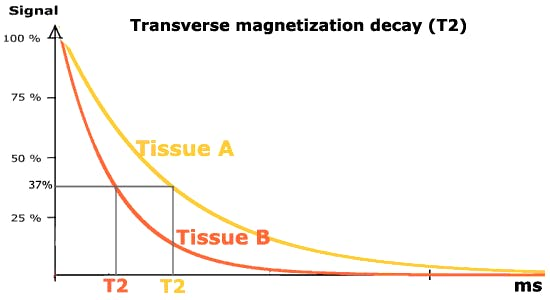

* 组织T1常数越大，在T1加权图像中越黑
* T2越大，在T2加权图像中越亮
* Gadolinium（镓）同时减小T1、T2，增强T1加权对比度，减弱T2加权。

$T_E$与$T_R$：

*  TR<500ms，TE<25ms ，$T_E$太短，$M_{xy}$还没来得及衰退，不论$T_2$值如何，$M_{xy}$都相同。此时主要拍$M_z$恢复程度差异，这样的图像称为T1-weighted（T1加权）。
*  TR＝1500～2500ms，TE＝90～120ms， $T_E$长，$M_{xy}$衰退差异已经很明显，占主导。称为T2-weighted
* TE短，TR长。不同组织的$M_z,M_{xy}$均无差异。信号强度S=[H]=水分子密度。

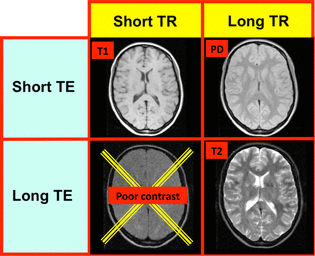

> short指$T_E,T_R\ll T_1,T_2$，long指$T_E,T_R=3\sim5\cdot T_1(T_2)$

#### 三、空间位置信息

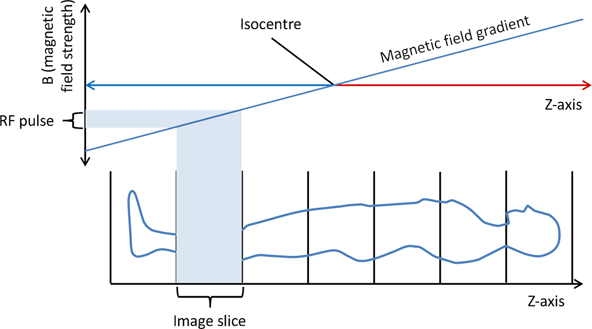

$\omega(z)=\gamma\cdot (B_0+z\frac{dG_z}{dz})$，变化率$\frac{dG_z}{dz}$称为slice selective gradient，这样沿着z轴每处水原子自传角速度均不同。

当且仅当90°脉冲频率与水原子自传频率相同时，自转轴会被脉冲旋转90°到达水平面。选择不同频率的90°脉冲，就可以选择不同的切片。

与此同时，y方向磁场变化率$\frac{dG_y}{dy}$，沿y方向每处自选轴相位$\phi$不同。

读取信号时，在x方向加磁场变化率$\frac{dG_x}{dx}$，沿x方向每处自传频率$\omega$均不同

最后取z位置的一片图像，对x、y坐标fft变换后得到最终图像。

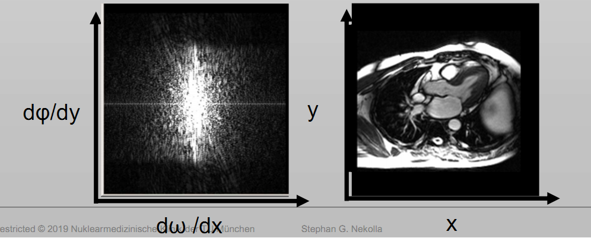

## 超声波

$\gt20.000Hz$，常用$2.5\to20MHz$，$\lambda=\frac cf=\frac{波速}{频率}$

由于声波慢，出发到返回间有时间差。相同时间中数有几个波，$\lambda=0.22mm$为最小可分辨波长

#### 一、声波衰减

声波是纵波，声源协振$x(t)=x_0\sin(\omega t-\phi)$，传播方程为$x(t,y)=x_0\sin(\frac{2\pi}{\lambda}(ct-y))$，声压为
$$
p(t,y)=p_0\cos(\frac{2\pi}{\lambda}(ct-y))
\\=\rho c\nu(t,y)\triangleq Z\cdot\nu(t,y)
$$
$Z=\rho c$称为声阻，声波在声阻不同的介面会被反射。接受所有回声需要两倍传播时间

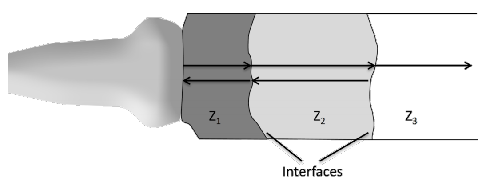

Wave Scattering：比$\lambda$小的组织会使声波发散，而基本上所有组织都会发散声波，且不同组织发散形式不同

能量衰减方程：$I(y)=I_0e^{-\alpha y}$，衰减系数$\alpha$取决于频率与物质本身$\alpha=\alpha_0f^n$

#### 二、Beamforming

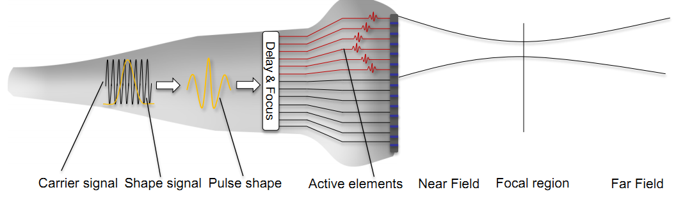

发射与接收声波均可用（transmit and receive，或rx&tx）。发射时，经过延时，不同发射源的声波恰好同时到达目标深度。接收回声时同理，对接收到的声音先延时再叠加delay and sum。

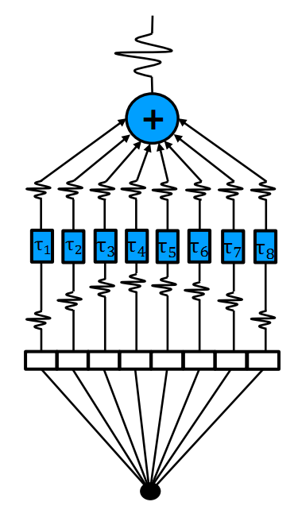

**成像方式：**

1. Scanline：每次生成沿传播方向一行图像，每一行都有对应的发射源。（比较慢，每次都要等）
2. Planewave：一次成型

声波会衍射，需要用过滤器过滤衍射波只留下主波。Point Spread Function（PSF）用于评价声波特征。理想的声波应LR小，PSL大。

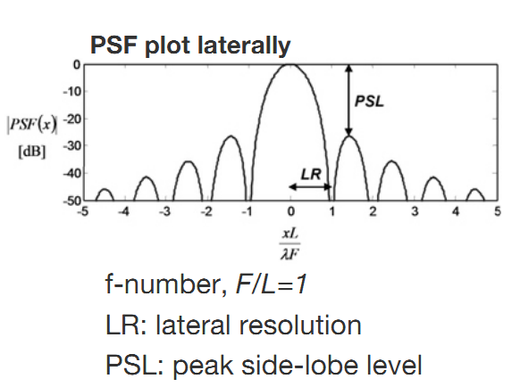

**预处理**：接收到模拟Radiofrequency信号，Hilbert变换得到包络线Envelop，再数字化Subsampling

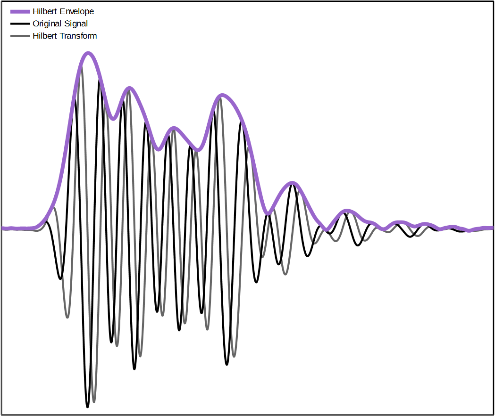

为了让人肉眼看得更清楚需要log compression

如果图像质量仍不理想可能需要Filtering

#### 三、分离度

两个太近的散射源会融合到一起，分不清。Full Width at Half Maximum （FWHM）是两个物体可以分离的最小距离。

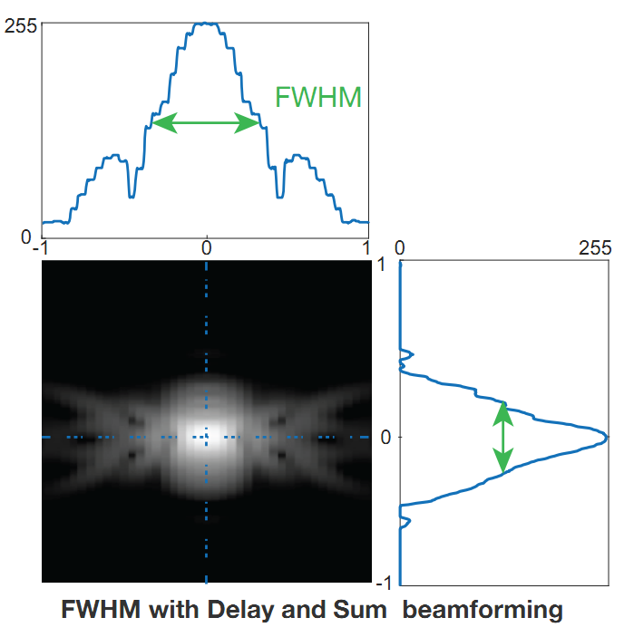

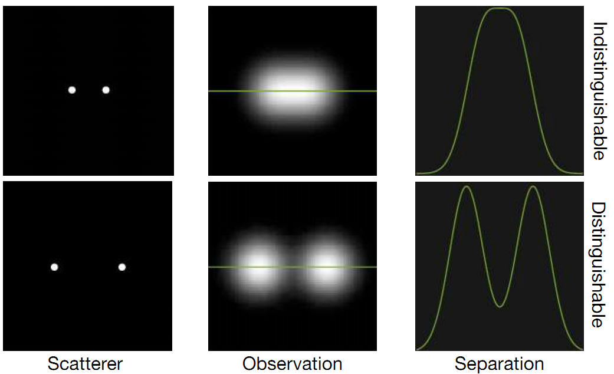

## 背诵内容

#### SSIM （Sturcture Similarity Index Metric）

3 Components: Luminance, Contrast, Structure

#### Segmentation 图片分离难点

* Noise: 常见于Ultra Sonic
* Partial volume effects: 像素有限，当像素不够精细时，前景背景交界处会模糊
* Imaging artifacts：患者戴的金属首饰、头发上的发蜡导致图片失真
* Leakage problem：纯灰度值分类法常分不清相似组织的边界

#### Challenges of deep learning techniques in segmentation and their solution

- Low amount of annotated data: use data augmentation, and auxiliary labels to account for it
- Leakage problem: assign higher weights for border pixels
- data imbalance: selective sampling, data augmentation, and weight cross-entrophy

#### How can convolutional Neuron Network handle 3D data?

* use 2D slices and post-process the results for consistency
* extract triplets of slices per sample (one per plane) and use them as channels
* use 3D convolutional networks (e.g. V-net) 

#### Registration 难点

**Pitfalls**

* local consistency

* No overlapping area
* bad initialization
* local minimum
* similarity measure does not model scenario
* transformation model does not model scenario

**2D-3D难点** （比如合并CT与X光照片）

* different dimensions
* different modalities
* outliers

#### X-Ray to CT registration

由CT产生generated平扫X-Ray，简单，称为DRR：Digitally Reconstructed radiograph

**Deep DRR**: annotate a handful of CTs, generate thousands of realistic X-rays from them while projecting the labels using the known geometry.

**Convolutional Pose Machine**: 输入X-ray，训练网络自动标记annatation位置。训练样本、标签为Deep DRR产生的数据

**problems of Xray to CT registration**:

* feature based: detect corresponding 2d and 3d points in the X-ray and CT

  * pros: no initialization, very fast

  * cons: pretty unprecise, finding corresponding ponits is difficult, markers are invasive 

* intensity based: start from the initial ponit, compare DRR to the true X-ray, compute the best move and generate the next DRR

  * pros: very precise
  * cons: requires an initialization

**Perspective n Ponit**:

1. 用与病人无关的数据，先训练一个NN，得到一些weights
2. 用病人的CT（not labelled）， Deep DRR forward projection得到simulated X-ray （已知position）；用Convolutional Pose Machine 得到X-ray的landmark，再反向投影回CT得3d坐标annotation（但不精准）；多次投影取均值，再取骨头上离预测点最近的一点（clustering）；再次forward projection 得到x-ray landmarks，重新训练NN。此时这个NN是为这位病人量身定做的。
3. 用于CT X-ray registration， 输入病人位置position的x-ray， 得到自动标记annatation的x-ray与CT

#### CT 与 MRI


|          | CT                                                           | MRI                                                          |
| -------- | ------------------------------------------------------------ | ------------------------------------------------------------ |
| 成像特点 | no details about soft tissue, only bones, <br />anatomical study | show soft tissues<br />physiological study                   |
| 原理     | Density Imaging, X-ray is weakened in scale to density or absorption rate of body tissues, generating a 3D image from multiple 2D X-ray images taken around a single rotation axis | water proton imaging, through the energy emission from relaxation of water proton spinning in the body tissue after stimulated by a spinning magnetic field |
| 缺陷成因 | metal objects scatters x-ray beam,<br />geometric error      | chemical property changes in water containing body tissue<br />mechanical vibration |
| 造影剂   | tissues can not be distinguished which have same absorbtion rate (e.g. vessal and lymph) | Gadolinium is para-magnetic substance, it reduces T1 by changing osmolarity of body tissues containing water$\implies$ better contrast |

#### MRI缺陷Artifacts

1. chemical shift:  occurs in the frequency-encoding direction and is due to spatial misregistration of fat and water molecules 
2. Gibbs Ringing:  low intensity "rings" parallel to the edges of the sample. 64 samples are aquired in the phase encode direction, 256 samples are aquired in the readout direction. So 192 samples in the readout direction are discarded, which leads to a loss of resolution.
3. Motion&instability:  any instability or fluctuations in the system, e.g.  power supply problems, mechanical vibrations. 
4. RF Inhomogeneity:  The shadowing (due to RF eddy currents in the copper foil) results in almost complete signal dropout. 
5. Foldover: occurs in the phase-encoding direction, the phases of signal-bearing tissues outside of the FOV in the y-direction are replication of the phases will be recorded and backfolded into the incorrect locations.

#### 超声波发射器

发射源阵列——压电（piezoelectricity）元件

* Linear array: 长方形阵列中排列相同发射源transducer。分辨率高，深度$\lt10cm$
* Curvilinear: 圆弧circular arc，分辨率高，深度20cm
* Phased array: 更小的长方形阵列，可通过electronically steered beams偏斜，从一个窗口扫过一片区域。深度20cm
* Intravascular: 棒末端一个压电元件，只用一条超声波成像，深度$\lt3cm$
* Biplanar

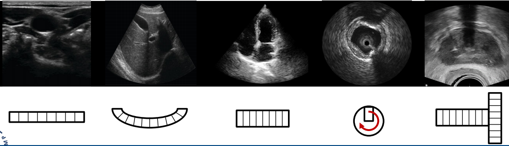

#### 超声波缺陷

* Shadow and enhancement
* Nonlinearity of tissue propagation
* interferecen of waves

这些成像缺陷可以用滤波器Filter弥补

#### Tomosynthesis

|                                | 优点                                                         | 缺点                                                         |
| ------------------------------ | ------------------------------------------------------------ | ------------------------------------------------------------ |
| Conventional Linear Tomography | depth localization                                           | Image blur from out of plane anatomy<br />only aquires one slice at a time, require an excessive dose to aquire a volume |
| CT                             | Volumetric Images<br />Reduces overlapping structures<br />Reconstruct many different planes<br />High sensitivity | radiation dose                                               |
| Orthopedic Tomosynthesis       | Lower dose than CT<br />Avoid streak artifacts from metal<br />less stringent positioning | Not able to have flexible image reconstruction               |
| Chest Tomosynthesis            | reduced overlapping structures(X-ray)<br />lower dose, lower cost and better resolution in X&Y direction(CT) | longer reading time(X-ray) <br />limited depth resolution(CT) |

3D Digital Breast Tomosynthesis

* Effect of Sweep Angle: wide angle - superior depth resolution, but complex mechanical movement and longer scan time; narrow angle - lower depth resolution, loss of details, but simple design, shorter scan time
* Effect of number of projections: Large number - better reconstruction, but lower SNR per projection (the total dose unchanged), thus lower image quality, longer scan time; Small number - less data for 3D reconstruction, but higher SNR dose, thus better  image quality
* Tube motion: continuous - faster scan time, simpler mechanics, but exposures during the tube`s movement create anyway a blurring effect; step&shoot - image made in "Frozen" conditions are clear and Crispy, less details lost, but more complex mechanics to avoid vibrations due to variations of speed.

2D DM and 3D DBT:

* pros: reduces superimposition, possibility to reduce compression
* cons: microcalcification

#### Nuclear medizin Imaging

不展现解剖学anatomy结构，而是器官功能function。

比如把糖带上辐射给病人吃，看放射性物质最终去向。和一般人不同说明器官工作不正常

**辐射类型：**

* $\alpha$：$H_2^4$氦核，质量大、危险，但也很容易停下
* $\beta^+/\beta^-$：电子，其中$\beta^+$反电子是反物质，会湮灭，更危险
* $\gamma$：电磁波

**Gamma detector**

1. Scintillator crystal + photomultiplier array (需要collimater限制入射方向)
2. Semiconductor detector array

**Modalities**

1. Scintigraphy
2. SPECT
3. PET, 示踪剂F18-FDG，一次只往两个相背的方向发射两个光子，图像质量高。

