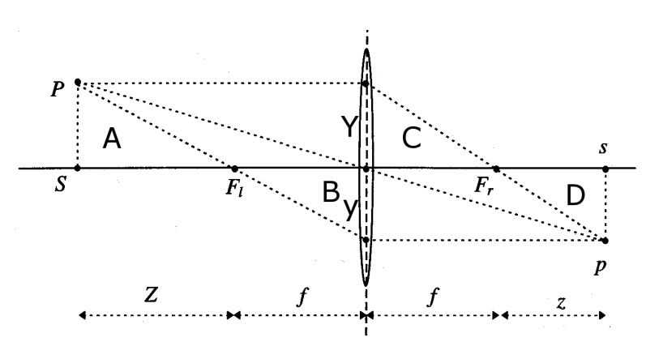

# ComputerVision2

## 一、数学复习

* 线性无关：$\forall i, \sum_{i=1}^K\alpha_iv_i=0\implies\alpha_i=0$，只能推出$\alpha_i=0$， 说明任何向量都不是其余向量的线性组合

* 内积: $<x,y>=\vec x^T\vec y=\sum_ix_iy_i$

1. 线性$<u,\alpha v+\beta w>=\alpha<u,v>+\beta<u,w>$
2. 对称$<u,v>=<v,u>$
3. 正定：$<v,v>\ge0$，当且仅当$v=0$时，$<v,v>=0$

模$|v|_2=\sqrt{<v,v>}$，距离$d(v,w)=|v,w|=\sqrt{<v-w,v-w>}$

正交 $<v,w>=0$

* kron乘积

$$
A^{\in R^{m\times n}}\otimes B^{\in R^{k\times l}}\equiv\begin{pmatrix}
a_{11}B 	& 	\cdots	&a_{1n}B
\\\vdots
\\a_{n1}B 	&\cdots	&a_{mn}B
\end{pmatrix}\in R^{mk\times nl}
$$

* 列向量叠加

$$
A\in R^{m\times n}\implies A^s\in R^{mn\times1}
$$

$u^TAv=(v\otimes u)^TA^s$

* Group, 需要满足以下条件

对矩阵来说，必须满足条件①乘法封闭$\forall A,B\in G, AB\in G$ 以及条件③ 包含单位矩阵 $Id\in G$

General Linear **GL(n)**： 所有可逆实数方阵$R^{n\times n}, det(A)\neq0$

Special Linear **SL(n)**: 行列式值为1,$det(A)=1$， span same area/ volume

Orthogonal **O(n)**: 保留内积，即旋转矩阵，保留长度、角度、模。定义为$<Rx,Ry>=x^TRRy=x^Ty$，可得$R^TR=I,R^T=R^{-1}$

Special Orthogonal **SO(n)**：$det(R)=+1$，$SO(n)=SL(n)\cap O(n)$

> $SO(n)\sub O(n)\sub GL(n)$

Affine **A(n)**：$\tilde A\vec x+\vec b$或homogeneous coordinate $\begin{pmatrix}y\\1\end{pmatrix}=\begin{pmatrix}A&b\\0&1\end{pmatrix}\begin{pmatrix}x\\1\end{pmatrix}$ 

Euclidean **E(n)**：$\begin{pmatrix}R&T\\0&1\end{pmatrix}$

Special Euclidean **SE(n)**：$\begin{pmatrix}R\in SO(n)&T\\0&1\end{pmatrix}$，SE(3) 是只有旋转、平移、镜像的Rigid Body Motion

> $SE(n)\sub E(n)\sub A(n)\sub GL(n+1)$

* $rank(A^{m\times n})+rank(B^{n\times k})-n \le rank(A,B)\le\min\{rank(A),rank(B) \}$

* Ax=b是否有解，$A\in R^{m\times n}$

有解条件：$b\in$range(A)$=\{y\in R^m|Ax=y\}$

唯一解条件：kernel(A)={0}, kernel(A)$=\{x\in R^n|Ax=0\}$， 否则$A(x_s+x_0)=Ax_s+Ax_0=b+0=b$，任何解都可以加上x0成为无数解。

* 特征值 $\tilde A\vec v=\lambda\vec v$

计算$det(\lambda I-A)=0$

* 半正定矩阵，$x^TSx\ge0$ 的对称矩阵 $S^T=S$

1. 所有特征值都为实数
2. 不同特征值对应的向量正交
3. $S=V\Lambda V^T$

* 反对称阵 skew-symmetric $A^T=-A$，对角元素必须为0
* hat-operation，在$R^3$中，向量叉乘可以化为矩阵

$$
\hat u=\begin{pmatrix}
0&-u_3&u_2
\\u_3&0&-u_1
\\-u_2&u_1&0
\end{pmatrix}
,\hat uv\equiv u\times v
$$

* SVD分解

$$
A\in R^{m\times n},m\ge n,rank(A)=p
\\
A=U^{m\times p}\Sigma^{p\times p}V^{Tp\times n}
\\
$$

pseudo-inverse: $A^\dagger=V\Sigma^\dagger U^T,\Sigma^\dagger=\begin{pmatrix}\Sigma^{-1}&0\\0&0\end{pmatrix}_{n\times m}$

当$Ax=b$无解时，依然可以得到$x_\min=A^\dagger b$为使$|Ax-b|$最小的$\vec x$中模最小的

## 二、表示相机移动

对相机来说，旋转矩阵一定是一个$SO(3)=\{R\in\mathbb R^{3\times 3}|R^TR=I,det(R)=+1\}$，再加上平移就成为$SE(3)$

可以表示为$x(t)=R(t)\cdot x_{origin}$，每时每刻的旋转矩阵不同

然而，要建立一个SO(3)太复杂，把它转化到 Lie Algebra变为线性空间好操作。
$$
R(t)R(t)^T=I
\\
\frac{d}{dt}\to\dot RR^T+R\dot R^T=0
\\
\therefore \dot RR^T=-(\dot RR^T)^T
$$
$\dot RR^T$为反对称阵, 而任何$M=-M^T$都可以经hat operation $\hat u$ 反变换转化为$R^3$ 向量

> Lie Group SO(3) → Lie Algebra so(3) → $R^3 $

设$\dot R\underbrace{R^T}_{=R^{-1}}\triangleq \hat w(t)$ 为Lie Algebra， 可得$\dot R=\hat wR$

即对旋转矩阵求导数只要左乘$\hat w$, $\hat w$反应了R的导数性质

泰勒展开：$R(t)=R(t_0)+\dot R(t_0)(t-t_0)=I+\hat w(0)dt$

#### 由Lie Algebra 反求Lie Group

Exponential Map:
$$
\left\{
\begin{array}{}
\dot R(t)=\hat w R(t)
\\
R(0)=I
\end{array}
\right.
$$
解这个微分方程可得$R(t)=e^{\hat wt}\left(=\mathop\sum_{n=0}^\infty\frac{(\hat wt)^n}{n!}\right)$
$$
\begin{array}{}
w=(w_1\ w_2\ w_3)^T, ||w||=1
\\\hat w =\begin{pmatrix}0&-w_3&w_2\\
w_3 &0&-w_1
\\-w_2&w_1&0
\end{pmatrix}

\\\begin{array}{}
\\\hat w^2&=\begin{pmatrix}
-(w_2^2+w_3^2)&w_1w_2&w_1w_3
\\w_1w_2&-(w_1^2+w_3^2)&w_2w_3
\\w_1w_3&w_2w_3&-(w_1^2+w_2^2) 
\end{pmatrix}
\\&=\begin{pmatrix}
w_1^2&w_1w_2&w_1w_3
\\w_1w_2&w_2^2&w_2w_3
\\w_1w_3&w_2w_3&w_3^2 
\end{pmatrix}-\begin{pmatrix}\underbrace{w_1^2+w_2^2+w_3^3}_{||w||=1用在这里}
\\&w_1^2+w_2^2+w_3^3
\\&&w_1^2+w_2^2+w_3^3
\end{pmatrix}
\\&=ww^T-I
\end{array}
\\
\begin{array}{}
\hat w^3&=\hat w\cdot\hat w^2=\hat w\cdot(ww^T-I)
\\&=\underline{\hat ww}w^T-\hat wI=\underline0\cdot w^T-\hat w\\&=-\hat w
\end{array}
\\
\hat w^4=\hat w\cdot\hat w^3=-\hat w^2
\\\hat w^5=\hat w\cdot \hat w^4=\hat w\cdot -\hat w^2=-\hat w^3=--\hat w=\hat w
\end{array}
$$
罗德里格斯公式：任何旋转都可转化为绕轴$w\over{|w|}$旋转$|w|$ 角度的运动

因为$||w||=1$不一定成立，设$v\triangleq\frac{w}{||w||},t\triangleq ||w||$，使$||v||=1$
$$
\begin{array}{}
e^{\hat w}=e^{\hat vt}
\\=\sum_{n=0}^{\infty}\frac{(\hat vt)^n}{n!}
\\=\underbrace{I}_{n=0}+
\underbrace{\sum_{k=0}^\infty\frac{t^{2k+1}}{(2k+1)!}\hat v^{2k+1}}_{n=1,3,5,\cdots}
+\underbrace{\sum_{k=1}^\infty\frac{t^{2k}}{(2k)!}\hat v^{2k}}_{n=2,4,6,\cdots}
\\=I+\underbrace{\sum_{k=0}^\infty(-1)^n\frac{t^{2k+1}}{(2k+1)!}}_{\sin(t)}\hat v
+\underbrace{\sum_{k=1}^\infty(-1)^{n+1}\frac{t^{2k}}{(2k)!}}_{1-\cos(t)}\hat v^{2}
\\=I+(t-\frac{t^3}{3!}+\frac{t^5}{5!}+\cdots)\hat v
+(\frac{t^2}{2!}-\frac{t^4}{4!}+\frac{t^6}{6!}+\cdots)\hat v^2
\\=I+\frac{\hat w}{||w||}\sin(||w||)+\frac{\hat w^2}{||w||^2}(1-\cos(||w||))
\end{array}
$$

#### 加入平移

Twist： 旋转同时平移

$SE(3)=g=\begin{pmatrix}R&T\\0&1\end{pmatrix}\in\mathbb R^{4\times 4}$， $g^{-1}=\begin{pmatrix}R^T&-R^TT\\0&1\end{pmatrix}$

得$\dot gg^{-1}=\begin{pmatrix}\dot RR^T&\dot T-\dot RR^TT\\0&0\end{pmatrix}=\begin{pmatrix}\hat w&\vec v\\0&0\end{pmatrix}\equiv\hat\xi\in\mathbb R^{4\times 4}$
$$
\left\{
\begin{array}{}
\dot g(t)=\hat\xi g(t)
\\g(0)=I
\end{array}
\right.
$$
解得$g(t)=e^{\hat\xi t}$

相机运动即可表示为$\bold X(t)=g(t)\bold X_0=R(t)\bold X_0+T(t)$

$\bold {\dot X}=\dot g(t)\bold X_0=\dot g(t)g^{-1}(t)\bold X(t)=\begin{pmatrix}\hat w&\vec v\\0&0\end{pmatrix}\bold X(t)=\hat w(t)\bold X(t)+\vec v(t)\bold X(t)$

## 三、透视法投影

薄透镜成像公式为$\frac{Y}{Z}=-\frac{y}{f}\iff y=-f\frac{Y}{Z}$

其中负号代表倒立的像，如果去掉负号相当于将感光器放置在透镜前

$$
\pi(\bold X)=\begin{pmatrix}f\frac{X}{Z}\\f \frac{Y}{Z}\end{pmatrix}
\\
\begin{array}{}
Z\bold x&=Z\begin{pmatrix}x\\y\\1\end{pmatrix}=\begin{pmatrix}
f&&&0
\\&f&&0
\\&&f&0
\end{pmatrix}\cdot\begin{pmatrix}X\\Y\\Z\\1\end{pmatrix}
\\&=\underbrace{\begin{pmatrix}f\\&f\\&&1\end{pmatrix}}_{K_f}
\cdot\underbrace{\begin{pmatrix}1&&&0\\&1&&0\\&&1&0\end{pmatrix}}_{\Pi_0}
\cdot\begin{pmatrix}X\\Y\\Z\\1\end{pmatrix}
\\∴Z\bold x&\triangleq\lambda\bold x=K_f\Pi_0\bold X
\end{array}
$$
将一个3D点投影到2D画布 (image plane)上：

1. 将点从世界坐标转移到相机内坐标 $\bold X=g\bold X_0=\begin{pmatrix}R&T\\0&1\end{pmatrix}\cdot \bold X_0$
2. 将3D坐标投映到2D画布 $\lambda\bold x=K_f\Pi_0g\bold X_0$

如果画布内单位长度为焦距f则可以省略$K_f$：$\lambda\bold x = \Pi_0g\bold X_0$

3. 转换到像素坐标系

$$
K_S\triangleq\begin{pmatrix}s_x&s_\theta&o_x
\\0&s_y&o_y
\\0&0&1
\end{pmatrix}
$$

* $s_\theta$一般为0，除非像素不是方形
* $s_x,s_y$缩放，$o_x,o_y$平移

固有参数矩阵$K=K_sK_f=\begin{pmatrix}fs_x&fs_\theta&o_x\\0&fs_y&o_y\\0&0&1\end{pmatrix}$

设$\Pi=K_sK_f\Pi_0g\in\mathbb R^{3\times 4}$，有$\lambda\bold x=\Pi\bold X_0$

#### preimage

投影的物体所有可能的原物体的集合，点→线，线→面。

co-image: pre-image的orthogonal complement，比如面的法线

co-image = preimage⊥

image = preimage ∩ image plane

## 四、确定图像中的对应点

想找到corresponding Point， 即不同角度的两张照片中哪些点是对应的? 而图片中只有灰阶和颜色信息→要得到点，线，面等几何信息是一个挑战。最后要得到相机运动的参数$R,T$和这些点的三维坐标。

假设两张照片之间只相差一个小的偏差Small Displacement， 是一串连续图像中的两张。这里不考虑大的偏差，大偏差可以用来3D定位，但是很难从中得到两个像素的对应关系。

一个点由于相机的运动，在成像上位置的变化可以这样表示：

假设第一张照片是原点，没有旋转平移的变化 $g=I$，再设K=1：$\lambda_1x_1=X$

由$\lambda_2x_2=RX+T=R(\lambda_1x_1)+T$ 可得 $x_2=\frac{1}{\lambda_2}(R\lambda_1x_1+T)$

#### Lucas-Kanade 方法

Optic Flow： 假设在这一段微小的位移内，一个点的光照强度不变。

则光照强度可以由两个因素引起：位置变化（物体运动或相机运动）和时间。

设$x(t)$是该点随时间变化的位置，$\forall t,\bold Illumination[x(t),t]=C$

两边求导：$\nabla I^T\cdot\underbrace{\frac{dx}{dt}}_{\vec v}+\frac{\partial I}{\partial t}=0$，其中$\nabla I=\begin{pmatrix}\frac{\partial I}{\partial x}\\\frac{\partial I}{\partial y}\end{pmatrix}$

$\vec v$ 就是要找的一个点在图像上位置的变化。

要找到这个最佳的$\vec v$，就要使损失函数最小 $\mathop{\min}_{\vec v} E(\vec v)=\int_{W(x)}|\nabla I(x',t)^T\cdot\vec v+\partial_tI|^2dx'$
$$
\begin{array}{}
E(v)&=\textcolor{red}{\int}|\nabla I^T\vec v+I_t|^2\textcolor{red}{dx'}
\\&=\vec v^T\textcolor{red}{\int}\nabla I\nabla I^T\textcolor{red}{dx'}\vec v
+2\textcolor{red}{\int}I_t\nabla I^T\textcolor{red}{dx'}\vec v+const
\\
\frac{d}{dv}E&=2\underbrace{\textcolor{red}{\int}\nabla I\nabla I^T\textcolor{red}{dx'}}_{M}\vec v
+2\underbrace{\textcolor{red}{\int}I_t\nabla I^T\textcolor{red}{dx'}}_{q}\doteq0
\\&\equiv2M\vec v+2q\doteq 0
\\\hline&\therefore \vec v=-M^{-1}q
\end{array}
$$
其中$M(x)=\int_{W(x)}\begin{pmatrix}I_x^2&I_xI_y\\I_xI_y&I_y^2\end{pmatrix}dx', q=\int_{W(x)}\begin{pmatrix}I_xI_t\\I_yI_t\end{pmatrix}dx'$

矩阵M表明窗口内梯度方向，当且仅当x、y方向梯度都不是常数，即M有两个特征值，$det(M)\neq0$的时候，可以确定移动向量。若M仅有一个特征值，意味着无法确定该方向的位移。

若$\nabla I (x',t)$在窗口内任意位置都是常数，即$\nabla I=\alpha\vec u$时，$M=G*(\nabla I\nabla I^T)=G*\alpha^2\vec u\vec u^T=G*\alpha^2\underbrace{\begin{pmatrix}u_1^2&u_1u_2\\u_1u_2&u_2^2\end{pmatrix}}_{\det=0}$

$\det(M)=(G*\alpha^2)^2*0=0$，无法判断任何一个方向

## 五、二图重建

三个假设：

1. 点与点对应关系正确
2. 场景静止，仅相机运动
3. 相机自身的参数已知且固定（不更换相机）

两个任务同时进行：

1. 要估计相机运动， Motion of Camera，包括R与T
2. 同时又要估计原始点X在3D空间中的位置

* Epipole: $e_1,e_2$
* Epipole Line: $l_1,l_2$
* Epipole plane: $Xo_1o_2$

#### Epipolar constraint

从这两个角度拍摄的照片一定满足Epipolar Constraint：$x_2^T\hat TRx_1=0$， 其中Essential Matrix $E\triangleq\hat TR$

> 证明：$\lambda_1x_1=X,\lambda_2x_2=RX+T=R(\lambda_1x_1)+T$
>
> 由于$\hat T\cdot T=\begin{pmatrix}0&-t_3&t_2\\t_3&0&-t_1\\-t_2&t_1&0\end{pmatrix}\cdot \begin{pmatrix}t_1\\t_2\\t_3\end{pmatrix}=\begin{pmatrix}0\\0\\0\end{pmatrix}$
>
> 两边同时左乘$\hat T$消除加法项T，$\lambda_2\hat Tx_2=\lambda_1\hat TRx_1$
>
> 两边再同时左乘$x_2^T$，得$\lambda_2\cdot \underbrace{x_2^T\hat Tx_2}_{=0,因为A为反对称阵时\\x^TAx=0}=\lambda_1x_2^T\hat TRx_1$
>
> ∴$x_2^T\hat TRx_1=0$，因此得证

该约束的几何意义： $x_2^T\hat TRx_1=0\implies<x_2,T\times Rx_1>=0$

* $\vec{o_1X}$  在第二个Frame中可表示为$Rx_1$
* $\vec{o_2X}$ 在第二个Frame中表示为$x_2$
* $\vec{o_1o_2}$ 表示为T

$<x_2,T\times Rx_1>=0$说明$\vec{o_1X},\vec{o_2X},\vec{o_1o_2}$三个向量组成的空间体积为0，那么$\vec{o_1X},\vec{o_2X} $的确交汇于空间中某点X

#### Essential Matrix 的特性

$E$只与相机自身运动有关，包含了运动信息$\hat T,R$

$\hat TR=E=U\Sigma V^T$,$\Sigma$一定$diag\{\sigma,\sigma,0\},\sigma\gt0$

只要有E就能算出$\hat T $与R，但一个E对应两组
$$
\hat T_1,R_1=UR_z(+\frac\pi2)\Sigma U^T,UR_z^T(+\frac \pi2)V^T
\\
\hat T_2,R_2=UR_z(-\frac\pi2)\Sigma U^T,UR_z^T(-\frac \pi2)V^T
$$

> $R_z(\pm\frac\pi2)=\begin{pmatrix}0&\mp1&0\\\pm1&0&0\\0&0&1\end{pmatrix}$，是一个旋转矩阵，特点：更换$\pm$号或者转置效果相同
>
> 即$R_z^T(\pm\frac\pi2)=R_z(\mp\frac\pi2)$

> 需要注意的是，由于$E=\hat TR$，如果$T=0$即相机没有平移，E就直接是0，在这种情况下是没有办法求出有意义的$T,R$组合的。

#### 8点算法

1. 相机运动信息$E^s=\begin{pmatrix}\vec e_1\\\vec e_2\\\vec e_3\end{pmatrix}=\begin{pmatrix}e_{11}&e_{21}&e_{31}&e_{12}&e_{22}&e_{32}&e_{13}&e_{23}&e_{33}\end{pmatrix}^T\in\mathbb R^9$
2. 同一点在一对照片上的信息$a\equiv\vec{x_1}\otimes\vec{x_2}=\begin{pmatrix}x_1x_2&x_1y_2&x_1z_2&y_1x_2&y_1y_2&y_1z_2&z_1x_2&z_1y_2&z_1z_2\end{pmatrix}\in\mathbb R^{9}$

用这种方式可将epipolar constraint 表示为向量内积$x_2^TEx_1=a^TE^s=0$

$a^TE^s=0$说明$\vec a$与$E^s$正交

解方程$\chi E^s=0$，其中$\chi$为$E^s$的Null Space，需要8对点（8个$\vec a$向量），得到唯一解，$\chi=\begin{pmatrix}a^1&a^2&\cdots&a^n\end{pmatrix}^T\in\mathbb R^{9\times n},n=8$

实际情况下由于测量误差，不可能得到8对点使得$\chi E^s$恰好为0。此时就要计算$||\chi E^s||_\min$

如果把$\chi$分解$=U_\chi\Sigma_\chi V_\chi^T$，**$E^s$必须为$V_\chi$的第九列**，对应$\Sigma_\chi$中最小的特征值

3. 分解$E=U\Sigma V^T=U\begin{pmatrix}\sigma_1\\&\sigma_2\\&&\sigma_3\end{pmatrix}V^T$，由于不关心物体实际的尺寸大小，直接将$\Sigma$换为$\begin{pmatrix}1\\&1\\&&0\end{pmatrix}$

> 由于$\chi E^s\neq0$，计算$||\chi E^s||_\min$时会得到两个$E^s$，绝对值相等，符号相反，都能使得$||\chi E^s||$最小
>
> 每个$E^s$对应两组$\hat T,R$，所以最后有4组不同的$\hat T,R$
>
> 如何区分? → 找到所有点深度均为正的那一组 （Depth≧0）

#### 求解尺寸系数

获得了E，就知道了相机运动$\hat T,R$，但图像的尺寸仍然未知

对任意一个点在两张照片上的成像，有$\lambda_2^j\vec{x_2^j}=\lambda_1^jR\vec x_1^j+\gamma T$，其中$\gamma,\lambda_1^j,\lambda_2^j$为尺寸系数，未知

> 两边同左乘$\hat x_2^j$，可得$0=\lambda_1^j\hat x_2^jR\vec x_1^j+\gamma\hat x_2 T$，即$\begin{pmatrix}\hat x_2^jR\vec x_1^j&\hat x_2^jT\end{pmatrix}\cdot\begin{pmatrix}\lambda_1^j\\\gamma\end{pmatrix}=0$

综合这8对点的信息，可得
$$
\bold M\vec\lambda=
\begin{pmatrix}
\hat x_2^1R\vec x_1^1&0&0&\cdots&0&\hat x_2^1T
\\
0&\hat x_2^2R\vec x_1^2&0&\cdots&0&\hat x_2^2T
\\
\vdots&&&\ddots&&\vdots
\\
0&0&0&\cdots&\hat x_2^nR\vec x_1^n&\hat x_2^nT
\end{pmatrix}
\cdot\begin{pmatrix}
\lambda_1^1\\\lambda_1^2\\\vdots\\\lambda_1^n\\\gamma
\end{pmatrix}=0
$$
转为优化问题：$\min_{||\lambda||=1}||M\lambda||^2=\min_{||\lambda||=1}\lambda^TM^TM\lambda$

$\vec \lambda$解为$M^TM$最小的特征值对应的特征向量

#### 4点算法

若全部点都位于同一2D平面，8点算法无解。4点算法专门解决这种情况，要求4个点位于同一平面

$$
N^T\bold X=d\implies\frac1dN^T\bold X=1,其中N为平面法线,\bold x为在成像面上坐标\in R^3
\\
\begin{array}{}
\bold X_2&=RX_1+T=RX_1+T\cdot\textcolor{red}{1}=RX_1+T\cdot\textcolor{red}{\frac1dN^TX_1}
\\&=(R+\frac1dTN^T)\bold X_1\equiv \bold H\bold X_1
\end{array}
$$

> $\bold H=R+\frac1dTN^T$称为homography matrix，包含了三个信息：旋转矩阵R，平面法线N，平移距离$\frac Td$ （只知道是d的多少倍）

由$\bold X_2=\bold HX_1$可得$\lambda_2x_2=\lambda_1\bold Hx_1$

两边同乘$\hat x_2$去掉$\lambda$：$\hat x_2\bold H\vec x_1=0\equiv \bold a^TH^s=0$

其中$H^s=\begin{pmatrix}H_{11}&H_{21}&H_{31}&H_{12}&H_{22}&H_{32}&H_{13}&H_{23}&H_{33}\end{pmatrix}^T\in\mathbb R^9$，而$\bold a=\vec x_1\otimes \hat x_2\in\mathbb R^{9\times 3}$

由于$\hat x_2$为反对称阵，RANK为2，因此$\bold  a$秩最高就是2。所以$\bold  a^TH^s$中虽然有九个方程但最多只有两个线性无关。

类似地，解$\chi H^s=0,\chi=\begin{pmatrix}\bold a^1&\bold a^2&\cdots&\bold a^n\end{pmatrix}^T\in\mathbb R^{3n\times 9}$

> * $E=\hat TH$
>
> $H=R+\frac1dN^TT\triangleq R+T\vec u^T\implies R=H-T\vec u^T$
>
> $E=\hat TR=\hat T(H-T\vec u^T)=\hat TH-\hat TT\vec u^T=\hat TH-0$
>
> * $H^TE+E^TH=0$
>
> $H^T\hat TH+(\hat TH)^TH=H^T\hat TH+H^T\underbrace{\hat T^T}_{=-\hat T}H=0$

#### 未知相机参数

如果相机内部intrinsic matrix $K=\begin{pmatrix}fs_x&fs_\theta&o_x\\&fs_y&o_y\\&&1\end{pmatrix}\neq1$未知 

$\lambda x'=K\Pi_0g\bold X=(KR,KT)\bold X=K\lambda x$，∴$x=K^{-1}x'$

$x_2^T\hat TRx_1=(K^{-1}x_2')^T\hat TR(K^{-1}x_1)=x_2'^T\underbrace{K^{-T}\hat TRK^{-1}}_{\bold F}x_1$

## 六、多图重建

#### 点的重建

点的成像与3D位置的关系为$\lambda_i\bold x_i=\Pi_i\bold X_i$，其中$\Pi=K_sK_f\Pi_0g\in\mathbb R^{3\times4}$

如果现在有N张照片，就有$\underbrace{\begin{pmatrix}x_1\\&x_2\\&&\ddots\\&&&x_n\end{pmatrix}}_{\mathcal I已知}\cdot\underbrace{\begin{pmatrix}\lambda_1\\\lambda_2\\\vdots\\\lambda_n\end{pmatrix}}_{\vec\lambda未知}=\underbrace{\begin{pmatrix}\Pi_1\\\Pi_2\\\vdots\\\Pi_n\end{pmatrix}}_{\Pi未知}\cdot\underbrace{\bold X}_{未知} $ →①式

设$N_p\triangleq(\Pi,\mathcal I)=\begin{pmatrix}\Pi_1&x_1\\\Pi_2&&x_2\\\vdots&&&\ddots\\\Pi_m&&\cdots&&x_m\end{pmatrix}\in\mathbb R^{3m\times(m+4)}$

* $rank(N_p)\le m+3$（证明略）

在①式两边各乘$\mathcal I^\bot=\begin{pmatrix}\hat x_1\\&\hat x_2\\&&\ddots\\&&&\hat x_n\end{pmatrix}$，因为$\hat x\vec x=0$，∴$\mathcal I^\bot\mathcal I=0$，①式变为 $\underbrace{\mathcal I^\bot\Pi}_{W_p}\bold X=0$

$W_p=\mathcal I^\bot\Pi=\begin{pmatrix}\hat x_1\Pi_1\\\hat x_2\Pi_2\\\vdots\\\hat x_m\Pi_m\end{pmatrix}$ 所有$\hat x_i$秩均为2,共有m张照片，因此公式$W_p\bold X=0$共有2m个约束。

* $rank(W_p)= rank(N_p)-m\le 3$ （证明略）

要得到$\bold X$唯一解，$W_p$秩必须为3。秩为4时无解。小于3时得不到唯一解

设$D_p=\begin{pmatrix}\hat x_1&\vec x_1&0\\0&0&1\end{pmatrix}=\begin{pmatrix}\begin{pmatrix}\ddots\\&3\\&&\ddots\end{pmatrix}&\begin{pmatrix}\vdots\\3\\\vdots\end{pmatrix}&\begin{pmatrix}0\\0\\0\end{pmatrix}\\\begin{pmatrix}0&0&0\end{pmatrix}&0&1\end{pmatrix}\in\mathbb R^{4\times 5}$
$$
W_pD_p=\begin{pmatrix}\hat x_1\Pi_1\\
\hat x_2\Pi_2\\\vdots\\\hat x_m\Pi_m\end{pmatrix}
\begin{pmatrix}\hat x_1&\vec x_1&0\\0&0&1\end{pmatrix}
\\=
\begin{pmatrix}\hat x_1(1,0)\\
\hat x_2(R_2,T_2)\\\vdots\\\hat x_m(R_m,T_m)\end{pmatrix}
\begin{pmatrix}\hat x_1&\vec x_1&0\\0&0&1\end{pmatrix}
\\=\begin{pmatrix}
\hat x_1\hat x_1&0&0
\\
\hat x_2R_2\hat x_1&\hat x_2R_2\vec x_1&\hat x_2T_2
\\
&\vdots
\\
\hat x_mR_m\hat x_1&\hat x_mR_m\vec x_1&\hat x_mT_m
\end{pmatrix}
$$

> $D_p$满秩，所以$rank(W_pD_p)=rank(W_p)\le3$，而$\hat x_1\hat x_1$两个反对称阵相乘这一列秩已经有2了，意味着右下角小矩阵秩最多只有1

记$M_p=\begin{pmatrix}\hat x_2R_2\vec x_1&\hat x_2T_2
\\
\vdots&\vdots
\\
\hat x_mR_m\vec x_1&\hat x_mT_m\end{pmatrix}\in\mathbb R^{3(m-1)\times2}$，秩≦1。而$M_p$只有两列，检察秩是否为1只需要看$M_p$的两列是否为线性关系。

> $rank(M_p)=1\implies$存在唯一重建

#### 分析

想要有唯一解，$M_p$两列必须线性相关。所以 $\lambda_1\begin{pmatrix}\hat x_2R_2\vec x_1
\\
\vdots
\\
\hat x_mR_m\vec x_1\end{pmatrix}+\begin{pmatrix}\hat x_2T_2
\\
\vdots
\\
\hat x_mT_m\end{pmatrix}=0$，即$M_p\cdot\begin{pmatrix}\lambda_1\\1\end{pmatrix}=0$

这个系数$\lambda_1$实际就是第一张照片的深度信息，在二图重建时这个信息是没有的，但多图重建可以获取

> $\hat x_iR_i\vec x_1=x_i\times(Rx_1)=\vec{o_ix_i}\times\vec{o_1x_1}$，而$\hat x_iT_i=x_i\times T_i=\vec{o_ix_1}\times\vec{o_1o_i}$，这两个向量呈线性关系说明它们垂直的面是同一个，再次证明了二图重建时推导的Epipolar Constraint

而且，现在m条方程之间都要呈线性关系，约束更强了。符合的是trilinear constraints： $\hat x_i(T_ix_1^TR_j^T-R_ix_1T_j^T)\hat x_j=0$，表现三张照片（$1,i,j$）之间的关系。（证明略）

j个点，i张照片的情况下，每一行都有约束$\lambda_1^j\hat x_i^jR_i^j\vec x_1^j+\hat x_i^jT_i^j\implies\hat x_i^jR_i^j\vec x_1^j+\underbrace{\frac1{\lambda_i^j}}_{a^j}\hat x_i^jT_i^j$

> 上式也可理解为$\lambda_ix_i=R_i(\lambda_1x_1)+T_i$两边同乘$\hat x_i $得$0=\lambda_1\hat x_iR_ix_1+\hat x_iT_i\implies\hat x_iR_ix_1+\frac1{\lambda_1}\hat x_iT_i=0$

$$
\hat x_iR_i\vec x_1+a^j\hat x_iT_i=0
\\
\begin{bmatrix}\vec x_1^j\otimes\hat x_i^j&a^j\hat x_1^j\end{bmatrix}
\cdot\begin{bmatrix}R_i^s\\T_i\end{bmatrix}=0
$$

$R_i,T_i$与$a^j$知道一个就可以推出另一个

#### 线的重建

