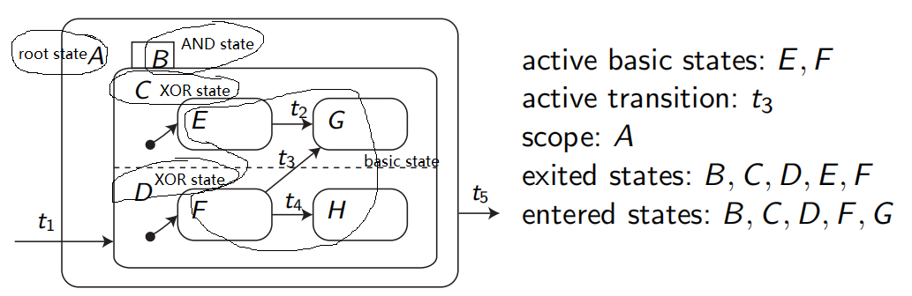

# CyberPhysicalSystems

## 一、Finine State Automata

static: 没有memory, 没有状态变量

deterministic: 同样的输入只有确定的下一个状态

输入事件，输出事件：$IE^{(n)}_i,OE^{(n)}_i$， n为大类，i为子类。

unique 输入输出事件：单独事件的组合，因为状态机只允许一个状态出现。unique输入事件要利用$IE^{(n)}_*$设定优先级。 
$$
\begin{array}{}
\tilde u_1=\{IE^{(2)}_1,IE^{(1)}_*,IE^{(3)}_*,IE^{(4)}_* \}
\\\tilde u_2=\{IE^{(4)}_1,IE^{(1)}_*,IE^{(3)}_* \}
\\\tilde u_3=\{IE^{(4)}_2,IE^{(1)}_*,IE^{(3)}_* \}
\\\tilde u_4=\{IE^{(3)}_1,IE^{(1)}_* \}
\\\vdots
\\\tilde u_7=\{IE^{(1)}_1\}
\end{array}
$$
\*代表忽略，*越多则中断等级高。\*越少的，优先级越低。unique输出事件直接组合OE即可。$\tilde y_1=\{OE^{(1)}_1,OE^{(2)}_1,OE^{(3)}_1\}$

Moore型与Mealy型状态机：Moore型输出只取决于当前状态，输出写在状态结点上;

Mealy型取决于当前状态与输入，输出写在输入Transition上。

不管是Moore型还是Mealy型，遇到没有定义的Transition时一般回到自己 (Self transition) 并输出空事件$\epsilon$

这样就可以写出State transition Table

## 二、Pretri-Net

适用于cocurrent事件，即多个状态同时发生且需要同步。

> 数学概念：FSA是Normal Graph，只有一种结点可以随便连。Petri-Net是Bipartite Graph，有两种结点、有方向。

这两种结点是Place与Transition。$\mathcal {PRE}:P\to T,\mathcal {POST}:T\to P $

**Token 令牌**： 当且仅当一个T的所有Pre-place令牌都到位时才会下一步，由此实现同步，即wait for each other

Transition激活称为Fire，每次Fire后k+1时刻p位置令牌数量m为：
$$
m(p,k+1)=\left\{\begin{array}{}
不变&，和T_1无关
\\-1&,在T_1上家
\\+1&,在T_1下家
\\不变&,自循环
\end{array}
\right.
$$
向量化表示所有Transition就要用到incidence matrix，
$$
N=\left.
\begin{bmatrix} 

-1&0&
\\1&0
\\1&-1&\cdots
\\0&-1
\\0&1
\end{bmatrix}\right\}places
\\初状态m_0+N\cdot\delta_0=次状态
\\\begin{bmatrix}1\\0\\0\\1\\0\end{bmatrix}+
N\cdot\begin{bmatrix}1\\0\\0\end{bmatrix}=\begin{bmatrix}0\\1\\1\\1\\0\end{bmatrix}
$$
存在三种Petri-Net：

* Place/Transition: 每个Place上可以有任意个令牌
* Condition/Event： 每个Place上有且仅有一个令牌
* Signal-Interpreted：Condition/Event加上输入输出

> P/E Petri-Net用法：共用资源
>
> 

Non-Deterministic：

* 一P对多T：任何网络都可能遇到，不知道接下来会触发哪个T
* 多T对一P：C/E网络中，由于一P最多就一个令牌，多个T也不能同时发射

Synchronization Graph：严格按照$T\to P\to T$的单一连接顺序 

#### Signal-Interpreted Petri-Net

在C/E Petri-Net的基础上：

* Trainsition 加上输入开关u
* Place 加上输出y

比起之前两种，又多了两条规则：

1. maximum step: 所有已满足条件（输入开关+令牌）的Transition均可发射
2. Iterative Firing：连环消消乐，遇到没有开关或者开关已满足的的Transition直接跳过，这些Transition永远不会被触发

**SIPN**有如下指标：

Reachable Set $\epsilon(m_0)$：从一个初态开始，所有可能的系统状态集合。

Reachability Graph：类似FSA，见下图。黑线是普通Petri-Net，一次只能触发一个Transition；红线是SI-Petri-Net，在前者的基础上，还可以同时激发多个Transition。

Conflict-Free Outputs：多个Place指向同一个输出时，输出不同（一个出0，一个出1）就会产生冲突。
$$
\begin{array}{c|ccc}
&0&1&-&c
\\\hline0&0&c&0&c
\\1&\cdot&1&1&c
\\-&\cdot&\cdot&-&c
\\c&\cdot&\cdot&\cdot&c
\end{array}
$$
Stability：由于IterativeFiring，如果一个输入会使得一个循环中所有开关都激活，就会导致无限循环。

检验方法：该循环中所有FireCondition并集为0。（比如$\neg u_2\and (u_2\and u_3)\implies0$）

Liveness：所有结点均可到达，所有Transition均有用

Deadlock：卡住或部分卡住

**Well-Defined**：Stable+Conflict-Free+Complete-Output+Deterministic Firing，此时可以与FSA互相转化。

## 三、Statecharts

有层级关系的FSA，主要特征是Superstate。比如紧急避险状态可能包含不少子状态，就不需要为它们一个个设置状态。

初始化：即使有Superstate存在，初状态仍要具体到某些子状态（Basic State）

每个层级都可以有一个H结点，用于保存退出时在这一层的结点信息。若没有则这一层存档丢失，要从默认结点开始。

XOR-State：这个状态中能有一个子状态激活

AND-State：同步状态用虚线分隔，被同步状态绑定的两个子状态激活联动。

1. StateCharts 可以在状态转移（类似Moore型）或收到输入（类似Mealy型）或保持状态时有输出。分别对应Entry, Exit, Throughout
2. 外部输入信号（希腊字母$\alpha,\beta$等）、内部的状态信号（$[in(A)], [NOT\ in(B)]$）、以及内部输出信号（大写拉丁字母ABC）都可以激发状态转移
3. 如果是内部信号激发的转移，则不消耗时间（$Still\ t_1$）
4. FSA输出信号只限于某个时间点，Petri-Net输出信号可以是连续时间，而Statecharts开关信号也可以连续。

Scope： 一条Transition的Scope为囊括它起点与终点的**最低一层XOR-Fashion**

当输入信号相同的两条Transition冲突时，执行Scope大的那条

## 四、Discrete Control

控制器Controller$\iff$ 工厂Plant

##### Controller For Non-deterministic FSA

前提是工厂的状态图已知

* 工厂彻底禁止某些事件 $Z_f$，连带和它们相连的所有Transition
* 对某些状态，只禁止某些输入 $\Omega_f=\{(Z_x,U_x),\cdots\}$
* 最后要到达目标事件 $Z_g$ goal

1. 禁止状态：$Z_2$

2. 删除Transition：只删除$z_2$的所有输入输出还不够。由于Non-deterministic，为了完全杜绝进入$Z_2$的可能性，必须ban掉所有$z_1$出发的$\tilde u_1$输入线，但只能禁止状态、没法禁止输入，因此$z_5$不幸也顺带被禁
3. 最后找一条起点至终点最短路径 $Z_1\to Z_3\to Z_8\to Z_9$ 或$Z_1\to Z_3\to Z_4\to Z_8\to Z_9$ ($Z_3$输入$\tilde u_2$时非Deterministic)

##### Controller For Petri-Net

* 禁止某些状态组合 Marking$\mathcal M_f$
* 禁止某些转移$\mathcal T_f$, 若不可控Transition（开关永远为1）被禁，还必须删除其Pre-Place
* 最后要到达某个 Marking $\bold m_g$

1. 题设$\mathcal T_f=\{T_6\}.\mathcal M_f=[**1****]$

2. $\mathcal M_f=[**1****]\cup[***1***]$

3. 转化为Reachability Graph

## 五、Discrete System Verification

## 六、连续系统建模与仿真

##### 非线性ODE解析解 Seperation of variables

$\frac{d\nu}{d\xi}=\tilde g(\xi)\tilde f(\nu)\implies\int\frac1{\tilde f(\nu)}d\nu=\int\tilde g(\xi)d\xi$

> e.g. $\dot h = -k\sqrt{h}$， 此时$\nu = h;\xi=t$（时间）                                                                                                                                                                                                                                                                                                                                                                                                                                                                                                                                                                                                                                                                                                                                                                                                                                                                                                                                                                                                                                                                                                                                                                                                                                                                                                                                                                                                                                                                                                                                                                                                                                                                                                                                                                                                                                                                                                                                                                                                                                                                                                                                                                                                                                                                                                                                                                                                                                                      
>
> $\therefore \tilde g(\xi)=1,\tilde g(\nu)=-k\sqrt{\nu}=-k\nu^{0.5}$
>
> $\implies \int-\frac1k\nu^{-0.5}d\nu=\int1\cdot d\xi\implies-\frac2k\nu^{0.5}+C_1=\xi+C_2$
>
> $\therefore \nu = \left[-\frac k2(\xi+C)\right]^2$
>
> 求初值：代入$\xi=0$, ;$v_0=(-\frac k2C)^2=h_0$

##### 线性时不变系统LTI 存在解析解

齐次解 $x^{(h)}(t)=e^{a(t-t_0)}x_0$

特解 $x^{(p)}(t)=\int_{t_0}^te^{a(t-\tau)}u(\tau)d\tau$

由于是线性系统，解析解就是两个解叠加

一维情况下：$x(t)=x^{(h)}(t)+x^{(p)}(t)$

##### 数字解法

* 欧拉法 $\dot x(t)=f[x(t)]$，$x(t_{k+1})=x(t_k)+\underbrace{(t_{k+1}-t_k)}_{步长h}\underbrace{f(x(t_k))}_{梯度}$
* Heun Method $\textcolor{red}{x(t_{k+1})}=x(t_k)+(t_{k+1}-t_k)\cdot \frac12\left[f(x(t_{k}))+f(\textcolor{red}{x(t_{k+1})})\right]$

为了得到$x(t_{k+1})$需要它本身的信息，这是不可能的，所以等式右边用欧拉法代替

$K_1=f(x(t_k)),K_2=f[x(t_k)+hK_1]$

$x(t_{k+1})=x(t_k)+h\cdot\frac12(K_1+K_2)$

* Runge-Kutta $x(t_{k+1})=x(t_k)+h\cdot \frac16(K_1+2K_2+2K_3+K_4)$
  $$
  \begin{array}{}
  K_1=f[x(t_k)]
  \\K_2=f[x(t_k)+\frac12hK_1]
  \\K_3=f[x(t_k)+\frac12hK_2]
  \\K_4 = f[x(t_k)+hK_3]
  \end{array}
  $$

这三种方法的误差呈指数级下降

$\left|\frac{x^e(t_k+h)-x(t_k+h)}{h}\right|\le C\cdot h^p$， 指数P越大，误差越小

欧拉p=1，Heun p=2，Runge p=4

## 七、分析连续系统

稳定条件：$\dot x(t)=A\cdot x(t)$，A所有特征值均$Re\lt0$

$\vec {\dot x(t)}=\bold A\vec x(t)+\bold B\vec u(t)\\\vec y(t)=\bold C\vec x(t)+\bold D\vec u(t)$

Controllability： $R=\begin{pmatrix}A&AB&A^2B&\cdots&A^{n-1}B\end{pmatrix}$ 若满秩则该系统完全可控（从任意状态到任意状态）

Observability：$O=\begin{pmatrix}C^T&A^TC^T&(A^T)^2C^T&\cdots&(A^T)^{n-1}C^T\end{pmatrix}$, 若满秩说明只看输入输出就可知状态。（单输出只要检察$det(O)\neq0$即可）

**拉氏变化：**

$sX(s)=AX(s)+BU(s)\implies X(s)=(sI-A)^{-1}BU(s) \\Y(s)=CX(s)+DU(s)\implies \underbrace{\left[C(sI-A)^{-1}B+D\right]}_{G(s)}U(s)$

传递函数为$G(s)=C(sI-A)^{-1}B+D$， 一维情况下$G(s)=\frac{cb}{s-a}+d$

初值定理与终值定理：
$$
\lim_{t\to 0}f(t)=\lim_{s\to\infty}sF(s)
\\
\lim_{t\to\infty}f(t)=\lim_{s\to0}sF(s)
$$
**非线性系统稳定的条件**

Lyapunov function $\dot V(x)\le0$

仍用线性系统举例：MSD系统，设$s_0=0,u=0$
$$
\dot x_1=x_2
\\\dot x_2=\frac 1m(-cx_1-d(x_2))
$$
V 一般选取能量，此例中，动能$T=\frac12mx_2^2$, 弹簧势能$P=\frac12 cx_1^2$

$V=T+P=\frac12mx_2^2+\frac12 cx_1^2$
$$
\begin{array}{}
\dot V = \frac{\partial V}{\partial x}\cdot \frac{dx}{dt}
\\=\begin{pmatrix}cx_1&mx_2\end{pmatrix}\begin{pmatrix}\dot x_1\\\dot x_2\end{pmatrix}
\\=cx_1x_2+mx_2\frac1m(-cx_1-dx_2)
\\=-dx_2^2\lt0
\end{array}
$$

## 八、 单输入单输出系统

$$
\begin{array}{}
G_{YR}=\frac{G_C\cdot G_P}{1+\underbrace{G_CG_PG_S}_{G_0}}=\frac{G_CG_P}{1+G_0}
\\G_{YW_1}=\frac{G_P}{1+G_0}
\\G_{YW_2}=\frac1{1+G_0}
\\G_{YW_3}=\frac{-G_0}{1+G_0}
\end{array}
$$
**PID 控制器**

$U(s)=(K_p+sK_d+\frac{K_I}{s})E(s)$

PD控制器可以稳定系统，但存在稳态误差$\lim_{t\to\infty}y(t)-r(t)=\lim_{s\to0}s\cdot(Y(s)-R(s))=\lim_{s\to0}s\cdot(G_{YR}-1)R(s)$

可以引入$K_I$来消除稳态误差：

$G(s)=\large{\frac{K(1+b_1s+\cdots+b_ws^w)}{s^m(1+a_1s+\cdots+a_us^u}}$，如果本身有一个极点就不需要$K_I$，只有分母上没有S的0态系统需要额外加一个S在分母上。