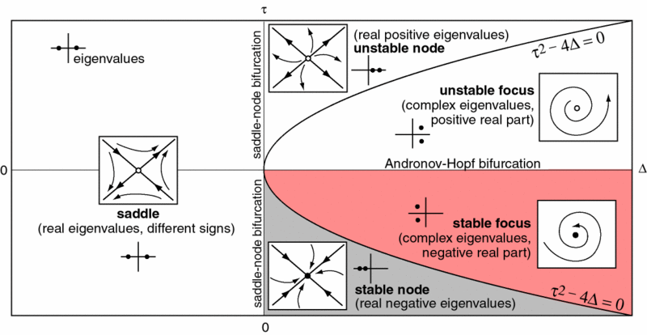
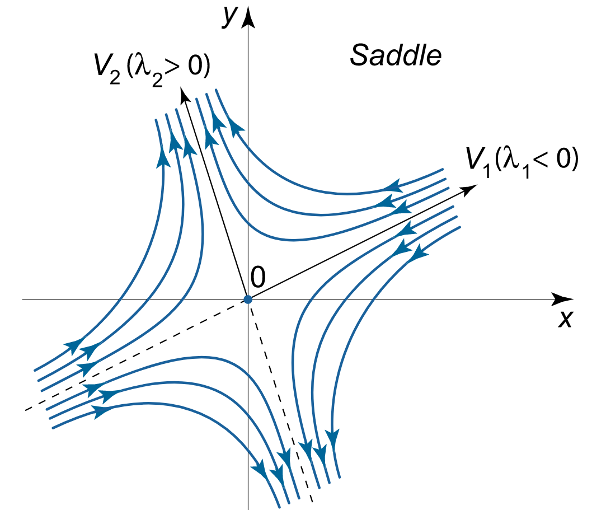

# Dynamische System

## 第一章 线性化

状态微分方程 $\dot {\vec x}=f(\vec x,\underbrace{\vec u}_{外部输入},\underbrace{t}_{时间})$，没有外部输入称为autonomous,没有时间称为time invariant时不变系统

输出微分方程$\vec y=h(\vec x,\vec u,t)$

control affine system: $\dot{\vec x}=\underbrace{f(\vec x)}_{非线性}+\underbrace{G(\vec x)}_{非线性}\underbrace{\vec u}_{线性}$

#### 线性化

在稳态点附近线性化：Reference point
$$
\begin{split}
\vec{\dot x(t)}+\Delta\vec{\dot x(t)}=\underbrace{f\left(\vec{x^*(t)},\vec {u^*(t)}\right)}_{稳态点}&+\frac{\partial f_i}{\partial \vec x_j}|_{x^*,u^*}\cdot\Delta\vec x(t)
\\&+\frac{\partial f_i}{\partial\vec u_j}|_{x^*,u^*}\cdot\Delta \vec u(t)
\\&+\frac{\partial f_i}{\partial\vec z_j}\Delta z(t)\ 扰动项
\end{split}
$$

在reference trajectory上线性化：将$\vec x^*(t)$替换为对应的$x$函数

> （例）练习1题2：设$m\ddot z+a\cdot\dot z^2=u\cdot(V-\dot z)$ ($\star$式)
>
> 输出$y=\ddot z$
> $$
> \begin{array}{}\vec x=\begin{bmatrix}z(位置)\\\dot z(速度)\end{bmatrix},
> 则\vec {\dot x}=\begin{bmatrix}\dot x_1\\\dot x_2\end{bmatrix}
> =\begin{bmatrix}x_2\\\frac1m(-ax_2^2+u(V-x_2))\end{bmatrix}\\
> \Delta\dot x=\begin{bmatrix}0&1\\0&\frac1m(-2ax_2^*-u^*) \end{bmatrix}\cdot\Delta \vec x+\begin{bmatrix}0\\\frac1m(V-x_2)\end{bmatrix}\cdot\Delta\vec u
> \\
> \Delta y=\begin{bmatrix}0&\frac1m(-2ax_2^*-u^*)\end{bmatrix}\cdot\Delta \vec x+(\frac1m(V-x_2^*))\cdot\Delta\vec u
> \end{array}
> $$
> 若给定位置$z(t)=1-\cos\Omega t$，则速度为$\dot z(t)=\sin\Omega t\cdot\Omega$，此时
> $$
> \begin{array}{}
> &\vec x^*=\begin{bmatrix}1-\cos\Omega t\\\Omega\cdot\sin\Omega t\end{bmatrix}\\
> 代入\star式得：&\vec u^*=\frac{m\Omega^2\cos\Omega t+a\cdot(\Omega\sin\Omega t)^2}{V-\Omega\sin\Omega t}
> \\将两者代入\Delta y式即得&沿Reference\ Trajectory
> \end{array}
> $$

#### Phase Protrait Analysis

步骤：

1. 找稳态点EP，令$\vec{\dot x}=0$
2. 算Jacobian矩阵，得状态转移矩阵$A$
3. 算$A$的特征值，$\det(\lambda I-A)=0$
4. 算特征向量，$\lambda\nu=A\nu\implies(A-\lambda I)\cdot\nu=0$
5. 由特征值与特征向量判断稳态点EP的类型
6. 画出phase protrait

> 二维情况下，稳态点类型分析：
>
> * 两个实数$\lambda$，
>   * 均正：不稳定Node
>   * 均负：稳定Node
> * 两个虚数$\lambda$，
>   * 实部为正：不稳定Spiral
>   * 实部为负：稳定Spiral
>   * 判断Spiral正逆时针方向：看$A$中$a_{21}$的正负，$a_{21}\left\{\begin{array}{}\gt0，逆时针\\\lt0，顺时针\end{array}\right.$
> * 两个实数一正一负$\lambda$，是Saddle，
>   * $\lambda$对应的$\nu$的方向即为Saddle两条渐近线的方向
>   * $\lambda$正的渐近线向外。$\lambda$负的渐近线向内。

## 第二章 非线性系统的稳定 Lyapunov

两个前提条件：

1. 是自动系统 (autonomous system)，没有外部输入$u$，即$\vec {\dot x}=f(\vec x,t)$

2. 存在local/global unique solution，充分条件：$f(\vec x,t)$连续并持续可导

#### Lyapunov Direct Method

> 从能量角度看，如果一个系统一直在损失能量，那么最后一定是稳定的

* 稳态点EP必须为零或可以转化为零，即$\vec x^*=0$，或$\vec x^*=2,z=x-2,z^*=0$
* $V(\vec x)$ 正定。即$V(\vec x)=\left\{\begin{array}{}0，&当且仅当\vec x=0\\\gt0,&当x\neq0\end{array}\right.$
* $\dot V(\vec x)$ 负定或半负定。即$\dot V(\vec x)=\left\{\begin{array}{}0，&当且仅当\vec x=0\\\underbrace{\lt0}_{负定}或\underbrace{\le0}_{半负定},&当\vec x\neq0\end{array}\right. $

> $\dot V(\vec 0)=0$必须满足$\vec x=0 $，即$\begin{pmatrix}x_1\\x_2\end{pmatrix}=\begin{pmatrix}0\\0\end{pmatrix}$，即每一个元素都是0
>
> 比如，若$\dot V(x_1,x_2)=-x_2^2\le0$也叫半负定（negativ semi-definite），因为$\exist \vec x\neq\vec0$使得$\dot V(x_1,0)=0$，如$\dot V(\underbrace1_{x_1\neq0},0)=0$

推论：

局部稳定：$\begin{array}{}V(\vec x)正定\\\dot V(\vec x)半负定\end{array}$ 局部渐近稳定：$\begin{array}{}V(\vec x)正定\\\dot V(\vec x)负定\end{array}$

全局稳定的附加条件：

* radially unbounded，即$||\vec x||\to\infty\implies V(\vec x)\to\infty$

* $\vec x^*=0 $为全局唯一稳态点

Uniform: $V(\vec x)$与时间$t$无关、独立。$V(\vec x,t)$descrescent

#### LaSalle Invariante Principle

适用于$V(\vec x)$非正定，也可以分析局部稳定性。有三个条件：

* $V(\vec x) $持续可导，即可以写出$\dot V(\vec x)$
* 在invariant集$\Omega $中，$\dot V(\vec x)\le0$
* $\varepsilon=\{\vec x\in\Omega|\dot V(\vec x)=0\}$

$\vec{\dot x}=f(\vec x)$从$\Omega$开始，最后必定收敛于$\mathcal M=\varepsilon$中最大invariant集

若$\mathcal M$只包含EP $\vec x^*=0 $点则为局部渐近稳定(asymptotisch stabil)

如果再加上radial unbounded条件即为全局渐近稳定(global asymtotisch stabil)

#### Lyapunov Indirect Method

在稳态点$\vec x^*$附近线性化，只适用于时不变系统(Zeit invariant)

* 要求$f(\vec x)$两次可导
* 任意稳定点$\vec x^*$

步骤：

1. 线性化：$\vec {\dot x}=A\vec x$，$A=\left[\frac{\partial f}{\partial \vec x}\right]_{\vec x=\vec x^*}$

2. 求特征值：$\det(\lambda I-A)=0$

3. 观察特征值：$\begin{array}{}所有\lambda实部均小于零，&\forall i,Re\{\lambda_i\}\lt0\implies局部渐近稳定\\有一个\lambda实部大于零，&\exist i,Re\{\lambda_i\}\gt0\implies局部不稳定\\有一个\lambda实部等于零，&\exist i,Re\{\lambda_i\}=0\implies说不清\end{array}$