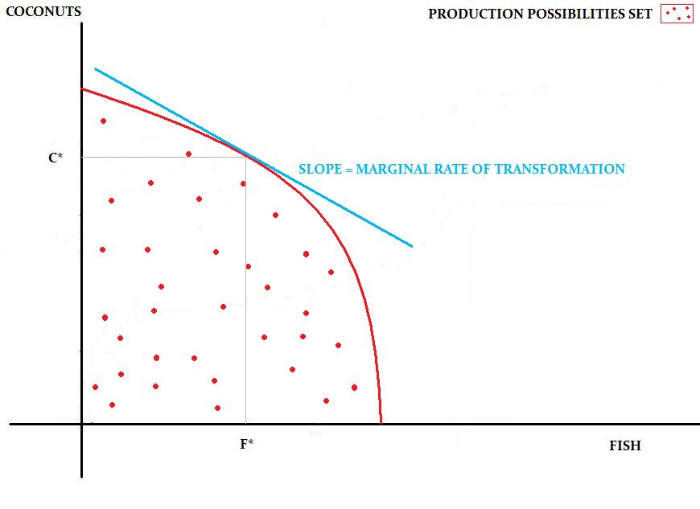
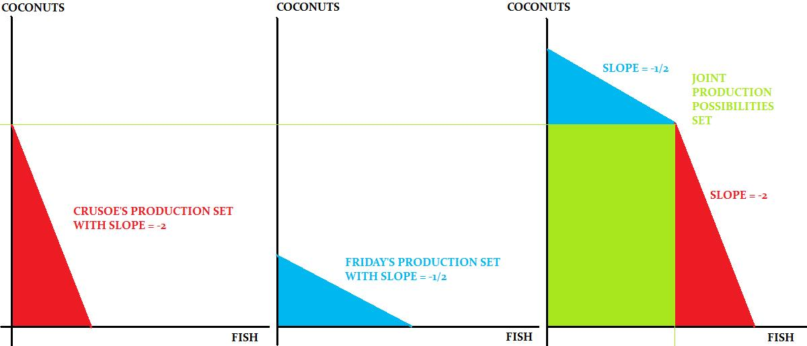
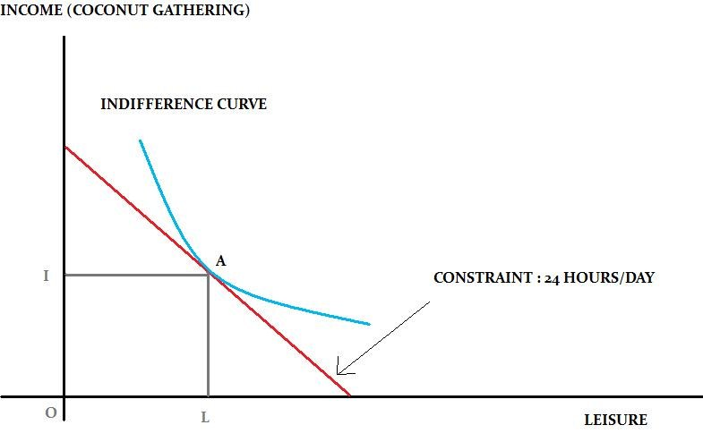

# 经济学原理

考试：120分钟，120分值，共40道选择题

## 第一章 引入

绝对优势(absolute advantage)：消耗更少资源

相对优势(comparative ~)：更少机会成本

**转换曲线transformation curve**: 假设一个人只生产两种货物A与B，而且时间是有限的，那么多生产一个A就少生产几个B，并且呈线性关系

> （例）练习1题1：设每一小时，Jack生产1kg鱼或者$\frac14$kg酒; Will 生产$\frac15$kg鱼或$\frac15$kg酒 
>
> $$
> \begin{array}{}
> 绝对成本（时间）&Fish&Rum
> \\\hline 
> Jack&1&4\\
> Will&5&5
> \end{array}
> $$
> $$
> \begin{array}{}
> 机会成本&Fish&Rum
> \\\hline 
> Jack&\frac14&4\\
> &\wedge&\vee\\
> Will&1&1
> \end{array}
> $$
>
> 虽然Jack全方位碾压Will, 但是在每个人时间有限的情况下，让Will去做Jack相对不擅长的事（Will机会成本小），这样jack可以省出时间做价值更高的事(Fish)

通过交易可以把饼做大，共同获益

**Joint Curve**: 只有两个人的情况下，折点为两人只做自己机会成本小的事。最后出来的图一定是bend-out的，代表总生产力提高了。

两种货物、多个人的情况下，先假设所有人都只生产货物A，然后让生产B机会成本低的先耗尽时间。

**怎么判断交易是否合理?** 看交易价格是否落在两人机会成本之间（造不如买）。

## 第二章 消费与要求（消费者角度）

## 第三章 生产与供应（生产者角度）

## 第四章 完美竞争

## 第五章 市场失灵

## 第六章 宏观经济指标

## 第七章 经济增长

## 第八章 经济波动

