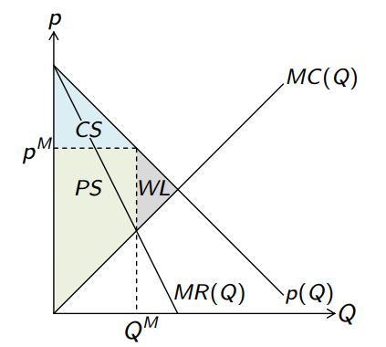
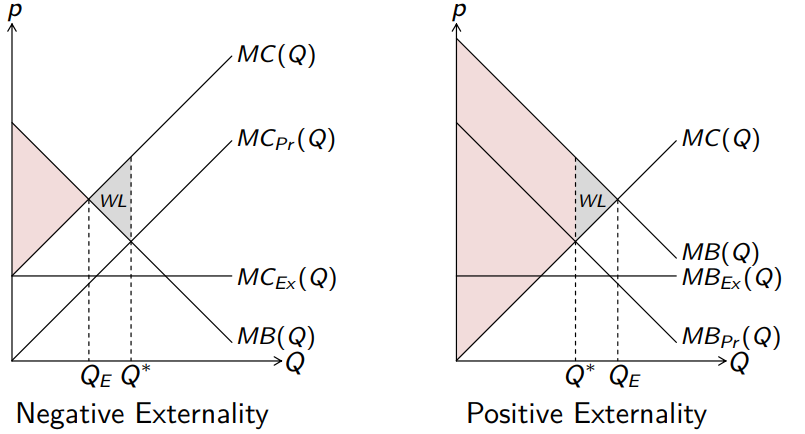

# 经济学原理

考试：120分钟，120分值，共40道选择题

## 第一章 引入

绝对优势(absolute advantage)：消耗更少资源

相对优势(comparative ~)：更少机会成本

**转换曲线transformation curve**: 假设一个人只生产两种货物A与B，而且时间是有限的，那么多生产一个A就少生产几个B，并且呈线性关系

> （例）练习1题1：设每一小时，Jack生产1kg鱼或者$\frac14$kg酒; Will 生产$\frac15$kg鱼或$\frac15$kg酒 
>
> $$
> \begin{array}{}
> 绝对成本（时间）&Fish&Rum
> \\\hline 
> Jack&1&4\\
> Will&5&5
> \end{array}
> $$
> $$
> \begin{array}{}
> 机会成本&Fish&Rum
> \\\hline 
> Jack&\frac14&4\\
> &\wedge&\vee\\
> Will&1&1
> \end{array}
> $$
>
> 虽然Jack全方位碾压Will, 但是在每个人时间有限的情况下，让Will去做Jack相对不擅长的事（Will机会成本小），这样jack可以省出时间做价值更高的事(Fish)

通过交易可以把饼做大，共同获益

**Joint Curve**: 只有两个人的情况下，折点为两人只做自己机会成本小的事。最后出来的图一定是bend-out的，代表总生产力提高了。

两种货物、多个人的情况下，先假设所有人都只生产货物A，然后让生产B机会成本低的先耗尽时间。

**怎么判断交易是否合理?** 看交易价格是否落在两人机会成本之间（造不如买）。

## 第二章 消费与要求（消费者角度）

假设有两种货物，$q$为数量，$p$为价格。而且消费者没有议价能力。预算$y=p_1q_1+p_2q_2$

个人最优解inidividual optimal: 花完所有的钱，达到最大效益(Utility)
$$
\begin{array}{}最大化&U(q_1,q_2)
\\s.t.&y=p_1q_1+p_2q_2
\end{array}
$$

#### Utility function

引入效益函数(Utility function)模拟用户的喜好

> 数字只有序数意义（顺序有意义），没有基数意义（数字本身大小无意义）, e.g. 效益10比效益5要好，但不能说效益10是5效益的两倍那么好

效益函数画成图像就是等优曲线(indifference curve)。等优曲线总是一条下陷的曲线。

> 心理学假设：一种货物多了就会想要另一种。

两个必须特征：

* Complete: 不同的两个Perference Bundle 总能两两比较，并给出优先级$A\prec B,A\succ B或A\sim B$。图形上每个消费组合(comsumption bundle)均在某条等优曲线上。
* Consistent/Transitive: 逻辑上通顺，如$A\succ B,B\sim C\implies A\succ C$。反应到图形上就是等优曲线不能相交。

还有两个特征不是必须的，甚至可能互斥：

* Monotonicity: 货物的数量越多总是越好。但必须是两种货物都比原来多（soft assumption），只多一种不算。推论：等优曲线总是负斜率的。
* Convexity: 均数*至少*和两个原数一样好。即$C=\lambda A+(1-\lambda)B\succeq A或B,\lambda\in(0,1)$.

> （例）练习2题3：$A=(8,2),B=(2.8)$,则两者的均数为$D=(5,5)$，由convexity得$D\succeq B$。若已知$C=(6,6)$且$B\succ C$，则由transitivity得$D\succ C$。但是monotonicity得$D(5,5)\prec C(6,6)$. 可知在这种情况下，monotonicity和convexity互斥。

#### Optimal Consumption Bundle

最优的消费组合：等优曲线勉强和预算线(Budget Line)相切，称为tagent solution

如何求这个切点（求此时$q_1,q_2$分别为多少）? 这可以转化为拉格朗日优化问题
$$
\begin{array}{rl}
\begin{split}\mathop{maximize}_{q_1,q_2}\end{split} & U(q_1,q_2)\\
s.t.&y-(p_1q_1+p_2q_2)\ge 0\\
\end{array}
\\转为
\mathcal L=U(q_1,q_2)+\lambda(y-p_1q_1-p_2q_2)\\
\left\{\begin{array}{}
\frac{\partial \mathcal L}{\partial q_1}=\frac{\partial U}{\partial q_1}-\lambda p_1\triangleq 0
\\\frac{\partial \mathcal L}{\partial q_2}=\frac{\partial U}{\partial q_2}-\lambda p_2\triangleq0
\end{array}\right.
\implies\left\{\begin{array}{}
\lambda=\frac{\partial U}{\partial q_1}/p_1
\\\lambda=\frac{\partial U}{\partial q_2}/p_2
\end{array}\right.
$$

> 可得：$\large{\frac{\partial U}{\partial q_1}\over{p_1}}={\frac{\partial U}{\partial q_2}\over p_2}$，即在这个平衡点上，要是多花一块钱在任何一种货物上，所获的效益都是相同的。若此条件不成立，就一定不是最优点（会减少一种货物而去买另一种）

切点处具有两个特征：

1. 落在预算线上$\therefore y=p_1q_1+p_2q_2$
2. 斜率相同$\therefore \frac{\partial U/\partial q_1}{\partial U/\partial q_2}\triangleq MRS_{1,2}=\frac{p_1}{p_2}$ expense rate=utility rate (marginal rate of substitution)

#### 货物的特征Charactise

1. Normal/Inferior

normal: 预算多时消费也多，$\frac{dq_i}{dy}\gt0$

inferior: 预算更多时消费反而少，$\frac{dq_i}{dy}\lt0$

> 比如垃圾食品、公共交通、主食（不吃肉只吃土豆）

2. Ordinary/Giffen

Ordinary: 价格上涨时消费量下降，$\frac{dq_i}{dp_i}\lt0$

Giffen: 价格上涨时消费量反常上升，$\frac{dq_i}{dp_i}\gt 0$

> 为何会出现Giffen商品? 因为代偿作用总是用相对廉价的货物来代替贵的货物。一种商品涨价导致了总购买力降低，而当该商品代偿作用过强时就反而超过原来消费量。比如，土豆涨价吃不起肉了，为了吃饱要买更多比例的土豆→土豆消费量上升。
>
> Giffen商品一定是Inferiro商品

3. Subsitution/Complement

Substitution代替商品: 货物1涨价会消耗更多货物2，$\frac{dq_j}{dp_i}\gt0$

> 两种货物其实无所谓要哪一种，比如葵花油和菜籽油。一种涨价了就去买另一种。

Complement配对商品：货物1涨价使货物2消费量也下降，$\frac{dq_j}{dp_i}\lt0$

> 两种货物一定是配对地使用的，比如当网球涨价，网球拍就会买得少了。

==分析三种属性用一个公式即可：写出$\underbrace{q_i}_{数量}\left(\underbrace{p_i}_{自己价格},\underbrace{p_j}_{另一货物价格},\underbrace{y}_{总预算}\right)$，然后求对三个元素的导数==

#### 价格变化效果的分解 Price Effect Decomposition

货物涨价带来两个作用：

1. 收入效应——购买力减少
2. 代偿效应——用廉价物品代替昂贵物品

分解步骤：

1. 先看代偿作用——假设预算增加到能达到原来的效益Ulitity，用现在的预算线平移出去和原效益曲线相切。从$C$点到$\tilde C$。
2. 再看收入作用——从$\tilde C$到$C'$

> 定量计算$\tilde C,C'$的具体位置需要用到效益函数。
>
> （例）练习2题4：$U(q_1,q_2)=(q_1\cdot q_2)^{\frac12}$，则可以联立公式$\left\{\begin{array}{}y=p_1q_1+p_2q_2\\\frac{\frac12q_1^{-\frac12}q_2^\frac12}{\frac12q_1^{\frac12}q_2^{-\frac12}}=\frac{p_1}{p_2}\implies\frac{q_2}{q_1}=\frac{p_1}{p_2}\end{array}\right.$
>
> 得$y=p_1q_1+p_2\cdot\frac{p_1}{p_2}q_1=2p_1q_1\implies q_1=\frac{y}{2p_1}$，同理$q_2=\frac{y}{2p_2}$，代入具体数值可以求$C$和$C'$点
>
> $\tilde C$点是一个辅助点，效益和$C$点一样。$U'(\tilde q_1,\frac{p_1}{p_2}\tilde q_1)=原来U$，即算出现在$\tilde q_1$,同理算出$\tilde q_2$

## 第三章 生产与供应（生产者角度）

假设有一个工厂，$q$为产品数量，$L$为劳动力数量，$K$为其生产资料。

则其生产成本为$c=wL+rK$，毛收入为$R(q)=p\cdot q$，其中$p$为货品的单价，为固定值不会变

#### production function (isoquant)

> iso - same, quant - quantity, isoquant意为同样数量

$q=F(L,K)$，确立投入与产出的关系，即给定数额的劳动力与生产资料，该工厂可以生产多少产品。可以类比为上一章的等优曲线。等产量曲线的两个假设：

1. monotonicity: 当$K,L$ **均**增加时，$q$也增加
2. convexity

>  等产量曲线和等优曲线不同，没有complete与transitive的假设。因为在等产量曲线上，$q$是产品数量，是一个具体的数字，可以直接量化比较。而非一个捉摸不定的心理衡量值。

##### 规模效应 Return to Scale

一个现象：产出与投入并非线性关系
$$
F(\lambda L,\lambda K)=\lambda^{\alpha}q
\\\left\{\begin{array}{}
increasing\ RS，&当\alpha\gt 1
\\constant\ RS，&当\alpha=1
\\decreasing\ RS, &当\alpha\lt1
\end{array}\right.
$$

#### 成本最小优化问题 cost min

此处优化问题和上一章反过来，生产往往给定了生产数量$q$，而一所工厂的成本可以认为是没有上限的（有利润就可以扩大规模），即：
$$
\min\ c=wL+rK
\\s.t. \ q=F(L,K)
$$
最优点的两个特征：

1. 一定在等产量曲线上
2. 是等产量曲线与等成本线的切点

$$
MRTS_{r,k}=\frac{\partial F/\partial L}{\partial F/\partial K}=\frac wr
$$

> MRTS: Margin Rate Technical Substitution
>
> （例）练习3题2：$q=F(L,K)=L^{\frac12}K^{\frac12},w=r=2.5$
>
> 计算最优点K，L的比例：$\frac{\partial q/\partial L}{\partial q/\partial K}=\frac{\frac12L^{-\frac12}K^{\frac12}}{\frac12L^{\frac12}K{-\frac12}}=\frac KL\mathop{=}\limits^{!}\frac wr\implies K=\frac wr\cdot L,\ L=\frac rw K$
>
> 代入isoquant：$q=L^{\frac12}(\frac wrL)^{\frac12}=(\frac wr)^{\frac12}L\implies L=(\frac rw)^{\frac12}q$，同理$K=(\frac wr)^{\frac12}q$
>
> 这样就得到了最低浮动成本的公式：$\therefore c(q)=wL+rK=2(wr)^{\frac12}q$
>
> $w=r=2.5$时，$c(100)=2\times2.5\times100=500$
>
> $w=10,r=2.5$时，$c(100)=2\times(2.5\times10)\times100=1000$

#### 利润最大问题 profit max

平均（浮动）成本：浮动成本除以产量，即$ac(q)=\frac{c(q)}{q}$

平均总成本：总成本（固定成本+浮动成本）除以产量，即$AC(q)=\frac{C(q)}{q}=\frac{c^f+c(q)}{q}=\frac{c^f}{q}+\frac{c(q)}{q}$

> 固定成本：与生产规模无关的付出，比如科研、广告、许可证等……

边际成本（Marginal Cost）：多生产一个单位所需要的成本，$MC(q)=\frac{dC(q)}{dq}$

边际收入（Marginal Revenue）：当货物的价格不会变动时，$MR(q)=\frac{pq}{q}=p$

##### 短期生产 short-run

总成本为$C(q)=\underbrace{c^f}_{沉没成本}+c(q),q\ge0$, 即不论生产量为多少，固定成本都已经付出去了，短期内生产可能只是为了少亏。

两阶段问题：

1. 应该生产吗? 价格只要大于平均浮动成本就会开始生产：$p\mathop{\ge}\limits^{?}\frac{c(q)}{q}$，$q$从$p=MC(q)$得出

2. 那么该生产多少呢? 临界点：$MR(q)=MC(q)\implies p=MC(q)$

那么该生产多少

##### 长期生产 long-run

总成本为$\left\{\begin{array}{}c^f+c(q),&q\gt0\\0,&q=0\end{array}\right.$，即如果根本不生产任何产品，不参加竞争就没有开销

两阶段问题：

1. 应该生产吗? $p\mathop{\ge}\limits^{?}\frac{C(q)}{q}=\frac{c^f}{q}+\frac{c(q)}{q}$，同样，这个$q$一定等于$p=MC(q)$计算出的值
2. 生产的话，生产多少? $p=MC(q) $

价格过低时，长期生产会停止。给多少价格才能让长期生产持续下去?  临界点：$MR=MC=AC\implies p =MC=AC$

$MR=MC$ 是收入最大点，$MC=AC$是成本最少点。在极限情况下，最低成本=最大收入，即一进一出并没有赚也没有亏，这是开始生产的临界条件。

## 第四章 完美竞争

#### 市场稳态点 Market Equilibrium

这一章使用的模型的几个假设

1. 所有人均为price taker，即按市场给定价格买进卖出
2. 只有一种商品，而且每个生产商的货物质量全部一样
3. 市场透明，只有一个价格
4. 生产商的边际成本是递增的
5. 生产商的数量为自然数$\in N$ （非负整数）

令货物需求量为$Q^D$，货物生产量为$Q^S$。在市场稳态点，生产量与消费量相同$Q^D=Q^S$，并且消费者的预期价格和生产商的最后一件货物的边际成本相同$p(Q^\star)=MC(Q^\star)$

> 根据经济学的经验规律，价格越高时，生产越多，消费越少。价格越低时反之。

> （例）练习4题1：设货物需求量为$Q^D(p)=a - p$，厂家生产商品的成本为$C(q)=\left\{\begin{array}{}c^f+q^2,&q\gt0\\0,&q=0\end{array}\right.$，求市场中生产商的数量，以及他们的利润。
>
> 厂家边际成本为$MC(q)=2q$，平均总成本为$AC(q)=\frac{c^f}{q}+q$
>
> 货物需求数量已经给出，只要求货物供应数量。这和上一章差不多，对生产商来说永远有两个问题：
>
> 1. 要不要开始生产? 临界条件：$MC=AC\implies 2q=\frac{c^f}{q}+q\implies q=\sqrt {c^f}$ ，结合问题2的$p=2q$得临界价格为$p=2q = 2\sqrt{c^f}$
> 2. 生产的话生产多少? 临界条件：$MC=p\implies 2q = p\implies q = \frac p2$
>
> 因此市场上$n$家同质的公司的总供应量为：$Q^S(p)=\left\{\begin{array}{}n\cdot\frac p2&p\ge 2\sqrt{c^f}\\0,&p\lt2\sqrt{c^f}\end{array}\right.$
>
> 市场临界的稳态点为
> $$
> \begin{array}{}&Q^D=Q^s
> \\&\equiv a-p = \frac{n\cdot p}2
> \\代入厂家开始生产的临界价格&\equiv a-2\sqrt{c^f}=n\frac{2\sqrt{c^f}}{2}
> \\&\implies n = \frac{a}{\sqrt{c^f}}-2
> \\厂家数量必须为非负整数：&n^\star=\max\{\lfloor\frac{a}{\sqrt{c^f}}-2\rfloor,0\}
> \end{array}
> $$
> 代入具体数字：（ⅰ）当$a=120,c^f=100时，n^\star=\frac{120}{10}-2=10$, 已经是一个自然数，说明此时的市场已经在临界稳态点，所有的厂家利润均为0,即$\pi^\star=0$
>
> （ⅱ）$a=126,c^f=100时，n=\frac{126}{10}-2=10.6\approx10$ 只有当理论厂家数量不是整数时，厂家才有盈利空间。
>
> **注意**此时货物的价格不再是厂家开始生产的临界价格了，而要代入到市场中去算：$Q=a-p=n\cdot\frac p2\implies 货物价格p=a/(\frac{n}2-1)=126/(\frac{10}2-1)=126/6=21$, 而货物交易数量为$\frac p2=10.5$。 
>
> 全部厂商的盈利总额为$\pi^\star=pq-(c^f+q^2)=21\times10.5-(100+10.5^2)=10.25$

#### 计算市场的Welfare

在达到最大交易量之前，认为每交易一件商品，消费者和生产者都是赚的，市场上总Welfare增加：消费者因为商品价格低于预期觉得赚，生产者多卖了产品也是赚。两者的Surplus相加就是市场的总Surplu，表现在图形上是两个三角的面积。

> Welfare只关心效率（怎么把饼做大），而不关心公平（怎么分配）

#### 引入价格限制

最高限价：$p'\lt p^\star$，产量偏少，价格偏低（消费者愿意付更多钱获更多产量）

最低限价：$p''\gt p^\star$，产量偏少，价格偏高???

#### 引入税收

在消费侧或者供给侧，每件商品收$t$的税，总税收为$T=t*Q$

收税使得消费者预期支付价格降低，或使生产者的成本上升。$t = p(Q_t^\star)-MC(Q_t^\star)$

> 不论税加在谁头上，效果是一样的。若加在消费一侧，购买欲望降低，生产商就会减少生产;加在生产一侧，直接导致商品涨价，消费者就会少买。
>
> 消费、生产两方支付的税金和自身曲线的斜率有关，斜率越大的付的税越多。
>
> 税收使得市场上的总交易量降低，且降低的效益比收上来的税多（有损失WL）

## 第五章 市场失灵

market failure: 所有使得市场上welfare减少的特殊情况

#### 一、 垄断 monopoly

假设：垄断知道市场需要量和价格曲线，可以随意设定价格，但是卖给所有人都是同一个价格

垄断者的目标也是最大化利润，与之前不同的是其盈利完全由市场需求曲线决定：
$$
\max_Q\pi(Q)=\underbrace{R(Q)}_{=p(Q)* Q}-C(Q)
$$
其中，$p(Q)$ 为 inversed market demand， 是一个关于Q的函数

**市场稳态点：** 1. MR(Q) = MC(Q)， 在此临界点上赚最多

2. 生产量=消费需求量，且$p(Q)\neq MR(Q)$
3. 垄断者可接受的最高固定成本为盈利全用来付固定成本，即$p(Q)*Q-C(Q)=0$

> 对垄断者来说, MR(Q) 一定不等于p(Q)， 且一定小于p(Q)
>
> 设$p(Q)=a-Q$，则$R(Q)=p(Q)*Q=aQ-Q^2$, ∴$MR(Q)=\frac{dR(Q)}{dQ}=a-2Q\lt a-Q$，$Q\gt0$

> 当垄断者知道自己可以操纵价格的时候，他一定会通过少卖制造稀缺性、抬高价格。如此一来，虽然销售额少了，但是单价提高，总利润提高。
>
> 反映到图上，producer surplus 的形状变为梯形，其面积大于原来的三角（上一章）。而消费者的consumer surplus 面积缩小，消费者吃亏。
>
> 实际起作用的还是p(Q) 和 MC(Q)两条线，MR(Q)只是辅助线，帮助垄断确定对其最有利的销售额和售价。

限高价的影响：

1. 限价之后，垄断者就像普通price taker一样，只能按指定价格出售，此时销售额由$MR(Q)=p\gt MC(Q)$确定。因为降低价格后，垄断者每件商品赚的本来就比原来预期的少了，再在此时的销售额上多生产一件商品他都是亏的，$MR(Q)\lt MC(Q)$，所以不会生产。
2. 将价格限定在原来正常市场价就可以消除垄断者带来的welfare损失

3. 限高价也可能导致$p\lt AC(Q)$，企业纯亏，不愿生产
   * 极限情况：限价$p=AC(Q)$
   * 限价于$p=MC(Q)$，企业刚好能赚回浮动成本但，赚不回固定成本。固定成本由政府补贴（subsidice）
   * 国有企业，无所谓损失

垄断为什么存在呢? 有以下几点原因：

1. 自然垄断：当固定成本太高，以至于多家公司的营运成本大于一家垄断公司的成本。$C(Q)\lt\sum_{i}^nC(q_i)$
2. 专利垄断：当研发成本高昂，为了保护创新者积极性，也是保护未来市场。

#### 二、外部效应 externality

第四章中不考虑消费与生产行为对其它人的影响。外部效应可以是正面或负面的。
$$
负效应(cost)：MC(Q)=MC_{private}(Q)+MC_{external}(Q)\\
正效应(benefit)：MB(Q)=MB_{private}(Q)+MB_{external}(Q)
$$

> 关键是自己考虑自己对别人带来的坏影响，从而自我规制。而不是考虑别人对自己的坏影响。

> （例）E5P5-8：有两家企业，每家企业的成本为$C(q_i)=15+\frac1{100}q_i^2+\frac15q_j$，即一家企业的生产会给另一家带来负面影响。
>
> 则每家企业在决定生产量时，要考虑到自己对别人的负面影响而少生产：
> $$
> \frac{\partial\pi}{\partial q_i}=p-(\frac2{100}q_i+\frac15)
> $$

#### 三、共享商品 public goods

共享商品有两个特点：

1. non-rivaly: 不随人们的消费而消耗
2. non-excludability: 所有人都可获得并消费

> 比如：电台，烟花

free-rider problem: 这样的商品只要一人付出所有人都得利，结果就是没有人愿意付出，或者原本所有人齐心协力能做得更好，但只有一人付出（效率低）。可以由政府牵头来办。

## 第六章 宏观经济指标

这一章是宏观经济的导言。

#### 一、GDP国内生产总值

有三种测算方法：

1. 产出法（output）：国内产出货物的市场价值，不论这些货物是由谁生产或者借用了谁的生产资料。$Y=F(L,K)$。
2. 收入法（income）：$Y=wL+rK$ 即劳动者报酬+生产资料折价。
3. 支出法（Expenditures）：$Y=\underbrace{C}_{个人消费}+\underbrace{G}_{政府消费}+\underbrace{I}_{投资}+\underbrace{EX}_{出口}-\underbrace{IM}_{进口}$。即常说的三驾马车：消费、投资和出口。

以上三种方法所测算出的GDP在理论上是相同的。

#### 二、物价指数

名义GDP：当年产量×当年价格

实际GDP：当年产量×往年价格

GDP-deflator （Paasche指数）：$\large P_t^P=\frac{\mathop{\sum}\limits_{i=1}^N(p_{i,t}\times Q_{i,t})}{\mathop{\sum}\limits_{i=1}^N(p_{i,0}\times Q_{i,t})}$， 当年物价和基年物价之比，以当年产量为权重。

消费者物价指数 CPI （Laspeyres指数）：$\large P_t^L=\frac{\mathop{\sum}\limits_{i=1}^N(p_{i,t}\times Q_{i,0})}{\mathop{\sum}\limits_{i=1}^N(p_{i,0}\times Q_{i,0})}$, 同样是当年物价和基年物价之比，不过以**基年**产量为权重。

> 基年指一个比较周期里的第一年，比如2017,2018,2019, 则所有计算时基年都是2017年

通胀指数：$\large \frac{P_t-P_{t-1}}{P_{t-1}}$

> 为什么存在通胀? 有这么一个理论：$\underbrace{M}_{通货量}\cdot \underbrace{V}_{货币易手速度}=\underbrace{P}_{价格}\cdot \underbrace{Y}_{货物产出}$
>
> 则$P=\large\frac{M\cdot V\to 而V一般为定值}{Y}$ 那么货币数量应一直与货物产出保持同步才能稳定物价。
>
> 当通胀率过高时，贷款方损失而借款方得利。

#### 三、劳动力

$$
\underbrace{N}_{适龄人口}\supset \underbrace{L}_{劳动力}=\underbrace{E}_{受雇佣人口}+\underbrace{U}_{非自愿无业人口}
$$

失业率：$u = \frac UL=\frac{U}{E+U}$

劳动参与率：$e = \frac LN=\frac{E+U}{N}$

## 第七章 经济增长

这一章讨论一个封闭的经济体怎么稳定增长。

有几点假设：

1. 输出$Y=F(L,K)$，且是constant return to scale, 即$F(\lambda L,\lambda K)=\lambda F(L,K), \forall \lambda$

> 比如：$Y=L^{\frac12}K^{\frac12}$，或$Y=L^{\frac13}K^{\frac23}$

2. 而生产的所有商品都用来消费或者投资（储蓄）： $Y=\underbrace{C}_{消费}+\underbrace{sY}_{投资I=储蓄}$

3. 输出 Y 随输入 L，K 渐缓增长，即投入越多增长越多，但增长的速度越来越慢。

以上式子可以写成简约形式，令$F(L,K)=Y$两端同除$L$，则有$\frac YL= \frac 1LF(L,K)= F(1,\frac KL)$

令$\frac KL\triangleq k, \frac YL\triangleq y$，分别代表人均资本和人均收入，简约形式即为$f(k)=y$

> $y=k^{\frac 12}$, 或$y=k^{\frac 23}$

现假设人口增长率为n，则人口$L_{t+1}=(1+n)L_t$

资产增值公式为$K_{t+1}=K_t+\underbrace{sY_t}_{投资}-\underbrace{\delta K_t}_{资产折旧}$，同样两边除以人口数得到简约形式
$$
K_{t+1}=K_t+sY_t-\delta K_t
\\\frac{\textcolor{blue}{L_{t+1}}}{\textcolor{red}{L_{t+1}}}\cdot \frac{\textcolor{red}{K_{t+1}}}{\textcolor{blue}{L_t}}=\frac{K_t}{L_t}+\frac{sY_t}{K_t}-\frac{\delta K_t}{L_t}
\\\textcolor{red}{k_{t+1}}\cdot\textcolor{blue}{(1+n)}=k_t+sy_t-\delta k_t
$$

#### 经济稳定状态

哪怕人口增长和资产折旧，经济总量都不变。$k_{t+1}=k_t=k^\star$

∴有$k^\star(1+n)=k^\star+sy_t-\delta k^\star\implies sy_t=\underbrace{sf(k^\star)}_{人均投资}=\underbrace{(n+\delta)k^\star}_{必要的投资量}$

所以$(n+\delta)k^\star$就是维持当前经济规模所需的必要投资量

$k^\star=\frac{sf(k^\star)}{n+\delta}$，当储蓄率s↑，$k^\star$↑ ; 当n或$\delta$ ↑，$k^\star$↓。

> $k^\star$称为稳态点，即不论原先k规模如何，总是会收敛到$k^\star$

#### 黄金准则

使人均消费量最大的储蓄率

人均消费量为$c_t=(1-s)y_t = f(k_t)-sf(k_t)$

则$c^\star=f(k^\star)-(\delta+n)k^\star$ 

要使得$c^\star$最大，即$c^{\star'}\mathop{=}\limits^{！}0\therefore f'(k^\star)=n+\delta$

## 第八章 经济波动

