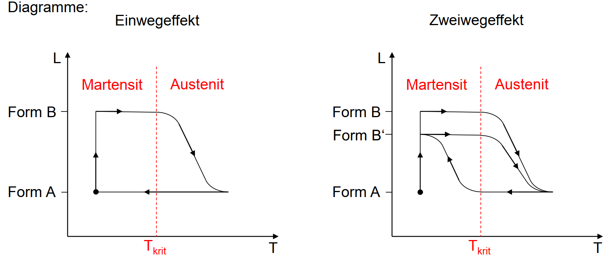

#  微传感器与微执行器

## 一、硅的晶格

密勒指数：用原子在晶胞内截距的倒数之整数比来描述晶面和晶向

由于硅是六面体晶胞，故共只有三大类晶面（及晶向）。

* (h k l ) 圆括号表示一个特定的晶面

* {h k l} 花括号表示一组性质相同的晶面，

  > {1 0 0} 包括6个面
  >
  > {1 1 0} 包括12个面
  >
  > {1 1 1} 包括8个面

* [h k l] 方括号表示一个特定方向
* \<h k l\>尖括号表示一组晶面，和花括号类似

>  （例）练习1.3： 画出晶面 (332)
>
> 同除最大公约数为 $\frac36,\frac36,\frac26=\frac12,\frac12,\frac13$
>
> 再取倒数：$x_0=2,y_0=2,z_0=3$

#### 算晶面夹角

两个晶面的夹角可以直接用密勒指数得出，$\cos(\alpha)=\frac{\vec{n_1}\vec{n_2}}{|\vec{n_1}||\vec{n_2}|}$

> （例）练习1.4：求晶面组{111} 和 (100) 的夹角
>
> $\cos(\alpha) = \frac{\pm1\cdot1+\pm1\cdot0+\pm1\cdot0}{\sqrt{(\pm1^2+\pm1^2+\pm1^2)\cdot(1^2+0^2+0^2)}}=\frac{\pm1}{\sqrt3}$
>
> ∴$\alpha =\arccos(\frac{\pm1}{\sqrt3})=54.74^\circ$

## 二、硅的腐蚀

分为异性Anisotropic（蚀刻速度在各个晶面不同）与同性Isotropic（蚀刻速度在各个晶面相同）

其中，异性腐蚀在{111}晶面组的腐蚀速度约为其它晶面的$\frac1{400}$

> 在{111}晶面，每个原子和另外三个原子相连，化学键相较其它面更加牢固。所以腐蚀更慢
>
> 

这也导致在异性腐蚀时，不论掩膜自身形状如何，只要时间一长，蚀刻出的区域总是与{111}面横平竖直。

## 三、压电陶瓷

Direct-piezo 效应：挤压形变产生电势

Reziproker piezo效应：电热势产生形变

 

压电材料产生的力，与施加的电压、材料的形变有关。
$$
\frac{\Delta l}{l}=\frac1E\cdot\underbrace{\frac FA}_{压强}
+d_{ij}\cdot\underbrace{\frac Ud}_{电场强度}
$$

> E为材料的弹性系数，由于机械挤压产生形变是所有材料都有的特性
>
> 而$d_{ij}$是由于施加电势产生的形变之系数，$d_{33}$是沿长度方向形变，最重要。

1. 求材料的劲度系数（类似于弹簧的$F=kx$的$k$）

   劲度系数只和材料本身有关，和施加的电势无关，∴$\frac{\Delta l}{l}=\frac 1E\cdot\frac FA$可得$c=\frac F{\Delta l}=\frac Al\cdot E\triangleq\frac A{l\cdot s_{33}}$, 其中$s_{33}=\frac 1E$

2. 无应力状态下，施加电势求**长度方向**形变

   $\frac{\Delta l}{l}=d_{33}\cdot\frac Ud\implies\Delta l =d_{33}\cdot\frac Ud\cdot l$，匀强电场中距离$d$也会写成$t_{El}$

3. 施加电场情况下，要多少应力才能使长度方向上的形变相互抵消

   $0 \mathop{=}\limits^{!} \frac 1E\cdot \frac FA+d_{33}\cdot\frac Ud\implies F = -d_{33}\cdot \frac {U}{t_{El}}\cdot\frac A{s_{33}} $， 外力的符号为负

4. 在压电材料上加上一个初始状态松弛的弹簧，其劲度系数为$c_F$，再施加电场，问压电材料可以沿长度方向形变多少?
   $$
   \frac{\Delta l}{l}=\frac {1}{E}\cdot\frac {F}{A}+d_{33}\cdot \frac Ud
   \\F_{弹簧}=-c_F\cdot\Delta l
   $$
   ∴$\large\Delta l \cdot(\frac1l+\frac{s_{33}\cdot c_F}{A})=d_{33}\cdot\frac Ud\implies\Delta l =\frac{d_{33}\cdot\frac{U}{t_{El}}\cdot l}{1+\frac{c_F\cdot s_{33}\cdot l}{A}}$

## 四、 记忆合金

镍-钛合金（Nickel-Titan）、铜锌铝合金（Kupfer-Zink-Aluminium）

这些合金在低温时是马氏体，柔软且容易变形; 而在高温时变为奥氏体，变得坚硬难变形

单程效果：低温时加工变形，加热后现原型，而且降温后不回复

双程效果：低温加工变形，加热后现原型，但是降温后可以**大概**回到加工后形状

## 五、光刻技术

