# Robotic motion planning

workspace：工作空间，真实空间

configuration space: 机器可设置的空间

#### Reduce a robot to a point

表示机器人的两种方法：

1. Point represent

障碍物: 将工作空间中障碍物投射到c-space中（discrete colision test)

参数：c-space中的$\theta_1,\theta_2,\cdots$

适用于：机械臂

2. padding of obstacles

参数：$x,y,[\theta]$

障碍物：在原障碍物上附加机器人的尺寸(geometry)

适用于：点状机器人

#### Collision Detection

discrete the C-space, for each configuration do a collision check

Hull：在机械臂外套一个简单的外壳用于计算初步的碰撞。只有当外壳遭遇障碍物时才投入更多计算机资源计算详细的碰撞。

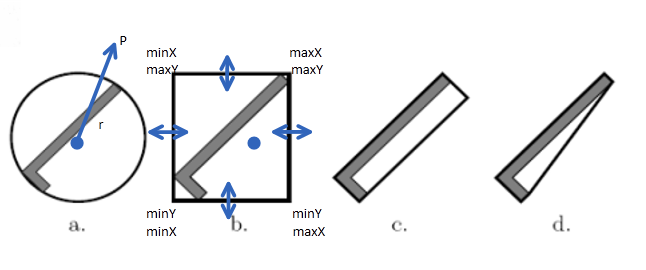

|                                   | pro                                        | con                                                          |
| --------------------------------- | ------------------------------------------ | ------------------------------------------------------------ |
| Sphere圆形                        | 只需要一次测试 simple alignment       | 外壳太空，浪费free space                                     |
| AABB (AxisAlignedBoundedBox) 正方 | 实现简单                                   | 需要$2^d$次测试，d=dimension维度 另外外壳还是太空       |
| OBB (ObjectBoundBox) 矩形         | 浪费的free space少                         | 仍需要$2^d$次测试 构建麻烦，需要PCA eigenvalue分析capture orientation |
| Polygon三角                       | 浪费的free space最少, tight representation | 构建复杂，测试也复杂                                         |

#### holonomic

* holonomic 约束$g(q,t)$：即约束直接由**状态q**与**时间t**表达。线性无关的Holonomic约束会使得c-space维度减一。
* Nonholonomic约束 $g(q,\dot q,t)$：（倒车入库）。不减少维度。

#### 旋转表示方法

1. 欧拉角：绕轴旋转，比如绕$Z-Y-Z$顺序分别旋转角度$\phi,\theta,\psi$

$R=R_{z,\phi}\cdot R_{y,\theta}\cdot R_{z,\psi}=\begin{pmatrix}c\phi&-s\phi\\s\phi&c\phi\\&&1\end{pmatrix}\cdot\begin{pmatrix}c\theta&0&s\theta\\0&1&0\\-s\theta&0&c\theta\end{pmatrix}\cdot\begin{pmatrix}c\psi&-s\psi\\s\psi&c\psi\\&&1\end{pmatrix}$

> 逐个右乘，因为此处是以body frame为参考（以物体自身为参考）：$T_{AB}\cdot T_1=T_{AB}\cdot\begin{pmatrix}R_1&P_1\\0&1\end{pmatrix}$
>
> 还可能是逐个左乘，这对应的是以不可移动的世界坐标为参考：$T_1\cdot T_{AB}$

存在问题：会导致Singularirty

2. axis angle representation

$$
Constraints:\left\{\begin{array}{}
\det(R)=1
\\\vec v_j\perp\vec v_i,j\neq i
\\||v_i||=1

\end{array}\right.
$$

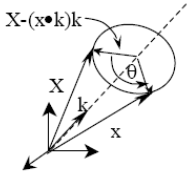

$R=I+(1-\cos\theta)K^2+\sin\theta K$

3. Quaternion 四元数

$\vec u=(u_1,u_2,u_3,u_4)=\begin{pmatrix}\cos\theta/2,n_x\sin\theta/2,n_y\sin\theta/2,n_z\sin\theta/2\end{pmatrix}$，$||u||_2^2=1$ 。其中$n_x^2+n_y^2+n_z^2=1,(n_x,n_y,n_z)$为旋转轴。

## 一、经典RMP方法

### （一）、BUG算法

假设机器人为一个点，利用零距离传感器（zero range sensor）前往目标。

一定能到达终点，但是只适用于简单的二维地图

#### Bug1

遇到障碍物时记下遭遇位置$q_i^H$：Hit point

绕障碍物一圈，测量障碍物上每一点到目标的距离，确定障碍物上离终点最近的一点$q_i^L$：Leave point。绕一圈后回到$q_i^H$前往$q_i^L$

m-line: 连接$q_i^L$与$q_{goal}$

如果m-line与当前障碍物相交说明在被障碍物封在内部，即可确定没有可行的路线

> 若前进路线只是蹭过障碍则没有必要执行算法，直接继续前进即可

$$
L_{Bug_1}\le d(q_{start},q_{goal})+\underbrace{1.5\sum_{i=1}^np_i}_{探索一倍周长+最坏情况下再走一半周长}
$$

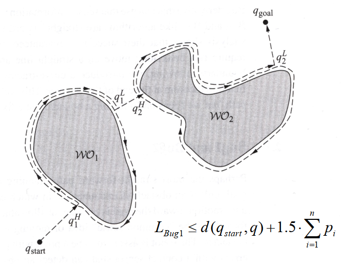

> 机器人能力：测量并记录任意一点到目标距离; 检测障碍物碰撞
>
> 难点：change of approach direction, large obstacles

#### Bug2

m-line：固定为$q_{start}$到$q_{goal}$

绕障碍物运动，只要再次碰到m-line就离开障碍物，相当于是在同一条m-line上找离终点更近的点。

如果再次遭遇m-line与障碍物相交的同一点则可确定不可行
$$
L_{Bug_2}\le d+0.5\sum_{i=1}^n \underbrace{n_i}_{同一个障碍物\\遭遇n次}p_i
$$

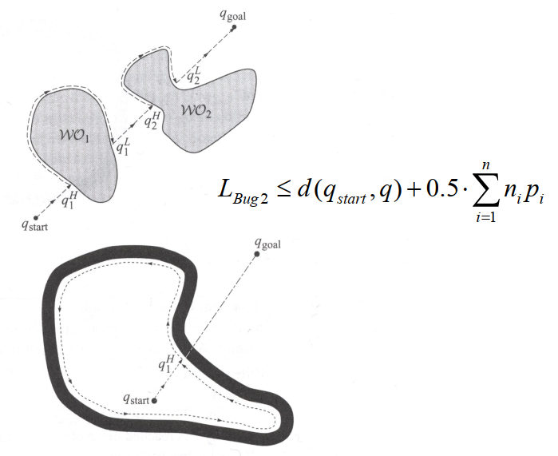

> 机器人能力：跟随m-line; 测量障碍物碰撞。
>
> 难点：spiral形障碍。

#### Tagent Bug

假设不再是零距离传感器而是有一点探测范围的传感器

这个传感器360度都可探测 $\rho_R(x,\theta)$，且精度无限。

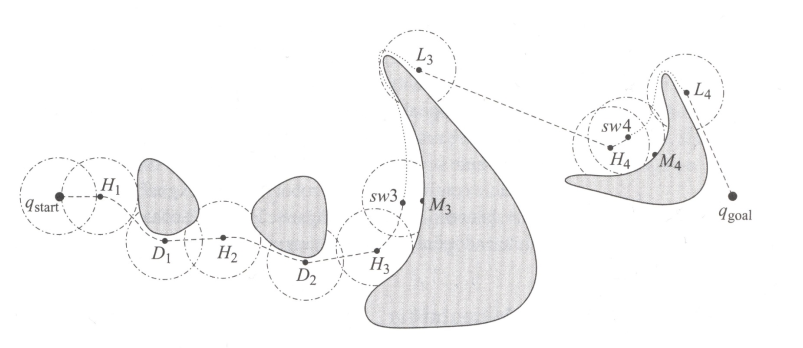

当传感器刚刚探测到障碍物时，传感器半径与障碍物相切 → Tagent正切

之后相切点分裂为相交段曲线，有两个端点$O_i$

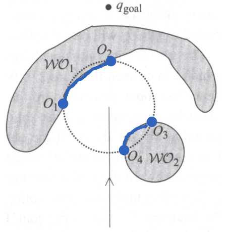

**状态一 Motion to go**

先前往终点，

如果前往终点的路径受阻，则会按Heuristic决定前往哪一个$O_i$作为subgoal

Heuristic比如：$h(x)=d(x,O_i)+d(O_i,q_{goal})$

直到无法再减小$h(x)$说明正要远离终点，此刻来到了local minimum，记为$M_i$，由motion-to-go算法转为follow-boundary 算法

**状态二 follow boundary**

沿障碍物表面法线方向$n(x)^\perp$前进

记录$d_{followed}$：目前这个障碍物边界上**曾经记录过**离终点最近的距离

$d_{reach}=\min_{c\in\Lambda}d(q_{goal},c)$：目前探测范围内障碍物上到终点最近距离

当$d_{reach}\lt d_{followed}$时离开障碍物，leave point 记为$L_i$，由follow boundary 算法变回motion to go 算法

> 机器人能力：检测所有正切点（discontinuity）; 知道目标在哪并且测量任意一点到目标距离。

### （二）、Roadmap

> 定义：Roadmap consists of Node(Location) and Edge(Path), models the connectivity of the freespace by set of 1D curves.
>
> 优点：Move large part of processing to offline step, only connecting q_init, q_goal is done online

* Visibility graph：时间、空间复杂度都比较高。不太好

每个端点与所有可见端点相连 (包含所有障碍物的边和所有端点不与障碍相交的两两连线)

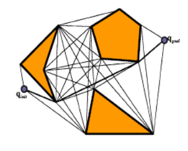

simplified: 障碍物之间只两两计算enclosing line与seperating line，还有自身的Edge。

* Grid View：画出图中每个像素可达性，但要作连续运动需要考虑一条运动路线上所有的点

* shortest-path

算法wave-front planner：  Avoids the local minima problem by planning one step at a time on a grid  

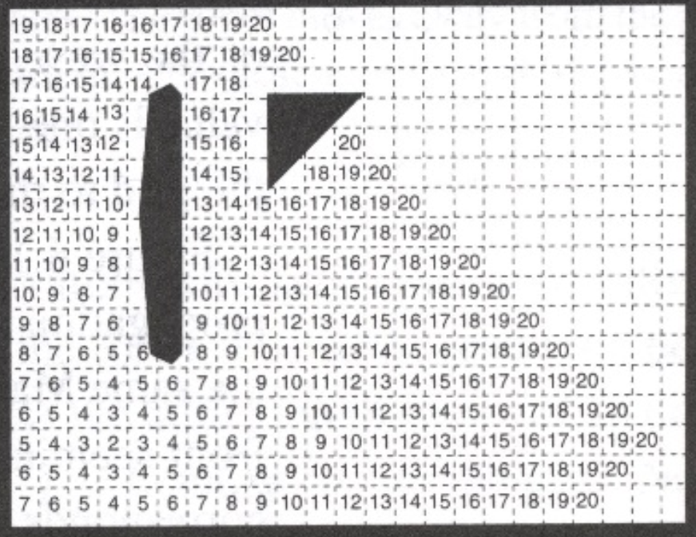

* maximum clearance 离障碍物最大距离

算法brushfire-planner: 得到Voronoi diagram

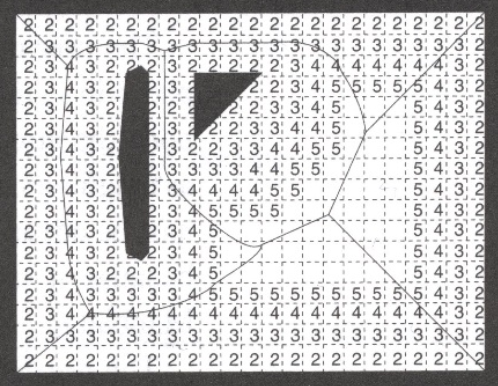

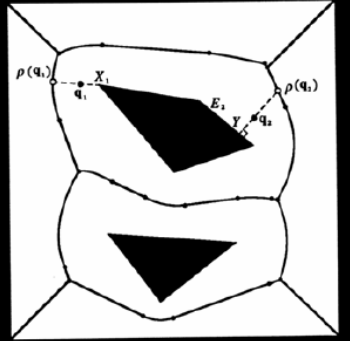

### （三）、Cell Decomposition

* trapezoidal decomposition

每次遇到障碍物的端点都画竖线。形状均为convex，但也包含许多不必要的结点。

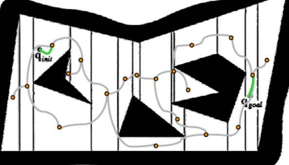

*   Boustrophedon Decomposition → Canny\`s Method 

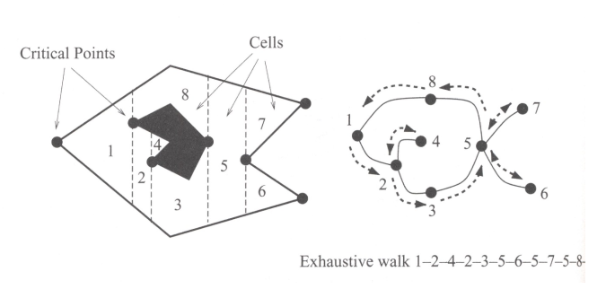

critical points&lines: 只在存在岔路的地方画竖线（线段两端都能沿伸）

Boustrophedon motion: exhaustive path

### （四）、Potential Field

把机器人当作是在gradient vector filed中移动的微粒。与之前的方法都不同的一点是不了解全局地图complete map。

机器人：positive charge

障碍：positive charge

目标：negative charge

能量的梯度为机器人受到的力$\dot c(t)=-\nabla U(c(t))$，机器人沿最陡梯度(steepest descent)前进。当梯度=0时导航结束，梯度为0的点称为critical point

ideal potential field: 1. global minimum at goal

2. no local minimum
3. grow to inf. at obstacles

一般只考虑Hessian矩阵非奇异的势能方程，这种情况下所有的critical points均孤立。意思是一个点要么是极值点，要么是鞍点，不会出现成片梯度为0的区域。

> Hessian正定（有极小）还是负定（有极大）不重要，因为势能法下机器人总是往势能最低处走，总是能找到一个极小值

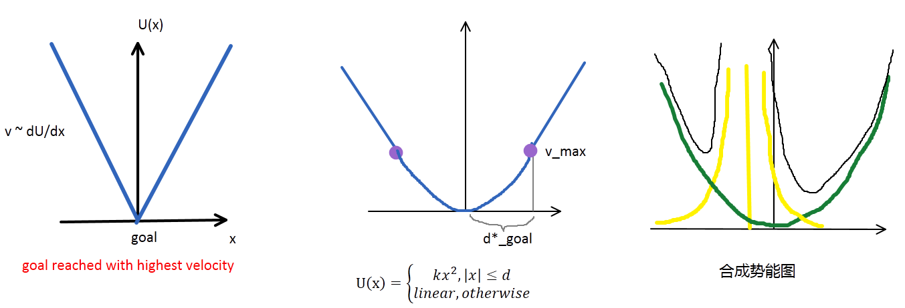

**两种失效情况**

1. 机器人可能会在**鞍点Saddle point**停下，解决方法：disturb the robot a bit

2. 机器人进入了一个死胡同**local minimum**，左右移动不能解决问题。解决方法：增加障碍物的$\rho$值，趁早避开障碍。但也可能因此放弃走狭窄通道，错过最优解。

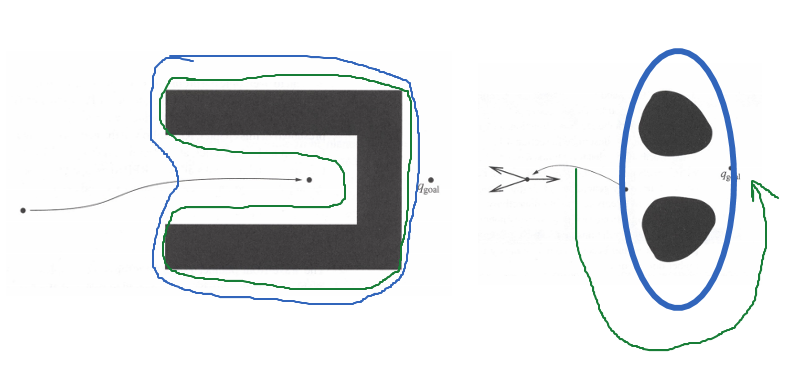

## 二、 PRM

probalistic roadmap: 当环境闭塞，障碍物小而多时，普通的Roadmap方法需要在C-space中频繁地碰撞测试。

> 一个N轴的机械臂，若每个轴可动范畴均为360度，每隔0.1度采样，则C-space中有$3600^n$个采样点，这就太多了

#### Multi-Query: PRM

> 定义：(Uniformly) sample on entire sapce to generate milestones, perform collision check for milestone and their connections
>
> 用处：used if multiple paths in a same static environment are needed

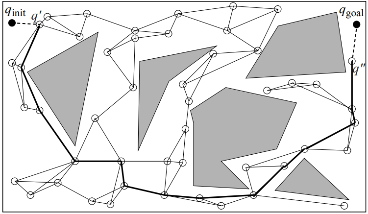

**平均采样**：?
$$
\left\{\begin{array}{}n_x=\sin\theta\cos\psi\\n_y=\sin\theta\sin\psi\\n_z=\cos\theta\end{array}\right.
$$
**三种得到fully connected graph的方法**

C-obstacle 太多时，milestone无法连接起点与终点，解决方法：

1. 增加采样点，increase number of milestones
2. 改进Connection策略，由直线连接改为**Random Walk**：在无法直接连接时先尝试移动一小段距离，适用于捕捉狭窄通道，对比之下如果是**平均采样**必然低概率走这种狭窄通道。
3. Repair path, 得到Approximate Path

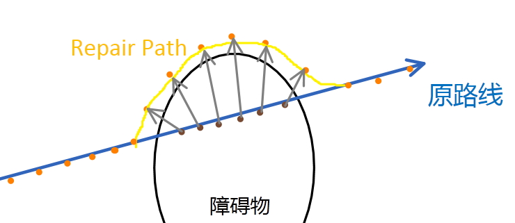

4. **Obstacle PRM**， 只在障碍物附近采样

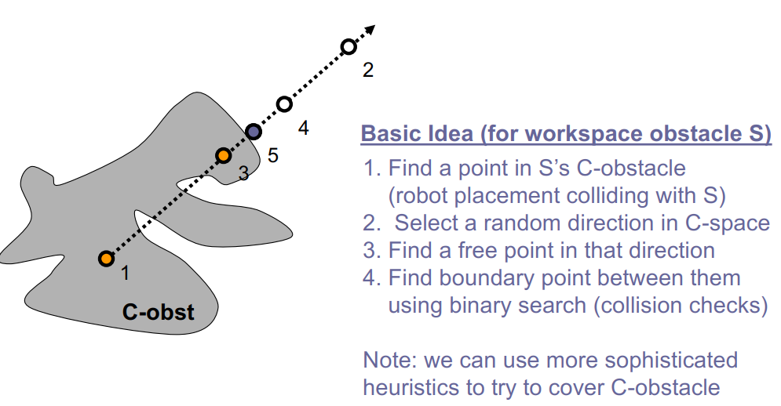

**（Path Smoothening）**

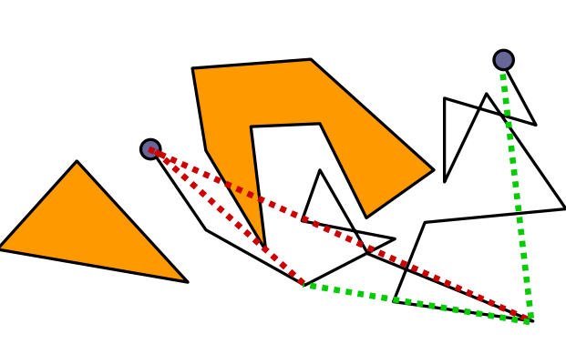

计算每个Milestone到障碍的距离用于简化路线，不用频繁地切换电机方向（节省能量）

**（Homotopic Path）**

经拓扑变形后不改变与障碍物关系的一组路径。（只从障碍物的一侧绕过）

Non-homotopic的路径：从障碍两侧分过的两条路线。

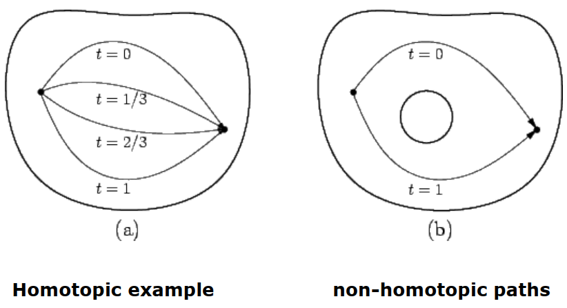

**总结：**

PRM优点：1. probalistically complete

2. easily apply to high-dim c-space
3. support fast query with enough pre-processing

缺点：难以捕捉narrow passages

#### Single Query: RRT

> 定义：sample on local operate region, grow two trees at start and goal. Randomly sample around existing nodes, finally connect two trees if they can see each other.
>
> 用途：apply to find one possible path, or when obstacles are dynamic. 

两个步骤：Expansion+Connection

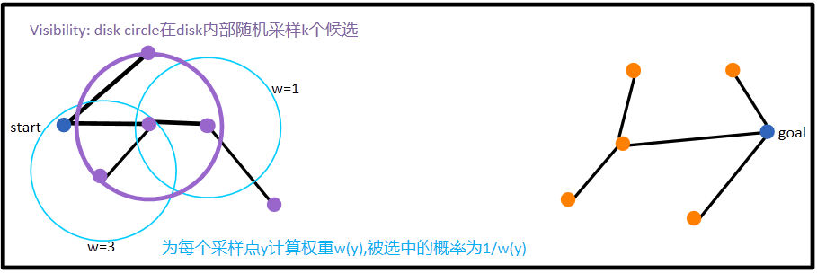

* growth limit: $\Delta q$，限制单程路线长度，在附近区域找可能的解，不要一下子跑太远。

* 避免在起点附近展开太多无用结点：新结点的disk内部已经展开的结点越多，则在下一步被选中的概率越小 → 渐渐向新区域扩展。

如果$d(x,y)\lt L$，就检查x是否可以看见y，看得见就建立连接。

#### 评估PRM：要兼顾两个指标

1. Coverage：要找到一个合适的Milestone数量N，尽量用同样数量的Milestone覆盖整个空间。

2. Connectivity：是否连续。如果地图上存在Narrow Passage达到Connectivity就比较困难

$$
\begin{array}{l|l|l}
\epsilon&\mu(reach(x))\ge\epsilon\cdot\mu(Q_{free})
&最差情况下，能看见的最少空间/所有空间
\\\beta&lookout_\beta(S)=\{x\in S|\mu(reach(x)-S \}\ge \beta\cdot\mu(Q_{free}-S)
&在一个小范畴内最差位置也至少能看见多少
\\\alpha&\mu(lookout_\beta(S))\ge\alpha\cdot\mu(S)&立足蜗居，放眼世界
\end{array}
$$

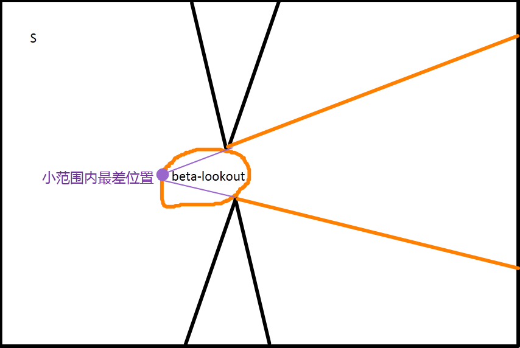

$\epsilon,\alpha,\beta$三项均是越大越好，代表建立一个Coverage和Connectivity高的地图越容易。

结点数量与三个参数的关系：$\large n = \frac{8\ln\frac{8}{\epsilon\alpha\gamma}}{\epsilon\alpha}+\frac3\beta$， 其中$\gamma$为failure rate

## 三、Kalman滤波

#### 普通Kalman Filter

确定机器人的位置状态pose=position+orientation

观测手段：1.外部传感器测量当前位置 2.惯性导航Odometry由之前位置预测当前位置

> 合并两个高斯分布：$z_1=\underbrace{r}_{真值}+\underbrace{\mathcal N(0,R_1)}_{传感器噪音},z_2=r+\underbrace{N(0,R_2)}_{R=\sigma^2}$
>
> 方差大的权重小一些，就能得到接近真值r的预测值
>
> 设误差为$e=\sum w_i(\hat r-z_i)^2$，则$\frac\partial{\partial \hat r}=2\sum w_i(\hat r-z_i)\doteq0\implies \hat r=\frac{\sum w_iz_i}{\sum w_i}$，权重$w=\frac1R$
>
> 在只有两个数值的情况下，$\hat r=\frac{\frac1{R_1}z_1+\frac1{R_2}z_2}{\frac{1}{R_1}+\frac1{R_2}}=\frac{R_2}{R_1+R_2}z_1+\frac{R_1}{R_1+R_2}z_2=z_1+\underbrace{\frac{R_1}{R_1+R_2}}_{融合系数K}(z_2-z_1)$
>
> 分析：当$\sigma_1=0$，即第一个值误差为0时，$K=0,\hat r\to z_1$
>
> 当$\sigma_1=\infty$，即第一个值完全无效时，$K=\frac{R_1}{R_1+R_2}=\lim_{R_1\to\infty}\frac11=1,\hat r\to z_2$
>
> 当$\sigma_2=0$，$K=1,\hat r\to z_2 $，完全信任第二个数值

Kalman滤波就是两个高斯分布的合并：

* 假设状态误差为高斯分布 (zero-mean Gaussian distribution)
* 假设测量误差也为高斯分布
* 假设新$\leftarrow$旧状态转移矩阵$A$为线性关系 (linear relation)
* 假设测量$\to$状态矩阵$H$也为线性关系

**Prediction**
$$
\begin{array}{}
预测新状态均值&x_{k+1}^-=Ax_k+\underbrace{B\vec u}_{外部控制力}
\\预测新状态方差&P_{k+1}^-=AP_kA^{-1}+\underbrace{Q}_{系统误差：A的可靠度}

\end{array}
$$

> 转移矩阵A是否可靠? 如果系统模型和实际出入较大就要适当加大Q

**Update**
$$
\begin{array}{}
更新系数&K=P_k^-H^T(HP_k^-H^T+\underbrace{R}_{测量误差})^{-1}
\\
融合预测状态与测量状态&x_k=x_k^-+K(z_k-Hx_k^-)
\\
更新状态方差&P_k=P_k^--KHP_k^-=(I-KH)P_k^-
\end{array}
$$

> H矩阵是对测量方法的建模，建立测量值与状态之间的关系
>
> 比如：电子称来称重，读数并非直接是重量

**一维情况的例题：**

 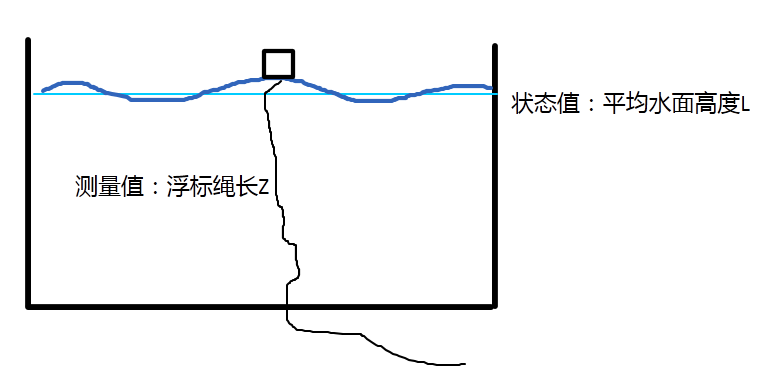

①Static Mode：水面高度$L=C$为常数

> 即已知水面高度不变，测量到上下浮动的浮标绳长，要怎么确定这个高度L? 

设水面实际高度$L=1$, 系统误差$q=0.0001$，测量误差$r=0.1$。此处$Q，R$均小写为$q，r$是因为它们均为标量。

1. 系统建模，测量建模

$$
x_{k+1}=Ax_k=1\cdot x_k
\\
z_k=Hx_k=1\cdot x_k
$$

2. 设初值$x_0=0$，方差为1000（初值完全错误）。第一次测量值$z_1=0.9$

$$
\left\{
\begin{array}{}
x_1^-=Ax=0
\\
p_1^-=p_0+Q=1000+0.0001
\end{array}
\right.
\\
\left\{
\begin{array}{}
K_1=\frac p{p+r}=1000.001(1000.0001+0.1)^{-1}=0.9999
\\x_1=z_1+K(z_2-z_1)=0+0.9999(0.9-0)=0.8999
\\p_1=(1-KH)p=(1-0.9999)\times1000.0001=0.1
\end{array}
\right.
$$

第一次滤波后，状态方差由1000降为0.1，状态值由0变为0.8999，十分接近第一次测量值。

3. 第二次测量$z_2=0.8$

$$
\left\{
\begin{array}{}
x_2^-=x_1=0.8999
\\p_2^-=p_1+q=0.1+0.0001=0.1001
\end{array}
\right.\\
\left\{
\begin{array}{}
K_2=0.1001(0.1001+\underbrace{0.1}_{此时0.1的\\测量误差就太大})^{-1}=0.5002
\\
x_2=0.8999+0.5002(0.8-0.8999)=0.8499
\\p_2=(1-0.5002)0.1001=0.05
\end{array}
\right.
$$

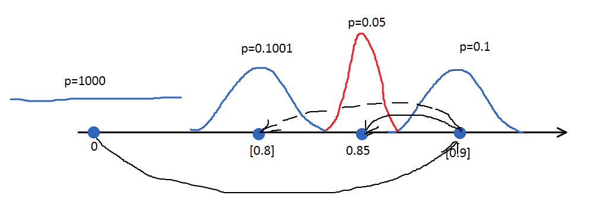

**估计最初的方差矩阵**$P_0$
$$
\begin{array}{}
P_0=\begin{bmatrix}\sigma_x^2&\sigma_x\sigma_y
\\\sigma_x\sigma_y&\sigma_y^2
\end{bmatrix}
=\frac1N\sum^N(x_i-\bar x)(x_i-\bar x)^T
\\（一维）\sigma_x=\frac1N\sum^N(x_i-\bar x)^2
\end{array}
$$
**系统可观测性**

Observability $O=\begin{bmatrix}H\\HA\\\vdots\\HA^{n-1}\end{bmatrix}$
$$
x_{k+1}= \begin{pmatrix}p\\v\end{pmatrix}_{k+1}=\begin{pmatrix}1&1\\0&1\end{pmatrix}
\cdot\begin{pmatrix}p\\v\end{pmatrix}_k
$$
①：观察位置P  $H=(1\ 0)$，$O=\begin{pmatrix}1&0\\1&1\end{pmatrix}$，满秩

②：观察速度V：$H=(0\ 1)$，$O=\begin{pmatrix}0&1\\0&1\end{pmatrix}$，不满秩

#### Extended Kalman Filter

当状态转移矩阵A，测量矩阵H不为线性时，利用泰勒展开一次近似线性。其余和普通Kalman一样。

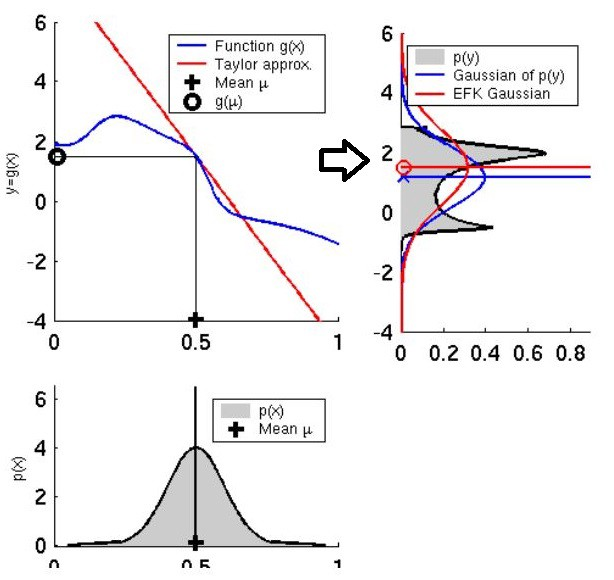

* 状态转移非线性：$x_{k+1}^-=f(\hat x_k,\hat u_k,\underbrace{\hat w_k)}_{噪声}$，

> 不确定度也经过非线性转变：$y=f(x)=f(\underbrace{\bar x+\epsilon}_{均值+高斯噪音}) $
>
> 泰勒展开：$f(x)=\sum_{n=0}^N\frac{f^{(n)}(a)}{n!}(x-a)^n\approx f(a)+f'(a)(x-a)$
>
> 代入到数据中，$a=\bar x$，$f(\bar x+\epsilon)\approx f(\bar x)+f(\bar x)'\epsilon= f(\bar x)+J\epsilon$
>
> y的均值为$E[\vec y]\approx E[f(x)+J\epsilon]=f(\bar x) $
>
> $\therefore \vec y-\bar y=f(x)+J\epsilon-f(x)=J\epsilon$
>
> y的协方差矩阵与x协方差矩阵关系为$C_y=E[(y-\bar y)(y-\bar y)^T]\approx E(J\epsilon\epsilon^TJ^T)=JC_xJ^T$

EKF: $P_{k+1}^-=\underbrace{A}_{\downarrow\\\left[\frac{\partial f}{\partial x}\right]}P_kA^T+\underbrace{W}_{\downarrow\\\left[\frac{\partial f}{\partial w}\right]}QW^T$

**例题：**
$$
f(\vec x)=\begin{bmatrix}f_1(x)\\f_2\\f_3\end{bmatrix}
=\begin{bmatrix}x\\y\\\theta\end{bmatrix}_k+
\begin{bmatrix}(v+w_v)\cos\theta\Delta t
\\(v+w_v)\sin\theta\Delta t
\\(\omega+w_\omega)\Delta t
\end{bmatrix}
\\A=\frac{\partial f_i}{\partial x_i}=
\begin{bmatrix}1&0&-v\sin\theta\Delta t
\\0&1&v\cos\theta\Delta t
\\0&0&1
\end{bmatrix}
\\W=\frac{\partial f_i}{\partial w_i}=
\begin{bmatrix}\Delta t\cos\theta&0
\\\Delta t\sin\theta&0
\\0&\Delta t
\end{bmatrix}
$$

* 测量值与状态值之间也非线性：$z=h(x,\underbrace{\nu}_{测量误差})$

$$
K_k=P_k^-H_k^T(H_kP_k^-H_k^T+V_kRV_k^T)^{-1}
\\\hat x_k=\hat x_k^-+K_k(z_k-h(\hat x_k^-,0))
\\P_k=(I-K_kH_k)P_k^-
$$

设测量值为机器人到一个地标的距离$z=\sqrt{(x-x_L)^2+(y-y_L)^2}$
$$
H=\frac{\partial z}{\partial x}=
\begin{bmatrix}
\frac{x-x_L}{\sqrt{(x-x_L)^2+(y-y_L)^2}}&\frac{y-y_L}{\sqrt{(x-x_L)^2+(y-y_L)^2}}&0
\end{bmatrix}
\\V=1
$$

>  第三个元素为0，说明角度$\theta$在只有一个地标的情况下无法测量。

#### SLAM

在状态向量中加入地标Landmarks，扩展了状态向量

> State vector contains  robot position as well as landmarks, convariance matrix is also extended.

$$
x_k=\begin{bmatrix}\vec x_R=\begin{pmatrix}x\\y\\\theta\end{pmatrix}
\\\vec x_{L_1}=\begin{pmatrix}x\\y\end{pmatrix}
\\\vec x_{L_2}
\\\vdots
\\\vec x_{L_N}
\end{bmatrix}
$$
协方差矩阵也融入这些信息
$$
P=\begin{pmatrix}P_{RR}&P_{RL_1}&\cdots&P_{RL_N}
\\&P_{L_1L_1}&&\vdots
\\&&\ddots
\\&&&P_{L_NL_N}
\end{pmatrix}
$$
测量矩阵
$$
H=\begin{bmatrix}H_R&0&0&\cdots&H_{L_i}&0&0\cdots\end{bmatrix}
$$
机器人自身的测量值$H_R$总更新，没见到的地标权重为0

* Data Association

$$
\nu_{ij}\triangleq y_i-h_i(x(k+1|k),j)
\\\cal X_{ij}^2=\nu_{ij}^TS_{ij}^{-1}\nu_{ij},其中S_{ij}=(HPH^T+R) 
$$

$\cal X_{ij}$为Mahanobis距离：$d=\sqrt{(x-y)^T\Sigma^{-1}(x-y)}$

#### Unscented Kalman Filter

当非线性强烈时，EKF的一阶近似已经不能很好地拟合实际情况。这是因为EKF只用一个点（原高斯均值）来估计变化后的分布，误差较大。

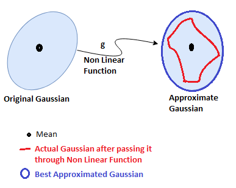

UKF采用一组点（Sigma点），完全地捕捉真实的均值与协方差，再经过真实的非线性变化方程$\bold y=g(\bold x)$，保证了非线性变化后误差仍较小。

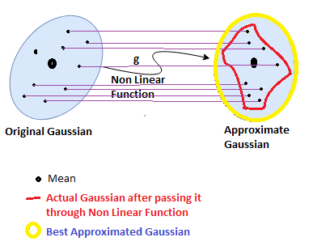

1. 选取Sigma点：

$$
\begin{array}{ll|l}
采样点&\cal X_0=\bar x
\\&\cal X_i=\bar x\pm(\sqrt{(n_k+\lambda)P_x})_i
&\cal X_i中每一点代表一个维度上n个Sigma点
\\权重&W_0=\frac\lambda{n_x+\lambda}&n_x为所有Sigma点数量
\\&W_i=\frac1{2(n_x+\lambda)}&权重之和为1：\sum_0^{2n}W_i=1
\end{array}
$$

2. 非线性变化——状态不确定度

$$
\begin{array}{}
&\cal Y_i=g(\cal X_i)
\\变化后均值\mu'&\bar y =\sum_0^{2n_x}W_i\cal Y_i
\\协方差矩阵\Sigma'&P_y=\sum_0^{2n_x}W_i(\cal Y_i-\bar y)(\cal Y_i-\bar y)^T

\end{array}
$$

3. 测量不确定度

$$
\begin{array}{}
&\cal Z=h(\cal X)
\\测量值均值&\hat z=\sum_0^{2n}W_i\cal Z_i
\\测量值协方差矩阵&S=\sum_0^{2n}W_i(\cal Z_i-\hat z)(\cal Z_i-\hat z)^T+Q
\end{array} 
$$

4. Kalman Gain

比较状态空间与测量空间中Sigma点，计算Correlation
$$
T=\sum_0^{2n}w_i\underbrace{(\cal X_i-\mu')}_{P}\underbrace{(\cal Z_i-\hat z)^T}_{H^T}
\\K=T\cdot S^{-1}
$$

5. 预测——综合状态转移与测量的不确定度

$$
\mu=\mu'+K(z-\hat z)
\\\Sigma=(I-KT)\Sigma'
$$

#### Bayesian Filter (Particle Filter)

高斯滤波器：给定初始位置后，每一次迭代有且仅有一个位置。称为Increment estimation

一种更普遍的过滤器 → 基于蒙特卡洛法，不再硬性要求概率分布为高斯。
$$
\begin{array}{}
motion\ model&P(x_{k+1}|x_k)
\\map已知，在何位置能看到什么&P(y_k|x_k)
\\观测后推测在什么位置&P(x_{k+1}|y_{k+1})

\end{array}
\\贝叶斯公式：P(x|y)=\frac{P(y|x)\cdot p(x)}{P(y)}
$$
$\textcolor{green}{P(x_k|u_{0:k-1},y_{1:k})}=\eta_k\cdot \underbrace{P(y_k|x_k)}_{观测}\int_{x_{k-1}}\underbrace{P(x_k|u_{k-1},x_{k-1})}_{状态预测}\cdot \textcolor{green}{\underbrace{P(x_{k-1}|u_{0:k-2},y_{1:k-1})}_{迭代项}}$

> 另一种写法：$Bel(x_t)=P(z_t|x_t)\cdot P(x_t|x_{t-1},u_{t-1})\cdot Bel(x_{t-1}) $

**状态转移举例：**
$$
\begin{array}{r|llll}
P(x_{k+1}|x_k,u_k)&x_{k+1}=1&2&3&4
\\\hline x_k=1&0.25&0.5&0.25&0
\\2&0&0.25&0.5&0.25
\\3&0&0&0.25&0.75
\\4&0&0&0&1
\end{array}
\\如果P_0=\begin{pmatrix}0&0.5&0&0.5\end{pmatrix}
\\P(x_{k+1}=1)=0.25\times 0+0\times0.5+0\times0+0\times0.5=0
$$
**resampling**

每一轮转移后，在高权重区域附近重新采样