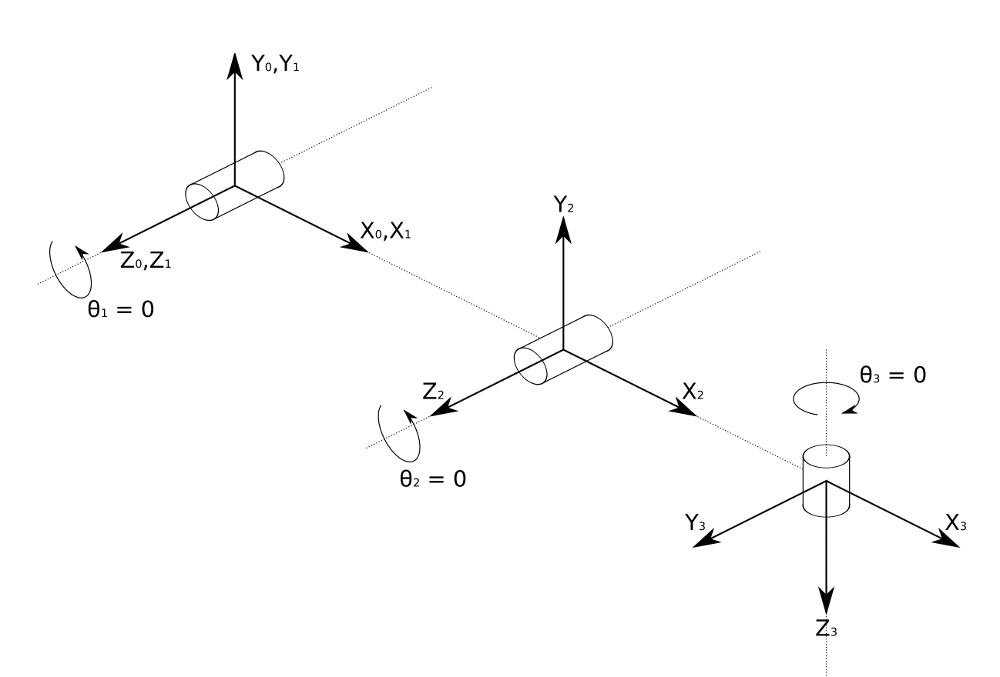
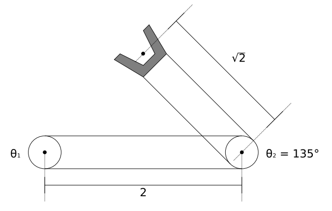
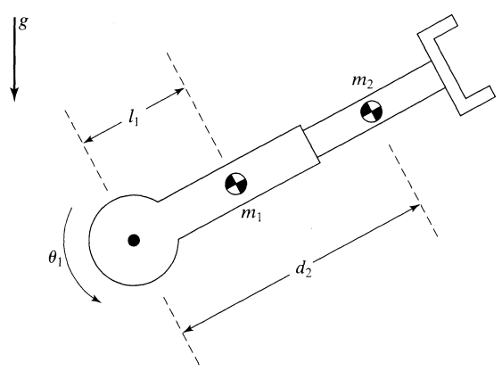
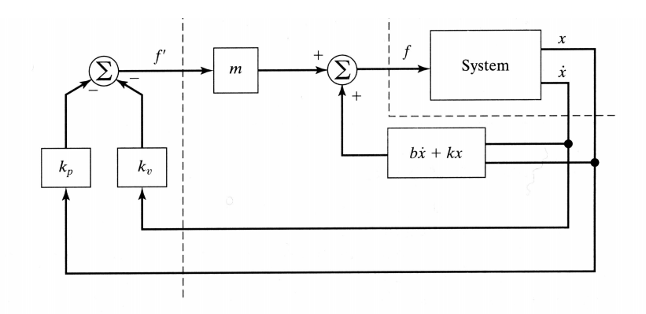

## 运动学——Forward Kinematics

描述空间中位置变化，Forward 由参数求位置

####　一、机器人运动两种方式

1. 平移 translation $\bold {\ ^1p}=\ ^0\bold p+\ ^1\bold t$

2. 旋转 Rotation $\bold {\ ^1p}=\ ^1_0\bold R\ ^0\bold p$

旋转矩阵$\bold R$为正交阵，有三个约束条件：1. 每一行为单位向量；2. 任意两行点积为0；3. 行列式值为1。这样$\bold R$ 只改变向量的方向，不改变长度。$||^1\bold p||=||^0\bold p||$三个条件实际上就是标准正交阵的定义。

#### 二、旋转矩阵推导方法

##### (一)、由欧拉角推导

$$
\begin{array}{c|c}
\bold R=\bold R_z\bold R_y\bold R_x&按z\to y\to x顺序旋转
\\
=\underbrace{\bold R_z(\gamma)}_{绕第二次\\变换后z轴}\cdot\underbrace{\bold R_y(\beta)}_{绕第一次\\变化后y轴}\cdot\underbrace{\bold R_x(\alpha)}_{绕初始x轴}
\\
=\begin{pmatrix}
c\gamma&-s\gamma&0
\\s\gamma&c\gamma&0
\\0&0&1
\end{pmatrix}
\begin{pmatrix}
c\beta&0&s\beta
\\0&1&0
\\-s\beta&0&c\beta
\end{pmatrix}
\begin{pmatrix}
1&0&0
\\0&c\alpha&-s\alpha
\\0&s\alpha&c\alpha
\end{pmatrix}
\end{array}
$$

##### (二)、由罗德里格斯公式推导

 Rodriguez formula ：绕任意向量$\overrightarrow k$旋转角度$\theta$

设$\bold K\cdot\bold v=\bold k\times\bold v$，$\bold K=\begin{pmatrix}0&-k_3&k_2\\k_3&0&-k_1\\-k_2&k_1&0\end{pmatrix}$

$\bold R=\bold I+(1-\cos\theta)\bold K^2+\sin\theta\bold K$

[推导过程](https://blog.csdn.net/q583956932/article/details/78933245)

#### 三、 DH变换

==空间变换原来需要6个参数，降到4个==

步骤1：一个joint一个frame，为每个frame选取z，x坐标轴方向。
$$
\begin{array}{}
z：&1.若是旋转轴，右手定则确定z轴方向。
\\&2. 滑动轴，z沿着滑动方向
\\
x:&x_{i-1}垂直于z_{i-1},z_i，因为DH定义x方向为两条z轴间最短距离
\end{array}
$$
步骤2：定4个参数
$$
\begin{array}{}
a_{i-1}&沿x_{i-1}平移
\\\alpha_{i-1}&绕x_{i-1}旋转
\\\hline 
d_i&沿z_i平移
\\\theta_i&绕z_i旋转，\textcolor{red}{顺时针为正方向，与通常相反}
\end{array}
\\
\ ^{i-1}_i\bold T=\left(\begin{array}{ccc|c}
\cos\theta_i&-\sin\theta_i&\underbrace0_{\textcolor{orange}{不可以绕y轴旋转}}&\alpha_{i-1}
\\\sin\theta_i\cos\alpha_{i-1}&\cos\theta_i\cos\alpha_{i-1}&-\sin\alpha_{i-1}&-\sin\alpha_{i-1}\cdot d_i
\\\sin\theta_i\sin\alpha_{i-1}&\cos\theta_i\sin\alpha_{i-1}&\cos\alpha_{i-1}&\cos\alpha_{i-1}\cdot d_i
\\\hline 
0&0&0&1
\end{array}\right)\triangleq
\tiny{\left(\begin{array}{ccc|c}
&&&
\\&R&&t
\\&&&
\\\hline 
0&0&0&1
\end{array}\right)}
$$
$\ ^x\bold p=\ ^x_y\bold T\cdot\ ^y\bold p$ 指y在x中的坐标。将多个$\bold T$依次迭代相乘，得到机械臂末端在原点坐标系中的坐标。

##### 特殊情况

一般情况下，空间中两条z轴既不平行也不相交

1. 当多条z轴平行：有无数条$x_i$可选，最好让$x_i$和$x_{i-1}$共线，这样$d_i=0$

2. 当两条z轴相交：$x_{i-1}$必须同时垂直于$z_{i-1}$和$z_i$，因此$\bold x_{i-1}=\Large{\frac{\bold z_{i-1}\times\bold z_i}{||\bold z_{i-1}\times\bold z_i||}}$

##### 平面机器人

平面机器人可以一眼看出末端坐标，不需要写标准DH变换矩阵
$$
\ ^0_e\bold X=\begin{pmatrix}l_1\cos\theta_1\\l_1\sin\theta_1\\\theta_1\end{pmatrix}
+\begin{pmatrix}l_2\cos(\theta_1+\theta_2)
\\l_2\sin(\theta_1+\theta_2)
\\\theta_2
\end{pmatrix}
+\begin{pmatrix}l_3\cos(\theta_1+\theta_2+\theta_3)
\\l_3\sin(\theta_1+\theta_2+\theta_3)
\\\theta_3
\end{pmatrix}
\\=\begin{pmatrix}
l_3\cos(\theta_1+\theta_2+\theta_3)+l_2\cos(\theta_1+\theta_2)+l_1\cos\theta_1
\\l_3\sin(\theta_1+\theta_2+\theta_3)+l_2\sin(\theta_1+\theta_2)+l_1\sin\theta_1
\\\theta_3+\theta_2+\theta_1
\end{pmatrix}
$$
三个坐标分别为$x,y,\theta$，对应平面机器人三个自由度：在X-Y平面内平移，以及末端360°旋转

#### 四、Jacobian 矩阵

物理意义：反映了在某个位置，joint变换导致坐标位置怎样变换

##### 1. 定义

$$
J(\bold q)=
\large 
\frac{\partial \overrightarrow p(\bold \theta)}{\partial \overrightarrow \theta}=\left[\frac{\partial f_i}{\partial x_j}\right]=
\begin{bmatrix}\partial f_1\over\partial\theta_1&f_1\over\partial\theta_2&\cdots&\cdots&f_1\over\partial\theta_6
\\f_2\over\partial\theta_1&
\\f_3\over\partial\theta_1&
\\\vdots
\\f_6\over\partial\theta_1&\cdots&\cdots&\cdots&f_6\over\partial\theta_6
\end{bmatrix}
$$

==求出的是在原点坐标系下的Jacobian矩阵，记作$\ ^0\bold J$==

平面机械臂的Jacobian矩阵：
$$
\ ^0\bold J(\theta)=\begin{pmatrix}
-l_3s_{123}-l_2s_{12}-l_1s_1&-l_3s_{123}-l_2s_{12}&-l_3s_{123}
\\l_3c_{123}+l_2c_{12}+l_1c_1&l_3c_{123}+l_2c_{12}&l_3c_{123}
\\1&1&1
\end{pmatrix}
$$

##### 2. 速度推导

另外，Jacobian矩阵也可以由速度得出
$$
\begin{pmatrix}\bold v\\\bold \omega\end{pmatrix}=\bold J\cdot\dot \theta=\begin{pmatrix}\bold J_v\\\hline \bold J_{\omega}\end{pmatrix}\dot\theta
$$
假设有6个joint：
$$
\ ^0_e\bold v=\begin{pmatrix}k_1\dot\theta_1+k_2\dot\theta_2+\cdots+k_6\dot\theta_6
\\\vdots
\\\vdots
\end{pmatrix}=\bold J_v\dot\theta
\\
\ ^0_e\bold \omega=\begin{pmatrix}r_1\dot\theta_1+r_2\dot\theta_2+\cdots+r_6\dot\theta_6
\\\vdots
\\\vdots
\end{pmatrix}=\bold J_{\omega}\dot\theta
$$
速度递推公式：(angular&linear)

$\ ^{i+1}\omega_{i+1}=\ ^{i+1}\hat Z_{i+1}\cdot \dot\theta_{i+1}+\ ^{i+1}_i\bold R\cdot\ ^i\omega_i$

>  $\ ^i\hat Z_n$：$Z_n$在坐标系$\{1\}$中的方向

$\ ^{i+1}v_{i+1}=\ ^{i+1}_i\bold R(\ ^iv_i+\ ^i\omega_i\times\ ^ip_{i+1})$

==求出的是在末端frame的Jacobian矩阵，记作$\ ^n\bold J$==

角速度的递推式可以转换为通式：
$$
\begin{array}{}
\large
{\begin{split}
\textcolor{green}{\ ^{i+1}\omega_{i+1}}
=&\textcolor{brown}{\ ^{i+1}\hat Z_{i+1}\cdot \dot\theta_{i+1}}+\textcolor{orange}{\ ^{i+1}_i\bold R}\cdot\textcolor{green}{\ ^i\omega_i}
\\=&\textcolor{brown}{\ ^{i+1}\hat Z_{i+1}\cdot \dot\theta_{i+1}}+\textcolor{orange}{\ ^{i+1}_i\bold R}\cdot
\textcolor{green}{[\ ^{i}\hat Z_{i}\cdot \dot\theta_{i}+\ ^{i}_{i-1}\bold R\cdot\ ^{i-1}\omega_{i-1}]}
\\\mathop=_{\Huge\vdots}&\ ^{i+1}\bold R_{i+1}\textcolor{brown}{\ ^{i+1}\hat Z_{i+1}\cdot \dot\theta_{i+1}}+\textcolor{orange}{\ ^{i+1}_i\bold R}\cdot\textcolor{green}{\ ^{i}\hat Z_{i}\cdot \dot\theta_{i}}+\underbrace{\textcolor{orange}{\ ^{i+1}_i\bold R}\textcolor{green}{\ ^{i}_{i-1}\bold R}}_{\huge{\ ^{i+1}_{i-1}\bold R}}\textcolor{green}{\cdot\ ^{i-1}\omega_{i-1}}\end{split}}
\\
\ ^n\omega_n=\ ^n_n\bold R\cdot\begin{pmatrix}0\\0\\1\end{pmatrix}\cdot\dot\theta_{n}
+\ ^n_{n-1}\bold R\cdot\begin{pmatrix}0\\0\\1\end{pmatrix}\cdot\dot\theta_{n-1}
+\cdots+\ ^n_{2}\bold R\cdot\begin{pmatrix}0\\0\\1\end{pmatrix}\cdot\dot\theta_{2}
+\ ^n_{1}\bold R\cdot\begin{pmatrix}0\\0\\1\end{pmatrix}\cdot\dot\theta_{1}
\end{array}
$$
即Jacobian矩阵的后三行（DoF=6时）。也可以方便求出末端在原点坐标系中的矩阵（当然也仅限后三行，线速度没有通式）
$$
\begin{split}
\ ^0\omega_n=&\ ^0_n\bold R\ ^n\omega_n
\\=&\ ^0_n\bold R\cdot\begin{pmatrix}0\\0\\1\end{pmatrix}\cdot\dot\theta_{n}
+\ ^0_{n-1}\bold R\cdot\begin{pmatrix}0\\0\\1\end{pmatrix}\cdot\dot\theta_{n-1}
+\cdots+\ ^0_{2}\bold R\cdot\begin{pmatrix}0\\0\\1\end{pmatrix}\cdot\dot\theta_{2}
+\ ^0_{1}\bold R\cdot\begin{pmatrix}0\\0\\1\end{pmatrix}\cdot\dot\theta_{1}
\\=&\begin{pmatrix}\ ^0\hat Z_1&\ ^0\hat Z_{2}&\cdots&\ ^0\hat Z_n
\end{pmatrix}\cdot\begin{pmatrix}\dot\theta_1&\dot\theta_2&\cdots&\dot\theta_n\end{pmatrix}^T
\end{split}
$$
所以，Jacobian矩阵的旋转部分（6自由度时，对应后三行）可以直接看出来。如果是平面机械臂，只有一个旋转自由度，它永远是$(1\ 1\ 1)$ ，放到空间中是$\begin{pmatrix}0&0&0\\0&0&0\\1&1&1\end{pmatrix}$ 。如果是空间机械臂，绕X、绕Y自由度不为0。

**例子：**

$\ ^0\bold J_{\omega}=(\bold {\ ^0\hat z_1 \ ^0\hat z_2\ ^0\hat z_3})=\begin{pmatrix}0&0&\sin(\theta_1+\theta_2)\\0&0&-\cos(\theta_1+\theta_2)\\1&1&0\end{pmatrix}$

 ##### 3. 坐标系间转换

平面坐标：
$$
\ ^0\bold J(\theta)=\ ^0_3\bold R\cdot\bold {\ ^3J}(\theta)
\iff\ ^3\bold J(\theta)=\underbrace{\ ^0_3\bold R^{T}}_{\equiv\bold R^{-1}}\cdot\bold {\ ^0J}(\theta)
$$
空间坐标：
$$
\begin{pmatrix}\ ^Av\\\ ^A\omega\end{pmatrix}
=\begin{pmatrix}\ ^A_B\bold R&0\\0&\ ^A_B\bold R\end{pmatrix}\begin{pmatrix}\ ^Bv\\\ ^B\omega\end{pmatrix}
\\\therefore\ ^A\bold J(\theta)=\begin{pmatrix}\ ^A_B\bold R&0\\0&\ ^A_B\bold R\end{pmatrix}\ ^B\bold J(\theta)
$$
只有当$det(J)\neq0$时才可以转换。==确定奇点时，计算最后一个frame中的$|\ ^eJ(\theta)|$，算式最简便。==

#### 五、奇点 Singularity

计算det(J)=0

> 这里有一件很奇怪的事情：由于只有方阵可以求行列式，而Jacobian矩阵又$\in\mathbb R^{n\times m}$，就导致n必须等于m，即joints（自由度）个数必须等于坐标个数。

三R平面机械臂：平面机械臂本身有X-Y平面内移动 + 末端旋转共3个自由度。三个旋转轴正好对应三个自由度。

两R平面机械臂：只有两个轴，所以必须忽略末端旋转自由度。

六轴空间机械臂：6个轴正好对应空间中6个坐标——3个平移，3个旋转。

#### 六、isotropic points

isotropic：Jacobian矩阵列之间正交，且每一列向量长度相等（不一定为1）。即$JJ^T=aI$

已知$\ ^3\bold J=\begin{pmatrix}l_1s_2&0\\l_1c_2+l_2&l_2\end{pmatrix}$

1. 由列之间正交得：$l_1s_2\cdot 0+(l_1c_2+l_2)l_2=0\implies c_2=-\frac{l_2}{l_1}$
2. 由列向量长度相等得：$(l_1s_2)^2+(l_1c_2+l_2)^2=l_2^2\implies c_2=-\frac{l_1}{2l_2}$

$\therefore l_1=\sqrt{2}l_2,\theta_2=135°$，此时$\ ^3\bold J=\begin{pmatrix}l_2&0\\0&l_2\end{pmatrix}$，意味着第一个joint控制第一个坐标，第二个轴控制第二个坐标，互不关联、影响，而且”力度“相同。==在isotropic点，机械臂控制性能最佳。==

## Inverse Kinematic

逆变换——知道位置求参数$\theta=f^{-1}(\bold X_{\omega})$，更难

#### 一、牛顿法

$$
\begin{array}{l|l}
\bold f(\bold q)=\bold f(\bold q_k)+\bold J(\bold q_k)\cdot(\bold q-\bold q_k)&泰勒展开
\\\equiv \bold x-\bold f(\bold q_k)=\bold J(\bold q_k)(\bold q-\bold q_k)
\\\equiv\bold J^{-1}(\bold q_k)[\bold x_d-\bold f(\bold q_k)]=\bold q-\bold q_k&\bold J^{-1}必须存在
\\\equiv \bold q_{k+1}=\bold q_k+J^{-1}(\bold q_k)[\bold x_d-\bold f(\bold q_k)]&得出递推公式
\end{array}
$$

$\bold J^{-1}$要存在，$\bold J$只能是方阵，并且$det(J)\neq0$

何时停止迭代？当$||x_d-f(q)||\lt\epsilon$或者$||q_{k+1}-q_k||\lt\epsilon$

当$\bold J\in\mathbb R^{n\times m}$，当$m\lt n$时，称为redundant。此时$\bold J^{-1}$不存在，但可以计算$(J^TJ)^{-1}J^Ty=x$

劣势：在奇点处，det(J)=0（缺少自由度）。即便只是靠近奇点也很糟

优势：快

#### 二、梯度下降法

$$
\begin{array}{l|l}
g(q)=\frac12||x_d-f(q)||^2=\frac12[x_d-f(q)]^T[x_d-f(q)]&这是一个优化问题，g(q)为损失函数
\\\nabla g(q)=-\underbrace{\frac{\partial f(q)}{\partial q}^T}_{\bold J(q)}\cdot[x_d-f(q)]
\\q_{k+1}=q_k-\alpha\nabla g(q_k)=q_k+\alpha\cdot\bold J^T(q_k)\cdot[ x_d-f(q)]&\alpha为一个很小的步长
\end{array}
$$

优势：计算转置T而非求逆-1，方便快捷，没有奇点问题

劣势：要选取$\alpha$，而且算得慢

##　静力学——Statics

计算机械臂不动的时候，作用在末端的力与扭矩需要各个轴出多少力，保证机械臂静止

机械臂末端收到的力是6维的：$\mathcal F=\begin{pmatrix}\ ^if\\\ ^in\end{pmatrix}=\tiny{\begin{pmatrix}F_1\\F_2\\F_3\\N_1\\N_2\\N_3\end{pmatrix}}$

递推公式：(力)$\ ^if_i=\ ^i_{i+1}R\cdot\ ^{i+1}f_{i+1}$，（扭矩）$\ ^in_i=\ ^i_{i+1}R\cdot\ ^{i+1}n_{i+1}+\ ^iP_{i+1}\times\ ^if_i$

算出的力，扭矩均$\in\mathbb R^{3\times 1}$，各自有三个分量。但由于旋转轴只能绕z轴转，滑动轴只能沿z轴滑，只有z轴上是驱动力/扭矩。不沿z轴的力、扭矩都直接加在刚性部件上，在理论计算中不需要考虑（实际工程学中用于检验强度）。

$\therefore\tau_i=\ ^in_i\odot\begin{pmatrix}0\\0\\1\end{pmatrix}$或$\tau_i=\ ^if_i\odot\begin{pmatrix}0\\0\\1\end{pmatrix}$

Jacobian矩阵可以直接联系末端受力与每个轴受力：
$$
\begin{pmatrix}\tau_1\\\tau_2\\\vdots\\\tau_n\end{pmatrix}=\overrightarrow\tau=\ ^n\bold J^T\ ^n\mathcal F=\ ^0\bold J^T\ ^0\mathcal F
$$

1. $\ ^n\mathcal F$是已知的， 而$\ ^0\bold J$比较好求。但它们并不对应同一个frame。

2. $\ ^0\mathcal F=\ ^0_n\bold R\cdot\ ^n\mathcal F$ 

3. $\ ^0_n\bold R=\prod\ ^{i}_{i+1}\bold R$或者$\ ^0_n\bold R=\begin{pmatrix}\ ^0\hat X_4&\ ^0\hat Y_4&\ ^0\hat Z_4\end{pmatrix}$

## 动力学——Dynamics

由于连杆自身也有质量，机械臂动起来后会产生惯性力，作用到下一个连杆上。动力学=运动学+静力学

#### 一、牛顿——欧拉公式

速度递推公式方向：原点坐标系$\to$末端，因此称为Forward

力/扭矩递推公式方向：末端$\to$原点坐标系，Backward
$$
\begin{array}{}
旋转轴\left\{
\large
\begin{array}{}
\textcolor{green}{\ ^{i+1}\omega_{i+1}}=\underbrace{ (\dot\theta_{i+1}\cdot\ ^{i+1}\hat Z_{i+1})}_{\huge\Downarrow}+\underbrace{\ ^{i+1}_i\bold R\cdot\textcolor{green}{\ ^i\omega_i}}_{\huge\Downarrow}
\\
\textcolor{blue}{\ ^{i+1}\dot\omega_{i+1}}={ (\ddot\theta_{i+1}\cdot\ ^{i+1}\hat Z_{i+1})}+\ ^{i+1}_i\bold R\cdot\textcolor{blue}{\ ^i\dot\omega_i}
+\underbrace{\ ^{i+1}_i\bold R\cdot[\textcolor{green}{\ ^i\omega_i}\times(\dot\theta_{i+1}\cdot\ ^{i+1}\hat Z_{i+1})]}_{\Large先叉乘再点乘}
\\
\textcolor{red}{\ ^{i+1}\dot v_{i+1}}=\ ^{i+1}_i\bold R(\textcolor{red}{\ ^i\dot v_i}+\textcolor{blue}{\ ^i\dot \omega_i}\times\ ^ip_{i+1}+\textcolor{green}{\ ^i\omega_i}\times[\textcolor{green}{\ ^i\omega_i}\times\ ^ip_{i+1}])
\end{array}\right.
\\\hline 
滑动轴\left\{
\begin{array}{}
\large
\textcolor{green}{\ ^{i+1}\omega_{i+1}}=\ ^{i+1}_i\bold R\cdot\textcolor{green}{\ ^i\omega_i}
\\
\large\textcolor{blue}{\ ^{i+1}\dot\omega_{i+1}}=\ ^{i+1}_i\bold R\cdot\textcolor{blue}{\ ^i\dot\omega_i}
\\
\\
\textcolor{red}{\ ^{i+1}\dot v_{i+1}}=\underbrace{\ ^{i+1}_i\bold R(\textcolor{red}{\ ^i\dot v_i}+\textcolor{blue}{\ ^i\dot \omega_i}\times\ ^ip_{i+1}+\textcolor{green}{\ ^i\omega_i}\times[\textcolor{green}{\ ^i\omega_i}\times\ ^ip_{i+1}])}_{\Large与旋转轴公式相同}+\underbrace{2\textcolor{green}{\ ^{i+1}\omega_{i+1}}\times\dot d_{i+1}\cdot\ ^{i+1}Z_{i+1}}+\underbrace{\ddot d_{i+1}\cdot\ ^{i+1}Z_{i+1}}
\end{array}
\right.
\end{array}
$$
每条连杆质心速度：

$\textcolor{red}{\ ^i\dot v_{c_i}}=\textcolor{red}{\ ^i\dot v_i}+\textcolor{blue}{\ ^i\dot \omega_i}\times\ ^ip_{C_{i}}+\textcolor{green}{\ ^i\omega_i}\times[\textcolor{green}{\ ^i\omega_i}\times\ ^ip_{C_i}]$

计算每条连杆由于加速度受到的力/力矩：
$$
\begin{array}{r|l}
F=ma\implies&\large\ ^iF_i=m\cdot\textcolor{red}{\ ^i\dot v_{c_i}}
\\
N=I\alpha=I_C\alpha+\underbrace{\omega\times I_C\omega}_{平行轴定理???}\implies
&\large\ ^iN_i=\ ^{C_i}I_i\cdot \textcolor{blue}{\ ^i\dot\omega_i}+ \textcolor{green}{\ ^i\omega_i}\times\ ^{C_i}I_i\cdot\textcolor{green}{\ ^i\omega_i}

\end{array}
$$

计算每个轴的受力与扭矩：
$$
\large
\begin{array}{}
\ ^if_i=\ ^i_{i+1}R\cdot\ ^{i+1}f_{i+1}+\ ^iF_i
\\
\ ^in_i=\underbrace{\ ^i_{i+1}R\cdot\ ^{i+1}n_{i+1}}_{与静力学相同}+\underbrace{\ ^iP_{i+1}\times\ ^i_{i+1}R\cdot\ ^{i+1}f_{i+1}}_{略微不同，因为\ ^if_i\neq\ ^i_{i+1}R\cdot\ ^{i+1}f_{i+1}}+\underbrace{\ ^iN_i+\ ^iP_{C_i}\times\ ^iF_i}_{新增两项}
\end{array}
$$

#### 二、MVG形式

$$
\begin{split}
({控制力}){\tau}=&\underbrace{M(\theta)\ddot\theta}_{一定包含\ddot\theta}^{惯性力}+\underbrace{V(\theta,\dot\theta)}_{一定包含\dot\theta}^{科里奥利力}+\underbrace{{G(\theta)}}_{一定包含g}^{重力}
\\=&M(\theta)\ddot\theta+B(\theta)\underbrace{[\dot\theta_i\cdot\dot\theta_j]}_{i\neq j，长度C_n^2}+C(\theta)\dot\theta^2+G(\theta)
\end{split}
$$

#### 三、拉格朗日势能法

每一条连杆都有动能K与势能U

$k_i=\frac12m||\overrightarrow v_C||^2+\frac12\overrightarrow\omega^T I\overrightarrow\omega$，$u_i=-mgh=-m{\overrightarrow g}^T\overrightarrow P_C$

> 线速度动能是平方项，因此只与向量长度有关——在各个坐标系中都相同。索性计算最简单的$\ ^0v_{c_i}=\frac d{dt}\ ^0P_{C_i}$，只要知道质心在原点坐标系中的位置即可。（对所有变量求导）
>
> 角速度动能$\omega_i$照常算，幸好计算本来就比较简单。

整个系统的动能$k_{总}=\sum k_i$，势能$u_{总}=\sum u_i$

$$
\tau_i=\Large\mathop{\frac d{dt}}\frac{\partial k_{总}}{\partial\dot\theta_i}-\frac{\partial k_{总}}{\partial \theta_i}+\frac{\partial u_{总}}{\partial \theta_i}
$$
**举例：**

如图是一个R-P机械臂，两轴质心分别为：$\ ^0P_{C_1}=\underbrace{\begin{pmatrix}\sin\theta_1\cdot l_1\\-\cos\theta_1\cdot l_1\\0\end{pmatrix}}_{包含1个变量\theta_1}$ $\ ^0P_{C_2}=\underbrace{\begin{pmatrix}\sin\theta_1\cdot d_2\\-\cos\theta_1\cdot d_2\\0\end{pmatrix}}_{包含两个变量\theta_1,d_2}$

$\ ^0\dot v_{C_1}=\begin{pmatrix}c_1\dot\theta_1l_1&s_1\dot\theta_1l_1&0\end{pmatrix}^T$ 对sin,cos求$\frac d{dt}$多出$\dot\theta$

$\ ^0\dot v_{C_2}=\begin{pmatrix}c_1\dot\theta_1d_2+s_1\dot d_2&s_1\dot\theta_1d_2-c_1\dot d_2&0\end{pmatrix}^T$ 要对两个变量分别求导

## 系统动力学控制——Control

####　一、质量、阻尼、弹簧模型

$$
\begin{array}{rl|l}
无外力时微分方程&m\ddot x+b\dot x+k x=0
\\
拉氏变换&\underbrace{ms^2+bs+k=0}_{\downarrow}
\\
&s^2+2\xi\omega_ns+\omega_n^2=0&w_n=\sqrt{\frac km},\omega=\sqrt{1-\xi^2}\omega_n
\\施加外力时微分方程&m\ddot x+b\dot x+k x=f\triangleq-k_v\dot x-k_px
\\&m\ddot x+\underbrace{(b+k_v)}_{b'}\dot x+\underbrace{(k+k_p)}_{k'} x=0&\omega_n=\sqrt{\frac{k'}m}=\sqrt{\frac{k+k_p}{m}}

\end{array}
$$

模型的弹簧系数$k$应该尽可能大（刚性可抵消扰动），但任何情况下，$\omega_n$又必须$\le\frac12\omega_{res}$共振频率。

==临界阻尼==状态：$b^2-4mk=0$，或$b=2\sqrt{mk}$；或$k_v=2\sqrt{k_p}$（如果m=1）

####　二、系统解耦Partitioning

##### （一）、平衡

**从单个物体开始：**

原来系统微分方程为：$m\ddot x+b\dot x+k x=f_{外力}$，

**解：**令$f=\alpha f'+\beta$，其中$\alpha=m\\\beta=b\dot x+kx$，再设$f'=-k_v\dot x-k_px$,就得到$\therefore \ddot x=f'\triangleq -k_v\dot x-k_px$

系统微分方程转换为：$\ddot x+k_v\dot x+k_p x=0$，变回没加外力的样子，顺便质量单元也消失了，成了单位质量1。

如图一通操作，要控制的系统由$m\ddot x+b\dot x+k x=f$变为$\ddot x=f'$，大大简化了系统模型。原本系统中复杂的阻尼、弹簧项现在可以自平衡，不再需要考虑。$f'\triangleq -k_v\dot x-k_px$是自己设的，$k_v、k_p$可以随意调整。要使得新的微分方程临界阻尼，只需要$k_v=2\sqrt{k_p}$(新模型中m=1)。

**多个物体控制解耦：**

如果有多个物体，微分方程要写成矩阵形式：$M\ddot x+B\dot x+K x=f_{外力}$

同理，得到新的微分方程$\ddot x+K_v\dot x+K_px=0$，由于$K_v，K_p$是自己选的，就将它们选为对角阵，实现解耦。
$$
\begin{pmatrix}\ddot x_1\\\ddot x_2\\\vdots\\\ddot x_n\end{pmatrix}+
\begin{pmatrix}k_{v1}&0&\cdots&0
\\0&k_{v2}&\ddots&\vdots
\\\vdots&&&0
\\0&\cdots&0&k_{vn}
\end{pmatrix}
\begin{pmatrix}\dot x_1\\\dot x_2\\\vdots\\\dot x_n\end{pmatrix}+
\begin{pmatrix}k_{p1}&0&\cdots&0
\\0&k_{p2}&\ddots&\vdots
\\\vdots&&&0
\\0&\cdots&0&k_{pn}
\end{pmatrix}
\begin{pmatrix}x_1\\ x_2\\\vdots\\ x_n\end{pmatrix}=\begin{pmatrix}0\\0\\\vdots\\0\end{pmatrix}
$$
由于每一个物体的控制互不关联，只要每个都满足==$k_{vi}=2\sqrt{k_{pi}}$即可==

##### （二）、轨迹追踪

对于一个PD控制器

$f'=-k_v\dot x-k_p x$时，得到关于位置坐标的微分方程$\ddot x+K_v\dot x+K_px=0$，物体最后可以平衡，但若存在扰动会有稳态误差。

$f'=\ddot x_d+k_v(\dot x_d-\dot x)+k_p(x_d-x)$时，得到关于位置误差$e$的微分方程
$$
\begin{array}{lr}
\ddot x=\ddot x_d+k_v(\dot x_d-\dot x)+k_p(x_d-x) 
\implies&(\ddot x_d-\ddot x)+k_v(\dot x_d-\dot x)+k_p(x_d-x)=0\\
&\equiv \ddot e+k_v\dot e+k_pe=0
\end{array}
$$
$e$现在在原先$x$的位置，意味着这个模型可以消除所有扰动和初始误差。

上述为纯数学角度，实际上肯定有没纳入模型的因素，模型会失效。实际应用中一般加上积分环节称为PID控制器。

$f'=\ddot x_d+\underbrace{k_v\dot e}_{D}+\underbrace{k_pe}_{P}+\underbrace{k_i\int edt}_{I}$

