# Robotics 3D Vision

## 透视法投影

#### 输入一张不变形的照片

旋转矩阵用Lie algebra $w$表示，$w=[w_1,w_2,w_3]^T$。平移用一个向量表示，$\vec t=[t_1,t_2,t_3]^T$

先把$w$变为$\hat w\in R^{3\times 3}$的旋转矩阵

```matlab
theta = norm(w);
n = w / theta;
n_hat = [ 0,    -n(3),  n(2);
          n(3),  0,    -n(1);
         -n(2),  n(1),  0];
R = eye(3) + sin(theta) * n_hat + (1 - cos(theta)) * n_hat^2;
```

$$
R=I+\frac{\hat w}{||w||}\sin(||w||)+\frac{\hat w^2}{||w||^2}(1-\cos||w||)
$$

则整个转化矩阵为$T=\begin{pmatrix}R&\vec t\\\begin{pmatrix}0&0&0\end{pmatrix}&1\end{pmatrix}$

相机内部参数矩阵：$C=\begin{bmatrix}f_x&0&c_x\\0&f_y&c_y\\0&0&1\end{bmatrix}$

建立棋盘的3D结构：

```matlab
x = (-1:9) * 0.04; % 1*11
y = (-1:6) * 0.04; % 1*8
z = 0;
% meshgrid函数：造出网格状
[X, Y, Z] = meshgrid(x, y, z); % X,Y,Z均为8*11，为网格上每个点坐标
corners_3D = [X(:), Y(:), Z(:)]'; % 88个点各自的3D坐标
```

将空间坐标转为像素坐标：

```matlab
% Transform the 3D points to camera frame: 点的空间变换
corners_3D_camera = T(1:3, 1:3) * corners_3D + repmat(T(1:3, 4), 1, size(corners_3D, 2));

% Normalize the coordinates: 使z坐标化为1
corners_3D_camera = corners_3D_camera./repmat(corners_3D_camera(3, :), 3, 1);

% Calculate image coordinates of corners: 投影到像素位置
corners_2D = C * corners_3D_camera;
```

#### 输入一张变形过的照片

仍用原来的相机参数，而将3D坐标扭曲为变形后的样子。变形的函数已给定：
$$
\bar{\mathbf y}_p = \mathbf C\bar {\mathbf y_d}
\\\mathbf y_d=(1+k_1r^2+k_2r^4)\mathbf y,\ r=||\mathbf y||_2
$$
将3D坐标变形：

```matlab
% 求向量的模
% 可以用库函数，vecnorm was introduced since R2017b
r = vecnorm(corners_3D_camera(1:2, :));
% 或直接写
r = sqrt(sum(corners_3D_camera(1:2, :).^2,1)); % 1*88
```

向量化操作更改所有的点的位置

```matlab
factor = 1 + k1 * r.^2 + k2 * r.^4; % 1*88
corners_3D_distorted = corners_3D_camera;
corners_3D_distorted(1:2, :) = repmat(factor, 2, 1) .* corners_3D_camera(1:2, :);

% Calculate image coordinates of corners:
corners_2D_distorted = C * corners_3D_distorted;
```

#### 确定相机视野


**未变形照片：**
$$
fov_x=\arctan(\frac{c_x}{f_x})\cdot\frac{180}{\pi}
\\fov_y=\arctan(\frac{c_y}{f_x})\cdot\frac{180}{\pi}
$$
**变形了的照片：**

先要找出未变形的坐标，原理：归一化?

```matlab
function yt = undistort(yd, k1, k2)
    if (size(yd, 1) == 1)
        yd = yd';
    end
    
    yt = yd;
    yt_prev = [Inf; Inf];
    threshold = 1.0e-06;
    
    while(norm(yt - yt_prev) >= threshold)
        r = norm(yt);
        rd = 1 + k1 * r^2 + k2 * r^4;
        yt_prev = yt;
        yt = yd / rd;
    end
end
```

$$
fov_x=\arctan y_t
$$

## Kalman 滤波

#### Prediction

小车的状态为$\mathbf x_t=(x_t,y_t,\theta_t)^T$. 传感器数据为$\mathbf u_t=(u_{r_1},u_{tr},u_{r2})$,即两个轮子差速运动

```matlab
% 获取预测值
mu_pred = mu + [ u.t * cos( mu(3) + u.r1 ); u.t * sin( mu(3) + u.r1 ); u.r1+u.r2 ];
% 与纯理论不同：实际中要将角度限定在[-pi,pi]之间，超过pi的减2pi，小于-pi的加2pi
mu_pred(3) = normalize_angle( mu_pred(3) );
```

$$
\begin{array}{}
状态转移：&\mu_{pred}=\begin{bmatrix}
x\\y\\\theta
\end{bmatrix}_{t-1}+\begin{bmatrix}
u_{tr}\cdot \cos(\theta_{t-1}+u_{r_1})\\
u_{tr}\cdot\sin(\theta_{t-1}+u_{r_1})\\
u_{r_1}+u_{r_2}
\end{bmatrix}+\mathcal N(0,\mathbf\Sigma_{dt})
\end{array}
$$

计算Jacobian矩阵：

```matlab
% Compute the 3x3 Jacobian G of the motion model
G = eye(3) + [ 0, 0, u.t * -sin( mu(3) + u.r1 ); 0, 0, u.t * cos( mu(3) + u.r1 ); 0, 0, 0 ];
```

$$
G=\begin{bmatrix}1\\&1\\&&1\end{bmatrix}
+\begin{bmatrix}0&0&u_{tr}\cdot-\sin(\theta_{t-1}+u_{r_1})
\\0&0&u_{tr}\cdot\cos(\theta_{t-1}+u_{r_1}\\
0&0&0
\end{bmatrix}
$$

设状态转移的系统误差为$\mathbf\Sigma_{dt}=\begin{pmatrix}0.1\\&0.1\\&&0.01\end{pmatrix}$

则新的状态转移误差为

```matlab
sigma_pred = G * sigma * G' + R;
```

$$
\mathbf P_{k+1}^-=G\mathbf P_{k} G^T+\mathbf\Sigma_{dt}
$$

#### Correction

空间中存在$m$个landmark，每个的位置为$\vec l_j=(l_{j,x},l_{j,y})$。传感器可以测量到某个landmark的直线距离**range** $r$和角度差**bearing** $\phi$

实际观测值为：（给定的一些测量值）

```matlab
for i = 1:m
	Z(2*i-1:2*i) = [z(i).range, z(i).bearing];
```

预计观测值为：（由地图中存的地标位置landmark ground truth与目前小车状态state算出）

```matlab
	zX = landmarks(landmarkId).x - mu(1);
    zY = landmarks(landmarkId).y - mu(2);
    range = sqrt(zX*zX+zY*zY);
    expectedZ(2*i-1:2*i) = [range, atan2(zY,zX) - mu(3)];
```

单个地标的测量——状态转化函数为$z_{t,i}=\begin{pmatrix}||(x_t,y_t)-(l_{j,x},l_{j,y})||_2\\\arctan(\frac{l_{j,y}-y_t}{l_{j,x}-x_t})-\theta_t\end{pmatrix}+\mathcal N(0,\mathbf\Sigma_{mt,i})$

观测单个landmark的Jacobian矩阵因此为：
$$
\begin{array}{}H_i&=\begin{bmatrix}\frac{\partial range}{\partial x}&\frac{\partial range}{\partial y}&\frac{\partial range}{\partial \theta}
\\\frac{\partial bearing}{\partial x}&\frac{\partial bearing}{\partial y}&\frac{\partial bearing}{\partial \theta}
\end{bmatrix}
\\&=\begin{bmatrix}
\frac12\frac{1}{\sqrt{(x-l_x)^2+(y-l_y)^2}}\cdot2(x-l_x)\cdot1&\frac12\frac{1}{\sqrt{(x-l_x)^2+(y-l_y)^2}}\cdot2(y-l_y)\cdot1&0
\\
\frac{\textcolor{red}{(x-l_x)^2}}{(x-l_x)^2+(y-l_y)^2}\cdot-\frac{y-l_y}{\textcolor{red}{(x-l_x)^2}}\cdot1
&\frac{(x-l_x)\textcolor{red}{^2}}{(x-l_x)^2+(y-l_y)^2}\cdot\frac{1}{\textcolor{red}{x-l_x}}\cdot1&-1
\end{bmatrix}
\\&=\begin{bmatrix}\frac{x-l_x}{\sqrt{(x-l_x)^2+(y-l_y)^2}}&\frac{y-l_y}{\sqrt{(x-l_x)^2+(y-l_y)^2}}&0
\\\frac{l_y-y}{(x-l_x)^2+(y-l_y)^2}&-\frac{l_x-x}{(x-l_x)^2+(y-l_y)^2}&-1
\end{bmatrix}
\end{array}
$$

```matlab
Hi = [ -zX/range, -zY/range, 0; zY/(range.^2), -zX/(range.^2), -1 ];
```

总Jacobian矩阵为所有$m$个$H_i$矩阵的stack:

```matlab
H=[];
for i=i:m
	H=[H;Hi];
```

设单个观测误差为$\mathbf\Sigma_{mt,i}=\begin{pmatrix}0.1\\&0.1\end{pmatrix}$

则所有$m$个landmark的观测误差为：$\mathbf\Sigma_{mt}=\begin{pmatrix}\mathbf\Sigma_{mt,0}\\&\mathbf\Sigma_{mt,1}\\&&\ddots\\&&&\mathbf\Sigma_{mt,M-1}\end{pmatrix} \in\mathbb R^{2M}$

则Kalman Gain为：
$$
K=P_k^-H^T(HP_k^-H^T+\mathbf\Sigma_{mt})^{-1}
$$

```matlab
K = sigma * H' * inv( H * sigma * H' + Q );
```

现在可以更新状态了，但是实际操作中要将角度值限定在$[-\pi,\pi]$范围内：

```matlab
% Compute the difference between the recorded and expected measurements.
% Remember to normalize the bearings after subtracting!
% (hint: use the normalize_all_bearings function available in tools)
z =  Z - expectedZ;
% The expected format of z is [range; bearing; range; bearing; ...]
for(i=2:2:length(z))
   z(i) = normalize_angle(z(i));
end
z_innovation = z;
% 然后照常更新状态
mu = mu + K * z_innovation;
mu(3) = normalize_angle(mu(3)); %仍要限定值域
sigma = (eye(3) - K * H) * sigma;
```

$$
\begin{array}{}
融合预测状态与测量状态&x_k=x_k^-+K(z_k-Hx_k^-)
\\
更新状态方差&P_k=P_k^--KHP_k^-=(I-KH)P_k^-\end{array}
$$

## Indirect Method

提取图片上关键点，然后只用这些关键点来估计相机运动

#### 2D-2D mapping：8点算法

和CV2中学的一样，不过3D重建部分有出入

利用trianglation，projection应等于reprojection, 即$\vec y_i=\pi(T_i\vec X_i)$，其中$\vec y=\begin{bmatrix}u_i\\v_i\end{bmatrix}$为成像位置，$\vec X$ 为空间位置。
$$
\begin{array}{}
\vec y_i=\pi(T_i\vec X_i)
\\\equiv\begin{bmatrix}u_i\\v_i\end{bmatrix}=
\begin{bmatrix}\frac{[T_i]_1\vec X_i}{[T_i]_3\vec X_i}
\\\frac{[T_i]_2\vec X_i}{[T_i]_3\vec X_i}\end{bmatrix}=
\begin{bmatrix}\frac{r_{11}x+r_{12}y+r_{13}z+t_x}{r_{31}x+r_{32}y+r_{33}z+t_z}
\\\frac{r_{21}x+r_{22}y+r_{23}z+t_y}{r_{31}x+r_{32}y+r_{33}z+t_z}
\end{bmatrix}
\\\equiv \left\{\begin{array}{}\left([T_i]_{第一行}-u_i\cdot[T_i]_{第三行}\right)\cdot\vec X_i\mathop{=}\limits^{!}0
\\\left([T_i]_{第二行}-v_i\cdot[T_i]_{第三行}\right)\cdot\vec X_i\mathop{=}\limits^{!}0
\end{array}\right.
\\\equiv\begin{bmatrix}
[R_i]_1-u_i\cdot[R_i]_3
\\ [R_i]_2-v_i\cdot[R_i]_3
\end{bmatrix}\cdot\vec X=-\begin{bmatrix}
t_x-u_i\cdot t_z
\\ t_y-v_i\cdot t_z
\end{bmatrix}
\end{array}
$$

```matlab
# reconstruction 重建3D点的另一个方法
function reconstruction(R,T,x1,y1,x2,y2,nPoints)
R2=R;#frame 2
T2=T;
R1=diag([1 1 1]);# frame1，坐标原点
T1=[0 0 0]';

p = zeros(nPoints,3);
for i=1:nPoints
	A=zeros(4,4);
	A(1,:)=[R1(1,:) T1(1)] - [R1(3,:) T1(3)]*x1(i)
	A(2,:)=[R1(2,:) T1(2)] - [R1(3,:) T1(3)]*y1(i)
	A(3,:)=[R2(1,:) T2(1)] - [R2(3,:) T2(3)]*x2(i)
	A(4,:)=[R2(2,:) T2(2)] - [R2(3,:) T2(3)]*y2(i)
B = -A(:,4);
A = A(:,1:3);
#solve Ap=B，算出3D坐标
p = A\B
```

> 这种方法适合二图重建，因为在只有两张图片的情况下，尺寸系数不重要。
>
> 原先在CV2中学的M矩阵方法适合多图重建，尺寸系数用于还原每张图片的尺寸信息（拍摄者位置的远近）。

#### 2D-3D mapping：DLT

>  Direct Linear Transformation，2d点和3d点之间的对应关系

$$
\begin{array}{}\vec x=K\cdot \underbrace{P}_{=(R\ t)}\cdot\vec X
\\\equiv \underbrace{K^{-1}\vec x}_{normalized\\coordinate}=P\cdot \vec X 
=\begin{bmatrix}A^T\\B^T\\C^T\end{bmatrix}\cdot\vec X
\\\equiv \left\{\begin{array}{}
\frac{x_i}{w_i}=\frac{A^T\vec X_i}{C^T\vec X_i}
\\ \frac{y_i}{w_i}=\frac{B^T\vec X_i}{C^T\vec X_i}
\end{array}\right.\implies\left\{
\begin{array}{}x_iC^T\vec X_i-w_iA^T\vec X_i=0
\\ y_iC^T\vec X_i-w_iB^T\vec X_i=0
\end{array}\right.
\\\equiv \underbrace{\begin{pmatrix}
-w_i\vec X_i&0&x_i\vec X_i\\
0&-w_i\vec X_i&y_i\vec X_i
\end{pmatrix}}_{\begin{pmatrix}a_{x}^T\\a_y^T\end{pmatrix}}
\cdot\begin{pmatrix}A^T\\B^T\\C^T\end{pmatrix}\mathop{=}\limits^{!}0

\end{array}
$$

其中，$w_i$可以取$1$或$-1$，一般取$1$。这样，每对点可以提供两个约束，综合多对点信息，有：
$$
\begin{bmatrix}a_{x1}^T\\a_{y1}^T\\\vdots\\\vdots\\a_{xi}^T\\a_{yi}^T\end{bmatrix}
p\triangleq \textbf Mp\mathop{=}\limits^{!}0
$$
要求的$p$是$\textbf M$最小的特征值对应的特征向量：$\textbf M=USV^T,\ p_s=V_{第12列}\to$ restack得到$P$

> restack时要小心，$p_s$列向量中每四个元素是$P$中的一行，所以必须$P=reshape(ps,4,3)';$

得到$P$后，需要归一化

```matlab
# det(R)=1
R3norm = norm(R(3,1:3));
P = 1/R3norm*P;
T = P(:,4)
# 正交化：R^T*R = I
Q = P(:,1:3);
[UQ,SQ,VQ]=svd(Q);
R=UQ*VQ'; # 等于scale matrix SQ 替换成了diag([1 1 1])
# 而UQ, VQ都是旋转矩阵，所以这样出来的R一定是旋转矩阵
P(:,1:3)=R
```

## 提取图片特征

间接法估计相机运动有两个附带难题：

1. 检测关键点

   * corners: 像素值剧烈变化的点

   * blobs: 独特的成片区域

2. 关键点对应：在关键点上提取descriptor，一般是一些不会随视角变化而变化的点，称为invariant

> 关键点仅在关键帧提取，相邻两个关键帧之间距离（baseline）足够大，同时拍摄的图像又有足够的重叠（overlap）

corners定义：在图片x,y两个方向上移动$(u,v)$距离，总会产生像素值的变化$E(u,v)=\sum_W\left[I(x+u,y+v)-I(x,y)\right]^2$，其中，当u,v足够小时，$I(x+u,y+v)\approx I(x,y)+\frac{\partial I}{\partial x}u+\frac{\partial I}{\partial y}v=I(x,y)+\underbrace{\begin{pmatrix}I_x&I_y\end{pmatrix}}_{gradient}\underbrace{\begin{pmatrix}u\\v\end{pmatrix}}_{shift}$，所以$E(u,v)=\sum_W\left[{\begin{pmatrix}I_x&I_y\end{pmatrix}}\begin{pmatrix}u\\v\end{pmatrix}\right]^2=\sum_W\begin{pmatrix}u\\v\end{pmatrix}^T\begin{bmatrix}I_x^2&I_xI_y\\I_yI_x&I_y^2\end{bmatrix}\begin{pmatrix}u\\v\end{pmatrix}=\begin{pmatrix}u\\v\end{pmatrix}^T\underbrace{\sum_W\begin{bmatrix}I_x^2&I_xI_y\\I_yI_x&I_y^2\end{bmatrix}}_{\triangleq H:\ structure\ tensor}\begin{pmatrix}u\\v\end{pmatrix}$

求$H$的特征值$\lambda$及特征向量$x$：

* $Hx_+=\lambda_+x_+$：对应变化最大方向
* $Hx_-=\lambda_-x_-$：对应变化最小方向

Harris operator: $f=\frac{\lambda_-\cdot\lambda_+}{\lambda_-+\lambda_+}=\frac{|H|}{trace(H)}$ 转为求$H$的模及迹，更快但是损失一些精度。$f\gt$某个阈值即为要找的corner点。

## RANSAC算法

用于存在outliers的数据集，可以有效排除outliers，清洗数据集。
$$
1-p=\underbrace{(1-\overbrace{w^s}^{s个样本\\均为\\群内值\\概率}}_{捡到至少一个\\离群值概率})^N=(1-(1-\varepsilon)^s)^N
$$
其中，p为成功概率（找到唯一解），$\varepsilon$为离群值占整体的比例（数据集干净程度），s为采样个数（8点算法中s=8），N为迭代次数。

上式变形后可得：$\large N\ge\frac{\log(1-p)}{\log(1-(1-\varepsilon)^s)}$，即经过N次RANSAC算法迭代后，可以得到一个离群值比例为$\varepsilon$，成功概率为$p$的数据集。

8点法估计相机运动时，每一次RANSAC算法的步骤：

1. 用特征提取，特征匹配算法得到原数据集
2. 在原数据集中随机地挑$s$组配对
3. 用这$s$对点，算出相机的运动，并用估计的相机运动重建所有配对的3D点
4. 将3D点重新投影到第二张照片，和原来取点的位置比较，如果位置变化小于一个阈值认为投影成功
5. 统计成功率，若这8对点估计的相机运动和大部分配对都契合，说明这次取的8对点中没有离群值。（少部分不契合的点大概率是离群值）。
6. 保留成功率最高的相机运动估计，（最贴近真实值）。把不符合这个相机运动的配对排除，得到清洗后的数据集。

## Direct Method 直接法

不经过特征提取，直接比较两张照片的像素值，从中算出相机运动。**必须要用RGB-D相机**

原理：相机的运动用twist表示，$\begin{pmatrix}v_1&v_2&v_3&w_1&w_2&w_3\end{pmatrix}$
$$
\begin{array}{}
重新投影：&w(\vec y,\xi)=\pi\left(\underbrace{(T(\xi)}_{相机运动}\cdot \underbrace{Z_1(\vec y)\cdot\vec y}_{深度\times标准化像素位置\\=空间位置}\right)

\\差异：&r(\vec y,\xi)=I_1(\vec y)-I_2(w(\vec y,\xi))\mathop{=}\limits^{!}0\\&即图一中某像素经运动到图二，像素值应不变
\end{array}
\\一样用高斯牛顿法：\large E(\xi)=\frac12\sum_{y\in\Omega}\frac{r(\vec y,\xi)^2}{\sigma_I^2}=\frac12 \vec r(\xi)^T\tilde W \vec r(\xi)
$$
牛顿法：$\nabla_x \tilde E(x)=\vec r(x_k)^T\tilde WJ_k+(x-x_k)^TJ_k^T\tilde WJ_k\triangleq b_k^T+(x-x_k)^T \tilde H_k\mathop{=}\limits^{!}0$

其中，$\vec r_k\in\mathbb R^{n}$为redisual两张照片对应点像素值差，只和当前估计的相机运动$\xi_k$有关

$J_k\in\mathbb R^{n\times 6}$为Jacobian，即$\vec r_k$随$\xi_k$中每个元素变化而变化的量。

>  数值法算$J_k$：对每个运动分量，加一个微小的变化$\epsilon$，新运动$\xi_k^\star=\log(T(\Delta\xi)\cdot T(\xi_k))$，再算一遍$\vec r^\star$，$\frac{\vec r_k^\star-\vec r_k}{\epsilon}$即对应$J_k$中该运动分量的列。

每次迭代更新量：$\implies x-x_k=-H_k^{-1}b_k$，


corse to fine算法：由于initialization一般为0, 为了减少计算量、收敛更快，从渣画质开始估算，一步步到高画质。

huber norm: 两张照片实际上对应点的像素值不可能一样，而且还有离群值影响。离群值的特点是不论怎么改变相机运动，像素差异仍然巨大。huber norm可以减少离群值的影响：
$$
||r||_\delta=\left\{\begin{array}{}
0.5r^2&|r|\le\delta
\\\delta(|r|-0.5\delta)&|r|\gt\delta
\end{array}
\right.
$$
> 此处的$r$不是向量值，而是$\vec r$中的每个元素。对每个元素（每对对应像素），差异小时按平方算差异，太大时按线性算差异，这样离群值造成的巨大差异就不会在整体中太过突出。

## EKF-SLAM

与普通EKF类似，但是地标的实际位置也不知道，需要靠优化收敛。

二维情况下，机器人的状态为$\begin{pmatrix}x\\y\\\theta\end{pmatrix}$，每个地标的状态为$\begin{pmatrix}l_x\\l_y\end{pmatrix}$ ，

整个状态向量变成$\begin{pmatrix}x&y&\theta&\cdots&l_{x,i}&l_{y,i}&\cdots\end{pmatrix}^T\in \mathbb R^{3+2n}$

机器人视角下到地标的测量值为$\begin{pmatrix}||(x_t,y_t)-(l_{j,x},l_{j,y})||_2\\\arctan(\frac{l_{j,y}-y_t}{l_{j,x}-x_t})-\theta_t\end{pmatrix}=\begin{pmatrix}range_i\\bearing_i\end{pmatrix}$

#### 一、初始化

①机器人初始状态均为0,方差为0

②地标方差为$\infty$（没有信息）

③机器人状态与地标之间的协方差为0

第一次见到某个地标时，将其位置初始化为机器人位置+观测
$$
l_x = x+r*\sin(\theta+b)
\\l_y = y+r*\cos(\theta+b)
$$

#### 二、预测

机器人状态（前三个状态量）依然按普通EKF更新：
$$
\begin{pmatrix}x\\y\\\theta\end{pmatrix}'
= \begin{pmatrix}x\\y\\\theta\end{pmatrix}+
\begin{bmatrix}
u_{tr}\cdot \cos(\theta_{t-1}+u_{r_1})\\
u_{tr}\cdot\sin(\theta_{t-1}+u_{r_1})\\
u_{r_1}+u_{r_2}
\end{bmatrix}+\mathcal N(0,\mathbf\Sigma_{dt})
$$
地标的位置则应不变：$m_t = m_{t-1}$

误差传递：机器人状态误差仍和原来一样，地标没有误差传递
$$
G_x = \begin{pmatrix}1\\&1\\&&1\end{pmatrix}+\begin{bmatrix}0&0&u_{tr}\cdot-\sin(\theta_{t-1}+u_{r_1})
\\0&0&u_{tr}\cdot\cos(\theta_{t-1}+u_{r_1}\\
0&0&0
\end{bmatrix}
$$

$$
G_{总}=\begin{bmatrix}G_x\\&I\end{bmatrix}
$$

误差传递只更新和机器人状态（姿态）有关的项：
$$
\Sigma_t^-=\begin{pmatrix}G_x\\&I\end{pmatrix}
\begin{pmatrix}\Sigma^+_{t-1,\ xx}&\Sigma_{t-1,\ xm}^+\\
\Sigma_{t-1,\ mx}^+&\underbrace{\textcolor{red}{\Sigma_{t-1,\ mm}^+}}_{这一项不变}\end{pmatrix}\begin{pmatrix}G_x\\&I\end{pmatrix}^T
+\begin{pmatrix}\Sigma_{dt,x}&0\\0&0\end{pmatrix}
$$

#### 三、更新

每个观测到的地标贡献一个$\mathbb R^{2\times(3+2n)}$的测量矩阵，其中，关于机器人状态的前三个量总是有值，而之后关于地标的测量就只有自己这个地标有信息（不是0）,其余地标均为0
$$
H_i = \begin{bmatrix}\frac{\partial range_i}{\partial x}&
\frac{\partial range_i}{\partial y}&
\frac{\partial range_i}{\partial \theta}&
\cdots&0&\cdots&
\frac{\partial range_i}{\partial l_{x,1}}&
\frac{\partial range_i}{\partial l_{y,i}}&\cdots
\\\frac{\partial bearing_i}{\partial x}&
\frac{\partial bearing_i}{\partial y}&
\frac{\partial bearing_i}{\partial \theta}&
\cdots&0&\cdots&
\frac{\partial bearing_i}{\partial l_{x,1}}&
\frac{\partial bearing_i}{\partial l_{y,i}}&\cdots
\end{bmatrix}
$$
若在某一步观测到了m个地标则总H矩阵为$\mathbb R^{2m\times(3+2n)}$

```matlab
Hi(1:2,1:3) = [ -zX/range, -zY/range, 0; ...
            zY/(range.^2), -zX/(range.^2), -1 ];
Hi(1,2*landmarkId+2:2*landmarkId+3) = [ zX/range, zY/range ];
Hi(2,2*landmarkId+2:2*landmarkId+3) = [ -zY/(range.^2), zX/(range.^2) ];
```

之后和普通EKF一样更新

```matlab
Q = 0.1*eye(2*m);
K = sigma * H' * inv( H * sigma * H' + Q );
mu = mu + K * (Z-Z_expected);
sigma = (eye(size(mu,1)) - K * H) * sigma;
```

> 虽然一开始地标之间协方差均为0,但是一旦观测到地标后，由于机器人位置和地标位置绑定，而地标的应测值和机器人位置绑定，所以所有的地标位置是互相关联的，$\Sigma$会成为一个稠密的矩阵

## Schur Complement

高斯牛顿法：$H\cdot\Delta x=-b \implies x_{k+1}=x_k-H_k^{-1}b_k$

当这个矩阵太庞大时，可以只更新一部分变量
$$
\begin{array}{}
H\cdot\Delta x= -b\\\begin{pmatrix}\mathbf H_{11}&\mathbf H_{12}\\\mathbf H_{21}&\mathbf H_{22}\end{pmatrix}\cdot\begin{pmatrix}\Delta \mathbf x_1\\\Delta \mathbf x_2\end{pmatrix}=\begin{pmatrix}-\mathbf b_1\\-\mathbf b_2\end{pmatrix}\\行变化，第二行左乘-\mathbf H_{12}\mathbf H_{22}^{-1}得\\\begin{pmatrix}\mathbf H_{11}&\mathbf H_{12}\\-\mathbf H_{12}\mathbf H_{22}^{-1}\mathbf H_{21}&-\mathbf H_{12}\end{pmatrix}\cdot\begin{pmatrix}\Delta \mathbf x_1\\\Delta \mathbf x_2\end{pmatrix}=\begin{pmatrix}-\mathbf b_1\\\mathbf H_{12}\mathbf H_{22}^{-1}\mathbf b_2\end{pmatrix}\\①行+②行\implies \begin{pmatrix}\mathbf H_{11}-\mathbf H_{12}\mathbf H_{22}^{-1}\mathbf H_{21}&0\end{pmatrix}\cdot\begin{pmatrix}\Delta \mathbf x_1\\\Delta \mathbf x_2\end{pmatrix}=\begin{pmatrix}-\mathbf b_1+\mathbf H_{12}\mathbf H_{22}^{-1}\mathbf b_2\end{pmatrix}\\\begin{pmatrix}\mathbf H_{11}-\mathbf H_{12}\mathbf H_{22}^{-1}\mathbf H_{21}\end{pmatrix}\cdot\Delta \mathbf x_1=-\mathbf b_1+\mathbf H_{12}\mathbf H_{22}^{-1}\mathbf b_2
\\\Delta \mathbf x_1=(\mathbf H_{11}-\mathbf H_{12}\mathbf H_{22}^{-1}\mathbf H_{21})^{-1}(-\mathbf b_1+\mathbf H_{12}\mathbf H_{22}^{-1}\mathbf b_2)\to式①
\end{array}
$$

这样只更新$\mathbf x_1$,保持$\mathbf x_2$不变。将求$\mathbf H^{-1}$转化为求$\mathbf H_{22}^{-1}$，计算量下降。而$\mathbf H_{21}\Delta \mathbf x_1+\mathbf H_{22}\Delta\mathbf x_2=-\mathbf b_2\implies \Delta \mathbf x_2=-\mathbf H_{22}^{-1}(\mathbf b_2+\mathbf H_{21}\Delta \mathbf x_1) \to式②$

* 应用1：visual-inertial 中的fix-lag smoothing

关键帧的数量不断增多，计算量大。此时可以只更新最新的一个 fix-lag window内的变量，而将旧的状态封存，称为marginalize边缘化。

> Kalman滤波 (Filtering) 是忘记所有过去的状态，仅保留当前一个状态的特例

* 应用2：visual SLAM, $\mathbf x=\begin{pmatrix}\xi_0\cdots\xi_t&m_1\cdots m_s\end{pmatrix}^T$ ，高斯牛顿法中

$\mathbf r(\mathbf x)=\left(\begin{array}{rcl}r^0\in\mathbb R^6&\triangleq\xi_0&\to锚点\\r^y_{0,1}\in\mathbb R^2&\triangleq y_{0,1}-h(\xi_0,m_{0,1} )\\\vdots&\vdots\\r^y_{t,i}\in\mathbb R^2&\triangleq y_{t,i}-h(\xi_t,m_{t,i})&\to t时刻观测到的第i个地标\end{array}\right)$

$\mathbf W=diag\begin{pmatrix}\Sigma_{0,\xi}^{-1}&\Sigma_{y_{0,1}}^{-1}&\cdots&\Sigma_{y_{t,i}}^{-1}\end{pmatrix}$

先只更新$\xi_1\cdots\xi_t$，保持$m_1\cdots m_S$不变，

## Full Posterior Factorization

不放弃任何一个旧状态

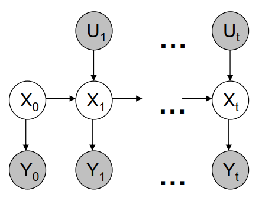
$$
\begin{array}{}
\textcolor{brown}{p(X_{0:t}\vert U_{1:t},Y_{0:t})}
\\\tiny\begin{array}{}{p(X\vert U,Y_t,Y_2)}=\frac{p(X,U,Y_t,Y_2)}{p(U,Y_t,Y_2)}
\\=\frac{p(Y_t\vert X,U,Y_2)\cdot p(X\vert U,Y_2)
\cdot p(U,Y_2)}
{p(Y_t\vert p(U,Y_2))\cdot p(U,Y_2)}
\end{array}
&=\large\frac{
	p(Y_t\vert X_{0:t},U_{1:t},Y_{0:t-1})
	\textcolor{red}{p(X_{0:t}\vert U_{1:t},Y_{0:t-1})}
    }
	{p(Y_t\vert U_{1:t},Y_{0:t-1})}
\\\textcolor{green}{markov假设}&=\large\frac{
\textcolor{green}{p(Y_t\vert X_t)}
\textcolor{red}{\cdot p(X_t\vert X_{0:t-1},U_{1:t},Y_{0:t-1})
\cdot p(X_{0:t-1}\vert U_{1:t},Y_{0:t-1})}
}{
p(Y_t\vert U_{1:t},Y_{0:t-1})
}
\\\textcolor{brown}{迭代项}&=\eta_t\cdot p(Y_t\vert X_t)
\textcolor{green}{p(X_t\vert X_{t-1},U_t)}
\textcolor{brown}{p(X_{0:t-1}\vert U_{1:t-1},Y_{0:t-1})}
\\&=\cdots
\\&=
\underbrace{
\left(\mathop{\prod}\limits_{\tau=0}^t\eta_\tau p(Y_\tau\vert X_\tau)\right)
}_{观测}
\underbrace{\left(\mathop{\prod}\limits_{\tau=1}^{t}p(X_\tau\vert X_{\tau-1},U_\tau) \right)
}_{状态转移}
p(X_0)
\end{array}
$$
SLAM: 除了估计运动还要估计地标位置
$$
p(\xi_{0:t},M|Y_{0:t},U_{1:t},
\underbrace{
c_{0:t}
}_{观测到?})
=\eta\cdot p(\xi_0)p(M)\prod_tp(Y_t\vert \xi_t,m_{c_t})p(\xi_t\vert \xi_{t-1},U_t)
$$

## PGO - Pose Graph Optimization

属于姿态后处理，在使用了直接法估计了相机的运动后，由于直接法只估计相邻两帧之间的相对运动，整体的姿态误差会越来越大，最后导致闭环失败。

PSO有两个作用：

1. 将闭环的首尾两个点相接，告诉模型这应是同一个点
2. 调整首尾之间的所有估计的运动值，使它们既和原来相差不大，又能使闭环成功

步骤：

1. 将所有姿态初始化为一开始的估计值，$x=\begin{pmatrix}\xi_0&\cdots&\xi_i&\cdots&\xi_n\end{pmatrix}^T \in\mathbb R^{6n}$

   > 这一步非常重要，因为PGO优化对初始化敏感，如果不给任何信息就优化是没有好结果的

2. residual 为$r^{ij}=(\xi_i\ominus\xi_j)\ominus\underbrace{\tilde\xi^j_i}_{原先别的算法的估计值}$，即PGO估算值和原来的估算值不能差太远

   其中，$\xi_1\ominus\xi_2=\log(T(\xi_2)^{-1}\cdot T(\xi_1))$

   > 原点的姿态优化比较特殊，原点应一直保留在原点不动，否则会给这个优化问题额外加6个自由度，得不到想要的结果，∴ $r_0 = \xi_0$ 即初始姿态应保持$\begin{pmatrix}I&O\\0&1\end{pmatrix}$,对应的$\xi_0=\begin{pmatrix}0&0&0&0&0&0\end{pmatrix}^T$。只要偏一点都是不对的。

3. 之后一样用高斯牛顿法：jacobian等于adjoint??


## ICP - Iterative Close Points

ICP算法也可以用来估计相机运动，不过不再基于像素值而是点云的3D位置

#### 一、从RGB-D相机得3D坐标

 $\lambda x = KX\implies X=\lambda \cdot K^{-1}x$ 需要特别精确的深度值

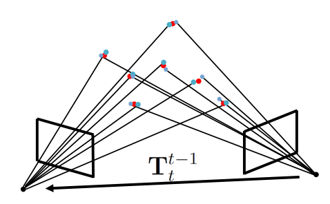

> 其中，像素坐标为一个和照片大小相同的长方阵列。

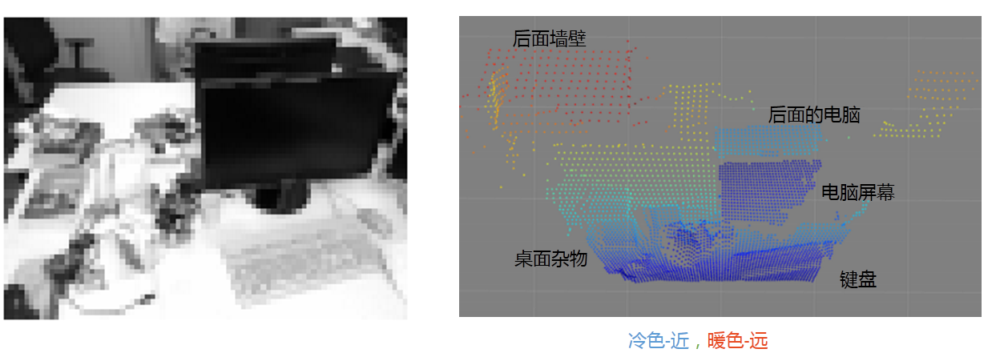

#### 二、求对应点

两张对应照片分别得到点云后（排除深度为0的无效点），设点云1为参考，为点云2中的每个点找一个点云1中的最近邻。对应点的集合分别为$\chi_2,\chi_1\in\mathbb R^{3\times N}$，元素个数相同，均为点云2中点的数量。

> 最近邻工具：KDTreeSearcher

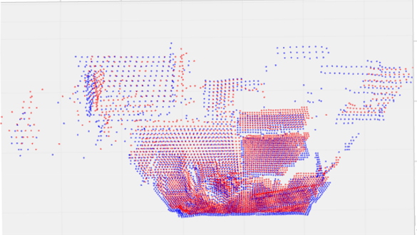

#### 三、3D-3D mapping: Arun's Method

> 属于稀疏间接法

先取中心点，$\mu_1=\frac 1N\cdot \mathop{\sum}\limits_{i=1}^Nx_{1,i},\ \mu_2=\frac 1N\cdot \mathop{\sum}\limits_{i=1}^Nx_{2,i}$
$$
A = \underbrace{(\chi_2-\mu_2)}_{\in\mathbb R^{3\times N}}\underbrace{(\chi_1-\mu_1)^T}_{参考}\in\mathbb R^{3\times 3}
$$
对矩阵A，SVD分解：$A=USV^T$，则两组点云的对应关系为$R^1_2=VU^T,\ t^1_2=\mu_1-R^1_2\mu_2$

变化关系为：$\chi_1 = R_2^1\chi_2+t_2^1$

## 稠密深度重建

Dense depth reconstruction

怎么从两张2D图片获取深度信息? 八点法可以， 在计算出相机运动后接着算出八个点的深度。但是也只有这八个点。怎么获取每个像素点的深度信息?

需要用到双目摄像头拍摄的两张 rectified image, 其特点是对应点在同一条平行线上：

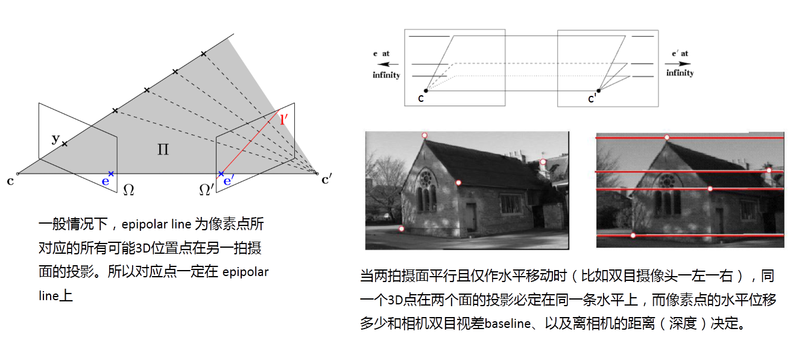

在这种简化情况下，由透视关系可知：$\large \frac bz=\frac df$

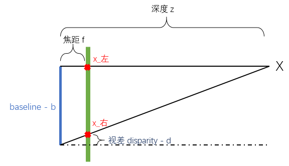

> 同一个物体在右侧照片照片中会偏左，像素坐标偏小

所以只要能确定视差d，就能知道点的深度z。

#### rectified image 寻找对应点

由于左侧照片中点在右侧照片中的对应点一定在同一水平线上（纵坐标相同），而且一定在偏左侧，可以只在这一范围内寻找。

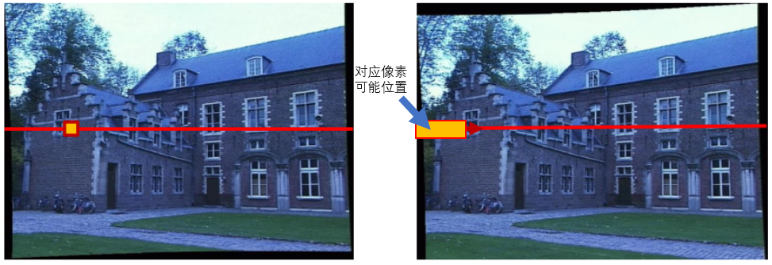

> 单个像素信息太少，要拉上其周围相邻点形成一个patch才能看出一点特征。patch的大小一般为$3\times3,\ 5\times5,\cdots,11\times 11$ 等

取SSD误差：$SSD=\mathop{\sum}\limits_{patch}\left(I_左(x,y)-I_右(x+\Delta x,y)\right)^2$ ,在右侧照片候选区域内SSD最小的patch即认为是对应点， 视差d 即为$\Delta x$

## structure light

在没有双目摄像头的情况下，由一个单摄像头主动探测深度的技术

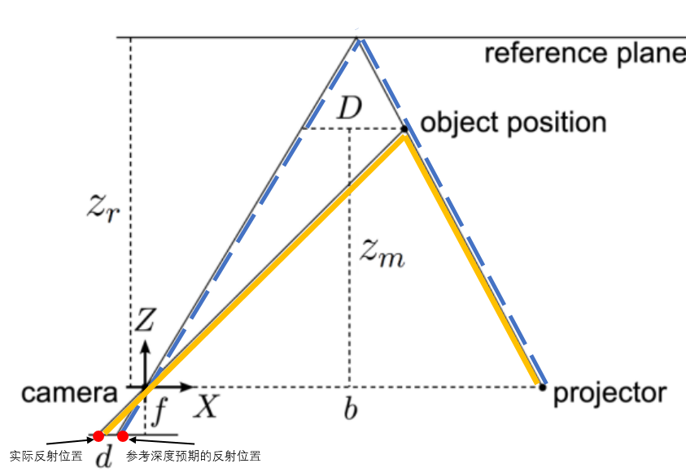

几何关系是两个相似三角形：
$$
\large{\left\{\begin{array}{}
\frac df = \frac{D}{Z_m}\ ①
\\\frac{D}{Z_r-Zm}=\frac b{Z_r}\ ②
\end{array}\right.}
\\由①得D=\frac{Z_m\cdot d}{f},代入②式：\\Z_m=\frac{Z_r}{1+\frac{Z_r\textcolor{red}{d}}{bf}}
$$
由于$b,f,Z_r$均是相机常数， 最后测得的深度$Z_m$只和视差d有关

## Hough Transformation

Line Fitting: 给一个点云阵，将其聚类成多根线

基本Idea: 将每个点在参数空间内表示，参数空间内的交点表示图像上的一条线。

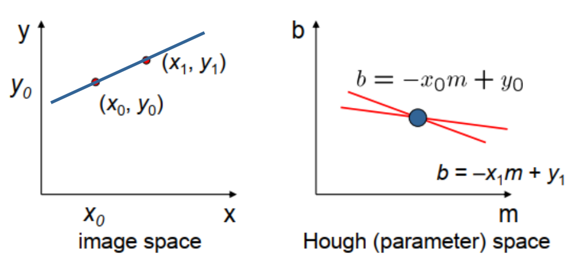

实际操作中，斜率+截距的方法无法表示垂直线，所以用polar line 代替：$x\cos\theta +y\sin\theta=d$，用直线到原点距离$d$和角度$\theta$表示一条直线。

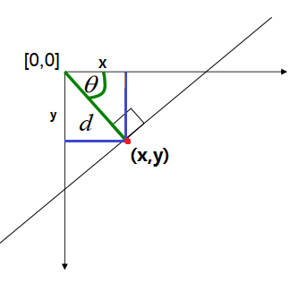

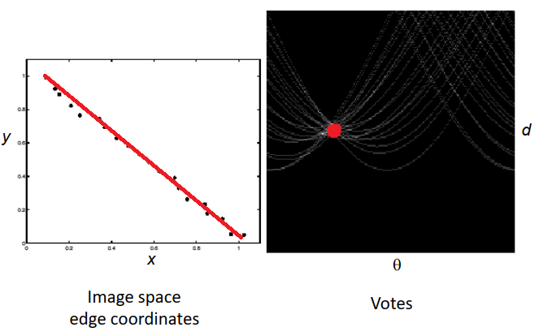

除直线之外，也可以捕捉任何形状：


待补充知识点：

1. Schur complement *
2. visual inertial
3. structure light *
4. Hough transformation
5. surfels and 3D Harris operator