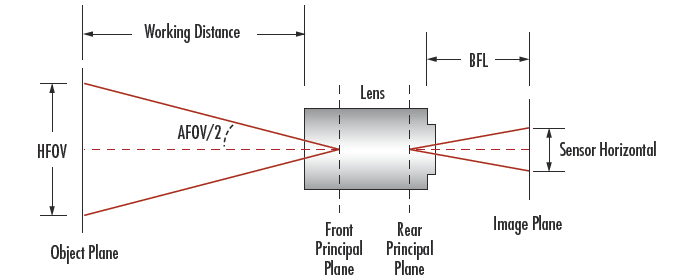

# Robotics 3D Vision

## 透视法投影

#### 输入一张不变形的照片

旋转矩阵用Lie algebra $w$表示，$w=[w_1,w_2,w_3]^T$。平移用一个向量表示，$\vec t=[t_1,t_2,t_3]^T$

先把$w$变为$\hat w\in R^{3\times 3}$的旋转矩阵

```matlab
theta = norm(w);
n = w / theta;
n_hat = [ 0,    -n(3),  n(2);
          n(3),  0,    -n(1);
         -n(2),  n(1),  0];
R = eye(3) + sin(theta) * n_hat + (1 - cos(theta)) * n_hat^2;
```

$$
R=I+\frac{\hat w}{||w||}\sin(||w||)+\frac{\hat w^2}{||w||^2}(1-\cos||w||)
$$

则整个转化矩阵为$T=\begin{pmatrix}R&\vec t\\\begin{pmatrix}0&0&0\end{pmatrix}&1\end{pmatrix}$

相机内部参数矩阵：$C=\begin{bmatrix}f_x&0&c_x\\0&f_y&c_y\\0&0&1\end{bmatrix}$

建立棋盘的3D结构：

```matlab
x = (-1:9) * 0.04; % 1*11
y = (-1:6) * 0.04; % 1*8
z = 0;
% meshgrid函数：造出网格状
[X, Y, Z] = meshgrid(x, y, z); % X,Y,Z均为8*11，为网格上每个点坐标
corners_3D = [X(:), Y(:), Z(:)]'; % 88个点各自的3D坐标
```

将空间坐标转为像素坐标：

```matlab
% Transform the 3D points to camera frame: 点的空间变换
corners_3D_camera = T(1:3, 1:3) * corners_3D + repmat(T(1:3, 4), 1, size(corners_3D, 2));

% Normalize the coordinates: 使z坐标化为1
corners_3D_camera = corners_3D_camera./repmat(corners_3D_camera(3, :), 3, 1);

% Calculate image coordinates of corners: 投影到像素位置
corners_2D = C * corners_3D_camera;
```

#### 输入一张变形过的照片

仍用原来的相机参数，而将3D坐标扭曲为变形后的样子。变形的函数已给定：
$$
\bar{\mathbf y}_p = \mathbf C\bar {\mathbf y_d}
\\\mathbf y_d=(1+k_1r^2+k_2r^4)\mathbf y,\ r=||\mathbf y||_2
$$
将3D坐标变形：

```matlab
% 求向量的模
% 可以用库函数，vecnorm was introduced since R2017b
r = vecnorm(corners_3D_camera(1:2, :));
% 或直接写
r = sqrt(sum(corners_3D_camera(1:2, :).^2,1)); % 1*88
```

向量化操作更改所有的点的位置

```matlab
factor = 1 + k1 * r.^2 + k2 * r.^4; % 1*88
corners_3D_distorted = corners_3D_camera;
corners_3D_distorted(1:2, :) = repmat(factor, 2, 1) .* corners_3D_camera(1:2, :);

% Calculate image coordinates of corners:
corners_2D_distorted = C * corners_3D_distorted;
```

#### 确定相机视野



**未变形照片：**
$$
fov_x=\arctan(\frac{c_x}{f_x})\cdot\frac{180}{\pi}
\\fov_y=\arctan(\frac{c_y}{f_x})\cdot\frac{180}{\pi}
$$
**变形了的照片：**

先要找出未变形的坐标，原理：归一化?

```matlab
function yt = undistort(yd, k1, k2)
    if (size(yd, 1) == 1)
        yd = yd';
    end
    
    yt = yd;
    yt_prev = [Inf; Inf];
    threshold = 1.0e-06;
    
    while(norm(yt - yt_prev) >= threshold)
        r = norm(yt);
        rd = 1 + k1 * r^2 + k2 * r^4;
        yt_prev = yt;
        yt = yd / rd;
    end
end
```

$$
fov_x=\arctan y_t
$$

## Kalman 滤波

#### Prediction

小车的状态为$\mathbf x_t=(x_t,y_t,\theta_t)^T$. 传感器数据为$\mathbf u_t=(u_{r_1},u_{tr},u_{r2})$,即两个轮子差速运动

```matlab
% 获取预测值
mu_pred = mu + [ u.t * cos( mu(3) + u.r1 ); u.t * sin( mu(3) + u.r1 ); u.r1+u.r2 ];
% 与纯理论不同：实际中要将角度限定在[-pi,pi]之间，超过pi的减2pi，小于-pi的加2pi
mu_pred(3) = normalize_angle( mu_pred(3) );
```

$$
\begin{array}{}
状态转移：&\mu_{pred}=\begin{bmatrix}
x\\y\\\theta
\end{bmatrix}_{t-1}+\begin{bmatrix}
u_{tr}\cdot \cos(\theta_{t-1}+u_{r_1})\\
u_{tr}\cdot\sin(\theta_{t-1}+u_{r_1})\\
u_{r_1}+u_{r_2}
\end{bmatrix}+\mathcal N(0,\mathbf\Sigma_{dt})
\end{array}
$$

计算Jacobian矩阵：

```matlab
% Compute the 3x3 Jacobian G of the motion model
G = eye(3) + [ 0, 0, u.t * -sin( mu(3) + u.r1 ); 0, 0, u.t * cos( mu(3) + u.r1 ); 0, 0, 0 ];
```

$$
G=\begin{bmatrix}1\\&1\\&&1\end{bmatrix}
+\begin{bmatrix}0&0&u_{tr}\cdot-\sin(\theta_{t-1}+u_{r_1})
\\0&0&u_{tr}\cdot\cos(\theta_{t-1}+u_{r_1}\\
0&0&0
\end{bmatrix}
$$

设状态转移的系统误差为$\mathbf\Sigma_{dt}=\begin{pmatrix}0.1\\&0.1\\&&0.01\end{pmatrix}$

则新的状态转移误差为

```matlab
sigma_pred = G * sigma * G' + R;
```

$$
\mathbf P_{k+1}^-=G\mathbf P_{k} G^T+\mathbf\Sigma_{dt}
$$

#### Correction

空间中存在$m$个landmark，每个的位置为$\vec l_j=(l_{j,x},l_{j,y})$。传感器可以测量到某个landmark的直线距离**range** $r$和角度差**bearing** $\phi$

实际观测值为：（给定的一些测量值）

```matlab
for i = 1:m
	Z(2*i-1:2*i) = [z(i).range, z(i).bearing];
```

预计观测值为：（由地图中存的地标位置landmark ground truth与目前小车状态state算出）

```matlab
	zX = landmarks(landmarkId).x - mu(1);
    zY = landmarks(landmarkId).y - mu(2);
    range = sqrt(zX*zX+zY*zY);
    expectedZ(2*i-1:2*i) = [range, atan2(zY,zX) - mu(3)];
```

单个地标的测量——状态转化函数为$z_{t,i}=\begin{pmatrix}||(x_t,y_t)-(l_{j,x},l_{j,y})||_2\\\arctan(\frac{l_{j,y}-y_t}{l_{j,x}-x_t})-\theta_t\end{pmatrix}+\mathcal N(0,\mathbf\Sigma_{mt,i})$

观测单个landmark的Jacobian矩阵因此为：
$$
\begin{array}{}H_i&=\begin{bmatrix}\frac{\partial range}{\partial x}&\frac{\partial range}{\partial y}&\frac{\partial range}{\partial \theta}
\\\frac{\partial bearing}{\partial x}&\frac{\partial bearing}{\partial y}&\frac{\partial bearing}{\partial \theta}
\end{bmatrix}
\\&=\begin{bmatrix}
\frac12\frac{1}{\sqrt{(x-l_x)^2+(y-l_y)^2}}\cdot2(x-l_x)\cdot1&\frac12\frac{1}{\sqrt{(x-l_x)^2+(y-l_y)^2}}\cdot2(y-l_y)\cdot1&0
\\
\frac{\textcolor{red}{(x-l_x)^2}}{(x-l_x)^2+(y-l_y)^2}\cdot-\frac{y-l_y}{\textcolor{red}{(x-l_x)^2}}\cdot1
&\frac{(x-l_x)\textcolor{red}{^2}}{(x-l_x)^2+(y-l_y)^2}\cdot\frac{1}{\textcolor{red}{x-l_x}}\cdot1&-1
\end{bmatrix}
\\&=\begin{bmatrix}\frac{x-l_x}{\sqrt{(x-l_x)^2+(y-l_y)^2}}&\frac{y-l_y}{\sqrt{(x-l_x)^2+(y-l_y)^2}}&0
\\\frac{l_y-y}{(x-l_x)^2+(y-l_y)^2}&-\frac{l_x-x}{(x-l_x)^2+(y-l_y)^2}&-1
\end{bmatrix}
\end{array}
$$

```matlab
Hi = [ -zX/range, -zY/range, 0; zY/(range.^2), -zX/(range.^2), -1 ];
```

总Jacobian矩阵为所有$m$个$H_i$矩阵的stack:

```matlab
H=[];
for i=i:m
	H=[H;Hi];
```

设单个观测误差为$\mathbf\Sigma_{mt,i}=\begin{pmatrix}0.1\\&0.1\end{pmatrix}$

则所有$m$个landmark的观测误差为：$\mathbf\Sigma_{mt}=\begin{pmatrix}\mathbf\Sigma_{mt,0}\\&\mathbf\Sigma_{mt,1}\\&&\ddots\\&&&\mathbf\Sigma_{mt,M-1}\end{pmatrix} \in\mathbb R^{2M}$

则Kalman Gain为：
$$
K=P_k^-H^T(HP_k^-H^T+\mathbf\Sigma_{mt})^{-1}
$$

```matlab
K = sigma * H' * inv( H * sigma * H' + Q );
```

现在可以更新状态了，但是实际操作中要将角度值限定在$[-\pi,\pi]$范围内：

```matlab
% Compute the difference between the recorded and expected measurements.
% Remember to normalize the bearings after subtracting!
% (hint: use the normalize_all_bearings function available in tools)
z =  Z - expectedZ;
% The expected format of z is [range; bearing; range; bearing; ...]
for(i=2:2:length(z))
   z(i) = normalize_angle(z(i));
end
z_innovation = z;
% 然后照常更新状态
mu = mu + K * z_innovation;
mu(3) = normalize_angle(mu(3)); %仍要限定值域
sigma = (eye(3) - K * H) * sigma;
```

$$
\begin{array}{}
融合预测状态与测量状态&x_k=x_k^-+K(z_k-Hx_k^-)
\\
更新状态方差&P_k=P_k^--KHP_k^-=(I-KH)P_k^-\end{array}
$$