## K近邻 k-NN

####  **一、标准化**

1. Z-score标准化
$$x_{i,std}=\frac{x_i-\mu_i}{\sigma_i}$$
2. 用Mahalanobis距离，当
$
\Sigma=\begin{pmatrix}
\sigma_1^2&0&0&0\\
0&\sigma_2^2&\cdots&\vdots\\
\vdots&\vdots&\ddots&\vdots\\
0&0&\cdots&\sigma_n^2\\
\end{pmatrix}
$
 时，相当于欧几里得标准化距离

#### **二、测距方法**
$$
\begin{array}{r|c|l}
L1-norm &\sum_i \begin{vmatrix}u_i-v_i\end{vmatrix}&沿坐标轴折线距离相加，距离相同点在一个正方形上\\
L2-norm &\sqrt{\sum_i (u_i-v_i)^2}&几何距离，距离相同点在一个圆上\\
Mahalanobis距离 &\sqrt{(u-v)^T\Sigma^{-1}(u-v)}&因为\Sigma存在，距离相同点可以在椭圆上，\Sigma为（半）正定对称矩阵
\end{array}
$$

#### **三、如何选取超参数？**

$$
\left\lbrace
\begin{array}{l}
学习集D_l
\left\lbrace
\begin{array}{c}
训练集D_T80\%\\
验证集D_v10\%
\end{array}
\right.\\
测试集D_t10\%
\end{array}
\right.
$$

* $D_v$可以选择k，但$D_t$应视作未来数据，测试集的结果不应反馈到模型中。只有在模型训练好后，才用$D_t$测试模型好坏
* 若验证集结果不错，但测试集结果很差，可能需要换一个分布，模型（不采用K-NN算法）

>**如何采样**
>1. random sampling 随机采样，在非常不幸的情况下，训练集正好没有囊括所有的标签，训练中缺失的标签永远不会被作为预测结果
>2. ***(推荐)*** stratified sampling, 按原比例保留训练数据确保所有标签都在$D_T$中出现

#### **四、怎么用？**
1. **分类**

   * 无加权，即比较周围k个最近数据的类型，取最常见的类

   * 加权，距离越远权重越低，$Z=\sum\frac{1}{d(x,x_i)}$为归一化常数，若只是预测类型则不用管Z

2. **回归**（当$y_i$为数字而非标签）$\hat y=\frac1Z\sum_{i\in N_i}\frac1{d(x,x_i)}y_i $

#### **五、二元分类质量评估** Performance evaluation
$$
\begin{array}{c|ll}
\text{预测\实际}&y=1&y=0\\
y=1&TP&FP\\
y=0&FN&TN
\end{array}
$$
* 准确度acc=$\frac{TP+TN}{ALL}$

* 精确度prec=$\frac{TP}{TP+FP}$

  ==acc与prec一般负相关==
* 敏感度rec=$\frac{TP}{TP+NF}$


#### **六、k-NN弊端**
* 维数多时，出现Empty-space Problem

==每增加一个维度，可能的数据空间呈指数级上涨，而训练数据增长没那么快$\to$新数据离训练数据太远==

* 内存memory消耗，检查时间inference时间复杂性均为Order(N)，即随着数据量线性增加
* 需要注意不平衡的类别imbalanced classes， 当一个种类占据数据集多数时，预测结果往往会一直是这个类

## 决策树 Decision tree
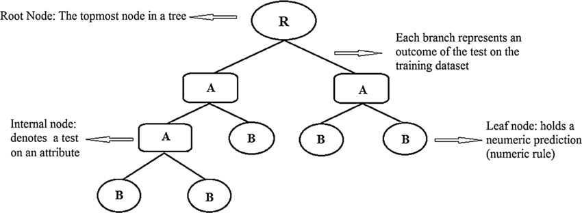

* inner nodes：判断指标
* leaf nodes：判断结果

#### **一、优化决策树**
若依照每个特征的每个值，划分会非常零碎而且繁琐。光root node就有D(N-1)种，组合太多   
**解决方案:** greedy heuristic, 寻找干净利落切分的最好方式 **指标:** i(t)描述在t节点某类别的纯度

1. **误捡率 Misclassification rate**
$$i_E(t)=1- \max_{c}p(y_{\in c}|t)$$，即1-主要类别
砍一刀后，增益为$\Delta i(s,t)=i(t)-p_Li(t_L)-p_Ri(t_R)$
>**存在问题**:
>
>1. 一旦没有增益就会停止
>2. 对不同分类可能有相同增益
2. **香农熵 Shannon Entropy**
对离散X值，有$$\mathbb H=-\sum_i^np(X=x_i)log_2p(X=x_i)$$
3. **Gini指数**
$$
\begin{equation} 
\begin{split}
i_G(t)&=\sum_{c_i\in t}\Pi_{c_i}(1-\Pi_{c_i})\\
&=\sum \Pi_{c_i}-\sum \Pi_{c_i}^2\\
&=1-\sum (\Pi c_i)^2
\end{split}
\end{equation}
$$

#### 二、决策树何时停止？

1. 某一枝纯净$i_e(t)=0 \to$ 但可能过拟合
2. 达到最大深度
3. 每一枝节点数量小于阈值$t_n$
4. 分枝增益小于阈值$\Delta i(s,t) \lt t_{\Delta}$
5. 验证集精确度acc足够


## 概率论

#### 一、频率学派——最大似然估计MLE

==$p(D|\theta)$ :观察到序列D，哪个$\theta$ 能让这个D出现的概率最大？==

写出事件D的方程$f(\theta)$, 再求$\mathop{\arg\max}\limits_\theta f(\theta) = \mathop{\arg\max}\limits_\theta \bold{log} f(\theta)$

**缺陷**：样本少时容易过拟合

| 观察序列                                                     | MLE                                 |
| ------------------------------------------------------------ | ----------------------------------- |
| 二项分布 <br />$p(D|\theta)=\theta^{|T|}(1-\theta)^{|H|}$    | $\theta_{MLE}=\frac{|T|}{|T|+|H|}$  |
| 高斯分布（方差为1）<br />$p(x|\mu)=\mathcal N(x|\mu,1)=\frac1{\sqrt{2\pi}}\cdot exp(-\frac12(x-\mu)^2)$<br />$p(D|\mu)=\prod_{i=1}^{n}\mathbb N(x_i|\mu,1)$ | $\mu_{MLE}=\frac{\sum_{i=1}^nx_i}n$ |

#### 二、贝叶斯派——观察+先验=后验MAP

==$p(\theta|D)= \frac{p(D|\theta)\cdot p(\theta)}{p(D)} \propto p(D|\theta) \cdot p(\theta)$ : 引入前置分布**prior** $p(\theta)$，在样本数太少时也有比较好的估计==

同样计算$\mathop{\arg\max}\limits_\theta \log [f(\theta)\cdot p(\theta)]$

**缺陷**：由于乘法运算，先验$p(\theta)=0$ 处后验永远为0

1. **如何选取$p(\theta)?$ **：选择和观察序列D公式形式上相同的，可以让后验与先验形式一致，简化计算

| 观察序列                                    | 共轭先验方程                                                 | 后验形式                                                     | MAP                                               |
| :------------------------------------------ | ------------------------------------------------------------ | ------------------------------------------------------------ | ------------------------------------------------- |
| $p(D|\theta)=\theta^{|T|}(1-\theta)^{|H|}$  | $Beta(\theta|a,b)=\frac{\Gamma (a+b)}{\Gamma (a)\Gamma(b)}\theta^{a-1}(1-\theta)^{b-1}$ | $p(\theta|D)\propto \theta^{|T|+a-1}(1-\theta)^{|H|+b-1}$    | $\theta_{MAP}=\frac{|T|+a-1}{|H|+|T|+a+b-2}$      |
| $p(D|\mu)=\prod_{i=1}^n\mathcal N(x|\mu,1)$ | $\mathcal N(\mu|0,\textcolor{Red}{\alpha}^{-1})=\sqrt{\frac{\alpha}{2\pi}}\cdot exp(-\frac\alpha2\mu^2)$ | $p(\mu|D,\alpha)\propto exp(-\frac{N+\alpha}2\mu^2+\sum_{i=1}^Nx_i\cdot \mu)$ | $\mu_{MAP}=\frac1{N+\alpha}\cdot \sum_{i=1}^Nx_i$ |

* _$\alpha=\frac1{\sigma^2}$为精度_
  $$
  {\scriptstyle
  \begin{split}
  p(\mu|D,\alpha)=&\frac{p(D|\mu)\cdot p(\mu|\alpha)}{p(D|\alpha)}\propto p(D|\mu)\cdot p(\mu|\alpha) \\
  \propto &\left(\prod_{i=i}^Np(x_i|\mu)\right)\cdot p(\mu|\alpha)\\
  \propto &\left(\prod_{i=i}^N\mathcal N(x_i|\mu,1)\right)\cdot \mathcal N(\mu|0,\alpha^{-1})\\
  \propto & \left(\prod_{i=i}^N\frac1{\sqrt{2\pi}}exp(\frac12(x_i-\mu)^2) \right)\cdot \sqrt{\frac\alpha{2\pi}}exp(-\frac\alpha2\mu^2)\\
  \propto & \ exp\left(\sum_{i=1}^N[-\frac12(x_i-\mu)^2]-\frac\alpha2\mu^2\right)\\
  \propto & \ exp(-\frac12\sum x_i^2+\mu \sum x_i-\frac12\sum \mu^2-\frac\alpha2\mu^2)\\
  \propto&\ exp(\mu\sum x_i-\frac N2\mu^2-\frac\alpha2\mu^2)\\
  \propto& \ exp(-\frac{N+\alpha}2\mu^2+\sum x_i\cdot \mu)
  \end{split}
  }
  $$
  

2. **全贝叶斯分布函数**

找到归一化常数，使得$\int_0^1p(\theta|D)d\theta=1$，实际上先验方程选的好就一定能合并观察公式

| 观察序列                                   | 分布函数                                                     |
| ------------------------------------------ | ------------------------------------------------------------ |
| $p(D|\theta)=\theta^{|T|}(1-\theta)^{|H}$  | $p(\theta|D)=Beta(\theta|a+|T|,b+|H|)$                       |
| $p(D|\mu)=\prod_{i=1}^n\mathbb N(x|\mu,1)$ | $p(\mu|D)=\mathcal N(\mu|\frac1{N+\alpha}\sum_{i=1}^Nx_i,\frac1{N+\alpha})$ |

设分布函数为:$${\scriptstyle \begin{equation}
\begin{split}
\mathcal N(\mu|m,\beta^{-1})=&\sqrt{\frac\beta{2\pi}}\cdot exp(-\frac\beta2\cdot (\mu-m)^2)\\
=&\sqrt{\frac\beta{2\pi}}\cdot exp(-\frac\beta2\mu^2+\beta\mu m-\frac\beta2m^2)\\
\propto& exp(\textcolor{Red}{-\frac\beta2}\cdot \mu^2+\textcolor{Green}{\beta m}\cdot \mu)
\end{split}
\end{equation}}$$

与后验形式${\scriptstyle p(\mu|D,\alpha)\propto exp(\textcolor{Red}{-\frac{N+\alpha}2}\mu^2+\textcolor{Green}{\sum_{i=1}^Nx_i}\cdot \mu)}$比较：

$$ {\scriptstyle \left\lbrace\begin{split}-\frac\beta2=&-\frac{N+\alpha}2\\\sum_{i=1}^N x_i=&\beta m\end{split}\right.\to\left\lbrace\begin{split}\beta=&N+\alpha\\m=&\frac{\sum^N_{i=1}x_i}{N+\alpha}\end{split}\right. }$$

#### 三、预测

$$p(f|D,a,b)=\int_0^1p(f|\theta)\cdot p(\theta|D,a,b)d\theta$$

对于MLE，MAP，$\theta$为一个固定的值；

对于全贝叶斯分布，$\theta$ 在每一处均不同。

| 观察序列                                   | 全贝叶斯预测                                              |                          |
| ------------------------------------------ | --------------------------------------------------------- | ------------------------ |
| $p(D|\theta)=\theta^{|T|}(1-\theta)^{|H|}$ | $p(f|D,a,b)=Ber \left(f|\frac{|T|+a}{|T|+a+|H|+b}\right)$ | 相当于求此Beta函数的期望 |
| $p(D|\mu)=\prod_{i=1}^n\mathbb N(x|\mu,1)$ | $\mathcal N(x|m,1+\beta^{-1})$                            |                          |

$$
\begin{split}
&p(x_{new}|D,\alpha)\\
=&\int p(x|\mu)\cdot p(\mu|D,\alpha)d\mu\\
=&\int \mathcal N(x|\mu,1)\cdot \mathcal N(\mu|m,\beta^{-1})d\mu\\
{\scriptstyle\frac1{\sqrt{2\pi}}exp(-\frac12(x-\mu)^2)= \frac1{\sqrt{2\pi}}exp(-\frac12((x-\mu)-0)^2)}=&\int \mathcal N(x-\mu|0,1)\cdot \mathcal N(\mu|m,\beta^{-1})d\mu\\
令y=x-\mu\to\mathcal N(y|0,1)\\
x=y+\mu\to \mathcal N(x|0+m,1+\beta^{-1})=&\mathcal N(x|m,1+\beta^{-1})
\end{split}
$$


## 线性回归

#### 一、定义

==当一个输入有D个分量，称为D个维度Dimension，找到一个线性系数向量$\bold w$，使得原输出$y\approx f_w(x_i)$==
$$
\begin{array}{l}
\tilde{\bold x_i}=(1,x_{i1},\cdots,x_{iD})^T\\
\tilde{\bold w}=(w_0,w_1,\cdots,w_D)^T\\
\to f_w(\bold x_i)=\tilde{\bold w}^T\tilde{\bold x_i}
\end{array}
$$

* _i代表第 i个x_

#### 二、如何选取最佳w?

**损失函数：**$E_{LS}(\bold w)=\frac12\sum_{i=1}^N(f_w(x_i)-y_i)^2$，最小平方和least square

* _$\frac12$ 只是个系数，方便之后运算_

**最佳系数向量:**
$$
\begin{split}
w^*=&\mathop{\arg\min}\limits_wE_{LS}(w)\\
仅一维=&\mathop{\arg\min}\limits_w\frac12\sum_{i=i}^N(f_w(x_i)-y_i)^2\\
可多维，\bold x\in\mathbb R^{N\times D}=&\mathop{\arg\min}\limits_w\frac12(\bold X\bold w-\bold y)^T(\bold X\bold w-\bold y)
\end{split}
$$
如何求解？
$$
\begin{split}
令梯度为0，类似求导：\nabla_WE_{LS}(\bold w)=&\bold X^T\bold X\bold w-\bold X^T\bold y=0\\
\bold w^\star=&(\bold X^T \bold X)^{-1}\bold X^T\bold y\\
\triangleq&x^\dagger,称为伪逆矩阵
\end{split}
$$

#### 三、非线性回归

1. **一维**数据情况下可以用多项式polynominal来逼近非线性的数据比如sinx

$f_w(x)=w_0+\sum_{j=1}^Mw_jx^j$，==对x做M次变换并乘以系数w再相加==

* _此时对于x已经不是线性，但对于w仍为线性，依旧可以叫“线性”回归_

2. 多维情况下，更一般地，

$$
\begin{split}
f_w(\bold x)=&w_0+\sum_{j=1}^Mw_j\phi_j\\
（令\phi_0=1）=&\bold w^T\phi(\bold x)
\end{split}
$$


，其中，$\phi_j为\mathbb R^D\to\mathbb R的函数,\phi(x)\in\mathbb R^{M+1}$
$$
\begin{split}
E_{LS}=&\frac12\sum_{i=1}^N(\bold w^T\phi(\bold x_i)-y_i)^2\\
=&\frac12(\bold\Phi\bold w-\bold y)^T(\bold\Phi\bold w-\bold y)
\end{split}
$$
其中，
$$
\Phi=
\begin{pmatrix}
\phi_0(x_1) & \phi_1(x_1) &\cdots&\phi_M(x_1)\\
\phi_0(x_2)&\phi_1(x_2)&&\vdots\\
\vdots&\vdots&\ddots\\
\phi_0(x_N)&\phi_1(x_N)&\cdots&\phi_M(x_N)
\end{pmatrix}
\in
\mathbb R^{N\times(M+1)}
$$
称为设计矩阵Design Matrix，

==在一维线性回归中，$\Phi=[1,\bold x]$==，$\phi_0=1,\phi_j=x$

然而，当w系数过大时常导致过拟合（过度贴合数据中的噪音）$\to$引入惩罚规则
$$
E_{ridge}(w)=\frac12\sum^N(\bold w^T\phi(x_i)-y_i)^2+\frac\lambda{2}||w||_2^2
$$

* $||w||_2^2$：w各项平方和=$\bold w^T\bold w$

* $\lambda$：惩罚力度
* 通常选一个高维度的j，并用$\lambda$控制

#### 四、正态分布序列与线性回归的关联

##### （一）、MLE


$$
y_i\sim\mathcal N(f_w(\bold x_i),\beta^{-1})
$$

* _序列的概率即为$p(\bold y|\bold X,\bold w,\beta)=\prod_ip(y_i|f_w(x_i),\beta)$_

$$
\begin{split}
\bold w_{ML},\beta_{ML}&=\mathop{\arg\max}\limits_{\bold w,\beta}p(\bold y|\bold X,\bold w,\beta)\\
&=\mathop{\arg\min}\limits_{\bold w,\beta}-ln\ p(\bold y|\bold X,\bold w,\beta)\\
=\mathop{\arg\min}\limits_{\bold w,\beta}&-ln\ \left[\prod_i\mathcal N(y_i|f_w(\bold x_i),\beta^{-1}) \right]\\
&=-\sum_iln\left[\sqrt{\frac\beta{2\pi}}exp(-\frac\beta2(\bold w^T\phi(\bold x_i)-y_i)^2 
\right]\\
&=\frac\beta2\sum_i(\bold w^T\phi(\bold x_i)-y_i)^2-\frac N2ln\beta+\frac N2ln2\pi\\
\end{split}
$$

==解w的MLE恰好就是线性回归的损失函数==
$$
\bold w_{MLE}=\mathop{\arg\min}\limits_{\bold w}\frac12\sum_i(\bold w^T\phi(\bold x_i)-y_i)^2\\
$$

$$
\beta_{MLE}=\mathop{\arg\min}\limits_{\beta}\frac\beta2\sum_i(\bold w^T\phi(\bold x_i)-y_i)^2-\frac N2ln\beta
$$

##### （二）、MAP


$$
p(\bold w|\bold X,\bold y,\beta,\alpha)\propto p(\bold y|\bold X,\bold w,\beta)\cdot p(\bold w|\alpha)
$$


## 线性分类

#### 一、hard decision based model

损失函数为zero-one loss 
$$
l_{01}(y,\hat y)=\sum_{i=1}^N \mathbb I(\hat y \neq y_i)
$$
perception函数用于二元分类
$$
y=\begin{cases}
1, when\ \bold \omega^T\bold x+\omega_0 \ \gt0 \\
0, when\ \bold \omega^T\bold x+\omega_0 \ \lt0
\end{cases}
$$

#### 二、generative model

$$
\bold y_{new}\sim p(\bold y|\hat{\bold \theta})\\
\bold x_{new}\sim p(\bold x|y=y_{new},\hat\psi)
$$

* $\overrightarrow \theta \in \mathbb R^c$ 代表每个类别的概率
* $\theta_c\in[0,1]$, $\sum_{c=1}^C\theta_c=1$

此时，$\theta_c^{MLE}=\frac{N_c}N=\frac{种类C的数量}{总数}$

##### (一)、 LDA (Linear discriminant analysis)

每个类别的期望输入值：自身平均值，和一个==公用的==协方差矩阵的正态分布
$$
p(\bold x|y=c)=\mathcal N(\bold x|\bold{\mu_c},\bold \Sigma)
$$


1. 二元分类：
   $$
   \begin{split}
   p(y=1|\bold x)&\equiv \frac{p(\bold x|y=1)p(y=1)}{p(\bold x|y=1)p(y=1)+p(\bold x|y=0)p(y=0)}\\
   &=\frac1{1+exp(-\alpha)}\\
   &=sigmoid\ \sigma(\alpha)\\
   即\ y|\bold x &\sim Bernoulli(\sigma(\bold w^T\bold x+w_0))
   \end{split}
   $$
   其中，$\alpha = ln\frac{p(\bold x|y=1)p(y=1)}{p(\bold x|y=0)p(y=0)}\\=\bold w^T\bold x+w_0 是一个线性分割$

   当$\alpha\gt0$时，标签判定为1

2. 多元分类
   $$
   \begin{split}
   p(y=c|\bold x)&=\frac{p(\bold x|y=c)p(y=c)}{\sum_{ci=1}^Cp(\bold x|y=ci)p(y=ci)}\\
   &=\frac{exp(\bold w^T\bold x+w_{c0})}{\sum_{ci=1}^Cexp(\bold w_{ci}^T\bold x+w_{ci0})}\\
   &=softmax\ \sigma(\alpha)
   \end{split}
   $$

* softmax输出一个向量，各元素为各类别的概率，比如$p_i=\begin{bmatrix}0.8\\0.1\\0.1\end{bmatrix}$

##### (二)、naive 贝叶斯

不同于LDA，让每个标签的数据有单独的协方差矩阵$\Sigma$


为了简化运算，假设$\bold x=(x_0,x_1,\cdots,x_n)$互相独立，当x的概率正态分布时，$\Sigma$为对角阵
$$
p(x_1,x_2,\cdots,x_d|y=c)=\prod_{i=1}^Np(x_i|y=c)\\
p(\bold x|y=c)=\mathcal N(\bold x|\bold \mu_c,\bold \Sigma_c)
$$

* _独立$\Sigma$好处：可以更容易处理不同的分布，以及不同的数据类型_

#### 三、discrimitive model 或逻辑回归

generative model 生成模型 不能自主选择$\bold w$与$w_0$，而是由数据决定 （好处是可以生成新的数据，在数据缺失时比较有用）

**discrimitive 区分模型**：直接给$y|\bold x\sim Bern(\sigma(\bold w^T\bold x+w_0))$ 建模，自由选择$\bold w$与$w_0$
$$
\begin{split}
p(\bold y|\bold w,\bold X)&=\prod_{i=1}^Np(y_i|\bold x_i,\bold w)\\
(二元分类)&=\prod_ip(y_i|\bold x_i,\bold w)^{y_i}\cdot(1-p(y_i|\bold x_i,\bold w)^{1-y_i})
\end{split}
$$
**损失函数：**负对数概率，即cross entrophy
$$
\begin{split}
E(\bold w)&=-ln\ p(\bold y|\bold w,\bold X)\\
（二元） &=-\sum_{i=i}^N\left[y_iln\sigma(\bold w^T\bold x_i)+(1-y_i)ln(1-\sigma(\bold w^T \bold x_i))\right]\\
（多元） &=-\sum_i^N\sum_c^Cy_{ic}ln\frac{exp(\bold w_c^T\bold x)}{\sum_{ci}exp(\bold w_{ci}^T\bold x)}=-\sum_iln\ \hat p_{ik(i)} \\
&=-\sum_i\ ln\ softmax(\bold W\cdot \bold x_i)\\
&即只将正确的分类的概率相加\\
\bold w^*&=\mathop{\arg\min}\limits_{w}E(\bold w)
\end{split}
$$

## 优化

#### 一、数学基础——凸集

convex set: 
$$
对于x,y \in \bold X, 有\lambda\in[0,1],使得\lambda x+(1-\lambda)y\in\bold X
$$


convex function:
$$
\lambda f(x)+(1-\lambda)f(y)\ge f(\lambda x+(1-\lambda)y)
$$

* 凸集没有多个极值，唯一的极值就是最值
* 凸集的最大值一定在某个顶点上，即 $\bold x^*\in Ve\{\bold X\}$
* 凸集若缺失一块，可以先补成凸集，最大值在填补上的凸集某个顶点上，即 $\bold x^*\in Ve\{Conv\{\bold X\} \}$
* 在凸集中找到导数为0处，就是最值（方便求最小值问题）

#### 二、迭代寻找导数为0点

$\theta$ 为函数自变量，$f(\theta)$为在$\theta$处函数值。要找到令$f(\theta)$最小值只要求导即可，但实际情况下$f'(\theta)=0$ 不那么好找。

##### （一）、牛顿法（近似法）

将$f(\theta)$ 泰勒展开：
$$
\begin{split}
f(\overrightarrow{\theta_t}+\overrightarrow \delta)&=f(\overrightarrow{\theta_t})\\&+\overrightarrow{\delta^T}\cdot\nabla f(\overrightarrow{\theta_t})\\
&+\frac12\cdot\overrightarrow{\delta^T}\nabla^2f(\overrightarrow{\theta_t})\overrightarrow\delta\\
&+O(\delta^3)
\end{split}
$$
令 $\nabla_{\delta} f(\theta)=\nabla f(\theta_1)+\delta^T\nabla^2f(\theta_1)\doteq0$

所以 $\delta=-\nabla f(\theta_t)\left[\nabla^2 f(\theta_t) \right]^{-1}$ 为一次迭代的变化量

$\theta_{t+1}\leftarrow\theta_t+\delta=\theta_t-\left[\nabla^2 f(\theta_t) \right]^{-1}\cdot\nabla f(\theta_t)$

直到

* 求逆矩阵计算量巨大，牛顿法一般只用于低维度数据

##### （二）、梯度下降 Gradient descent

**通用方法：Exact Line Search**

1. $\Delta\overrightarrow\theta=-\nabla f(\overrightarrow \theta)$

2. $t=\mathop{argmin}\limits_{t\gt0}f(\overrightarrow\theta+t\cdot\overrightarrow\theta)$ 
   *  找梯度方向最小值，比较慢

3. $\overrightarrow\theta=\overrightarrow\theta+t\cdot\Delta\overrightarrow\theta$

**变种一：Backtracking**

依然$\overrightarrow\theta=\overrightarrow\theta+t\cdot\Delta\overrightarrow\theta$， 但t的选取不同

有 $\beta\in(0,1)，\alpha\in(0,\frac12)$，

从$t_0=1$开始，令$t_{i+1}=\beta\cdot t_i$, 不断缩小$\beta$，直到

$f(\bold x+t\cdot\Delta\bold x)\lt f(\bold x)+t\cdot\alpha\cdot\nabla f(\bold x)^T\Delta\bold x$


* 原理：若$f(x+t\Delta x)$比$f(x)+t\alpha\nabla f(x)^T\Delta x$ 高，那么在其下方一定有更好的另一个解

**变种二：直接选取t**

$\theta_{t+1}\leftarrow\theta_t-\tau\cdot\nabla f(\theta_t)$

$\tau$ 称为学习率

* $\tau$ 太大，一下子越过目标
* $\tau$ 太小，太慢；还可能在鞍点上卡住（非凸函数）

##### （三）、随机梯度下降 Stochastic GD

针对大数据集，计算最小化$\sum_i^nLoss_i(\theta)$ 特别慢

理想情况下，数据集的一部分能反映整体，所以有：
$$
\frac1n\sum_i^nL_i(\theta_i)\approx\frac1{|s|}\sum_{i\in S}L_i(\theta_i)\\
即 \sum_i^nL_i(\theta_i)\approx\frac n{|s|}\sum_{j\in S}L_j(\theta_j)
$$
$\theta_{t+1}\leftarrow \theta_t-\tau\cdot\frac n{|s|}\cdot\sum_{j\in S}\nabla L_j(\theta_j)$


#### 三、应用实例perception 函数


$$
y_i=\begin{cases}
1,&if\ \bold w^T\bold x+b\gt0
\\-1,&else
\end{cases}
$$
目标
$$
\mathop{min}\limits_{\bold w,b}\sum_iLoss(y_i,\bold w^T\bold x_i+b)
$$
损失函数
$$
Loss=max(0,\epsilon-u\cdot v)
$$
其中$u=y_i,v=\bold w^T\bold x_i+b$ , 

同时$\epsilon$ 是一个预设的距离，为正数


| 在错误一侧                   | $uv\lt0$             | $\epsilon-uv\gt0$ |
| ---------------------------- | -------------------- | ----------------- |
| 在正确一侧但是离分界线太近   | $0\lt uv\lt\epsilon$ | $\epsilon-uv\gt0$ |
| 在正确一侧并且离分界线足够远 |                      | 0                 |

$$
\nabla_wmax(0,y_i(\bold w^T\bold x_i+b))=
\begin{cases}
-y_i\cdot \bold x_i, &if\ uv\lt\epsilon
\\0,&if\ uv\ge\epsilon
\end{cases}
\\\nabla_b=\begin{cases}
-y_i, &uv\lt\epsilon
\\0,&uv\ge\epsilon
\end{cases}
$$

当n为训练数据样本量，|s|=1，

只要有分类不正确，就更新w与b，直到分类完全正确
$$
\bold w\leftarrow\bold w+\tau\cdot n\cdot y_i\cdot \bold x_i
\\\bold b\leftarrow \bold b+\tau\cdot n\cdot y_i
$$
**特殊情况：取$\tau=\frac1n$ **
$$
\begin{cases}
w=w+x,class1=1
\\w=w-x,class0=-1
\end{cases}
\\
\begin{cases}
b=b+1,class1=1
\\b=b-1,class0=-1
\end{cases}
$$

## 约束优化

#### 一、投影

梯度下降不能用于求约束优化，因为可能会跳出允许的参数域范围$\rightarrow$ 只能将取得的新值投影到参数域

找到$\mathcal X$内最近的一点$\overrightarrow\theta$
$$
\pi_{\mathcal X}(\bold p)=\mathop{argmin}\limits_{\overrightarrow\theta\in\mathcal X}||\overrightarrow \theta-\bold p||
$$


==最优解一定垂直于允许的参数域表面==

#### 二、拉格朗日

定义约束优化问题：
$$
f_0, f_1:\mathbb R^d\to\mathbb R
\\\mathop{minimize}\limits_{\overrightarrow\theta}f_0(\overrightarrow\theta)
\\subject\ tof_i(\overrightarrow\theta)\le0
$$

结论：==最优解处的梯度负数 共线 所有约束的梯度的线性组合==
$$
-\nabla f_0(\theta^*)=\sum_i^M\alpha_i\nabla f_i(\theta^*)
\\并且\alpha_i\ge0
$$

$$
\scriptsize{
反证法：若-\nabla f_0(\theta^*)与\nabla f_1(\theta^*)不共线，一定可以写出
\\ \nabla f_0(\theta^*)=\alpha\cdot\nabla f_1(\theta^*)+\beta\cdot \bold v
,\bold v是一个和\nabla f_1 正交的向量
\\ \therefore \nabla f_0(\theta^*+\epsilon \bold v^T)\to（泰勒展开）\nabla f_0(\theta^*)+\epsilon\cdot \bold v^T\nabla f_0(\theta^*)
\\=\nabla f_0(\theta^*)-(\epsilon \bold v^T\alpha\nabla f_1+\epsilon \bold v^T\beta \bold v)
\\=\nabla f_0(\theta^*)-0-\epsilon\bold v^T\beta\bold v
\\=\nabla f_0(\theta^*)-\epsilon\beta||\bold v||^2_2
\\ \lt \nabla f_0(\theta*) 矛盾
}
$$

拉格朗日即为

$L(\theta,\alpha)=f_0(\overrightarrow \theta)+\sum_i^M\alpha_if_i(\overrightarrow\theta)$

且$a_i\ge0,f_i(\overrightarrow\theta)\le0$

令拉格朗日梯度等于0：

$\nabla_{\theta^*} L(\theta,\alpha)=\nabla f_0(\overrightarrow \theta)+\sum_i^M\alpha_i\nabla f_i(\overrightarrow\theta)\doteq 0$， 即可算出无约束最小值$min_{\theta\in \mathbb R} L(\theta,\alpha)$

但无约束最小值一定比约束最小值更小，是一个下界
$$
\forall \alpha,\ min_{\overrightarrow\theta\in \mathbb R} L(\overrightarrow\theta,\alpha)\le L(\overrightarrow {\theta^*},\alpha)
=f_0(\theta^*)+\sum_i^M\alpha_if_i(\theta^*)
\\ \scriptsize\textcolor{red}  {(\because a_i\ge0,f_i(\overrightarrow\theta)\le0, \therefore\sum_i^M\alpha_if_i(\theta^*)\le 0)}
\\ \le f_0(\theta^*)=受约束的\mathop{min}\limits_{f_i(\theta)\le0}f_0(\theta)
$$

#### 三、 dual problem

设拉格朗日无约束最小值$g(\alpha)=min_{\overrightarrow\theta\in \mathbb R} L(\overrightarrow\theta,\alpha)\triangleq d^\star$， 是一个concave函数

真正的受约束最小值记为$p^\star$


在Slater`s constraint qualification ==充分非必要==条件下，$\exist\alpha, 使得\ d^*=p^*$

1. $f_i$ 均为convex

2. 有一处$\overrightarrow \theta$ ，

   (a)约束均为线性，即$f_i(\theta)=\bold w_i^T\bold \theta+b_i$

   或 (b) 严格小于 $f_i(\theta)\textcolor{red}\lt0$

此时，求解$max(g(\alpha))即=p^*$

#### 四、 KKT 推论

$$
\exist \alpha,\ min_{\overrightarrow\theta\in \mathbb R} L(\overrightarrow\theta,\alpha)\textcolor{red}= L(\overrightarrow {\theta^*},\alpha)
=f_0(\theta^*)+\sum_i^M\alpha_if_i(\theta^*)
\textcolor{red}= f_0(\theta^*)=\mathop{min}\limits_{f_i(\theta)\le0}f_0(\theta)
\\\therefore f_0(\theta^*)+\sum_i^M\alpha_if_i(\theta^*)\textcolor{red}= f_0(\theta^*)
\\\to\sum_i^M\alpha_i^* f_i(\theta^*)=0
\\\because \alpha_i^* f_i(\theta^*)\le0
\\\to \alpha_i^* f_i(\theta^*)=0 \ (complementary\ slackness)
$$

## SVM

#### 一、硬边界SVM

找到一条线分割2元数据，同时保证空白区间最大


$$
\begin{cases}
\bold w^T\bold x+b\ge s， 当分类为1类
\\\bold w^T\bold x+b\le -s， 当分类为0类
\end{cases}
$$
$\therefore 空白区间margin=\frac{2s}{||\bold w||}$， 通常直接令$s=1$， 这样只需优化$\bold w $

$即margin=\frac{2}{||\bold w||}=\frac2{\bold w^T\bold w}$

如果设1类标签值为1, 0类标签值为-1，上式可以化简为
$$
y_i(\bold w^T\bold x+b)-1\ge0
$$
拉格朗日优化问题即转为：
$$
L=\frac12\bold w^T\bold w+\sum_ia_i\left[1-y_i(\bold w^T\bold x+b)\right]
\\\begin{split}
&1.\nabla_{\bold w}L(\bold w,b,\overrightarrow\alpha)=\bold w-\sum_i\alpha_iy_i\bold x_i\doteq0
\\&2.\nabla_bL=\sum_i\alpha_iy_i\doteq0
\end{split}
$$
$\therefore \bold w最优值\bold w^*_{\overrightarrow\alpha}=\sum_i\alpha_iy_i\bold x_i$ ，是标签值与数据值的线性组合

将$\bold w$代回，
$$
L=
\scriptsize
\begin{split}
&\frac12\bold w^T\bold w
\\+&\sum_i a_i
\\-&\sum_i a_iy_i(\bold w^T\bold x+b)
\end{split}
\textcolor{red}{w^*_{\overrightarrow\alpha}=\sum_i\alpha_iy_i\bold x_i\implies}

\begin{split}
&\frac12\sum_i\sum_jy_iy_j\alpha_i\alpha_j\bold x_i^T\bold x_j
\\+&\sum_i a_i
\\-&\sum_i a_i y_i(\sum_ja_jy_j\bold x_j)\bold x_i-\sum_i a_iy_ib
\end{split}
\\
\scriptsize
\implies\begin{split}
&\frac12\sum_i\sum_jy_iy_j\alpha_i\alpha_j\bold x_i^T\bold x_j
\\+&\sum_i a_i
\\-&\sum_i\sum_jy_iy_j a_ia_j\bold x_i^T \bold x_j-\sum_i a_iy_ib
\end{split}
\textcolor{red}{\sum_i\alpha_iy_i\doteq0\implies}
\small 
\sum_i\alpha_i-\frac12\sum_i\sum_jy_iy_j\alpha_i\alpha_j\bold x_i^T\bold x_j
$$


拉格朗日此时可以写作dual problem
$$
\begin{array}{}
最大化g(\overrightarrow\alpha)=\sum_i\alpha_i-\frac12\sum_i\sum_jy_iy_j\alpha_i\alpha_j\bold x_i^T\bold x_j
\\1.\sum_i\alpha_iy_i=0
\\2.\alpha_i\ge0
\end{array}
$$
矩阵形式即为：
$$
\begin{array}{}
最大化g(\overrightarrow\alpha)=\frac12\overrightarrow\alpha^T\bold Q\overrightarrow\alpha+\overrightarrow\alpha^T\bold 1_N
\\其中,\bold Q=-(\bold y\odot\bold X)\cdot(\bold y\odot\bold X)^T
\end{array}
$$
由上一章KKT slackness推论：
$$
\sum_ia_i\left[1-y_i(\bold w^T\bold x+b)\right]=0
$$
$\alpha_i\neq0$处，$y_i(\bold w^T\bold x+b)=1\implies \bold w^T\bold x+b=\frac1{y_i}=y_i, (\because y_i\in\{1,-1\})$

==只有那些恰好在边缘上的点可以决定分割线的走向，因此$\alpha_i\neq0$处的点被称为support vector==
$$
\therefore 
\begin{array}{l|l}
b=average(y_i-\bold w^T\bold x)&取平均值更稳定
\\
\hline 
\bold w=\sum_{i\in S}\alpha_iy_i\bold x&\bold w实际上只取决于支持向量
\end{array}
$$

#### 二、模糊边缘SVM

加一个slack variable $\xi_i\ge0$
$$
\begin{cases}
\bold w^T\bold x+b\ge+1-\xi_i，当\ y_i=+1
\\
\bold w^T\bold x+b\le-1+\xi_i，当y_i=-1
\end{cases}
\\
同样可化简为y_i(\bold w^T\bold x+b)\ge1-\xi_i
$$
约束优化问题即为：
$$
\begin{array}{}
f_0=\frac12\bold w^T\bold w+C\cdot \sum_i\xi_i
\\
1.y_i(\bold w^T\bold x+b)-1+\xi_i\ge0
\\
2.\xi_i\ge0
\end{array}
$$
**常数C的作用**：$C\to\infty 容忍误差为0，当于硬边界；C\to0相当于误差范围无限大，没有意义$

$\frac{\partial L}{\partial\xi_i}=C-\alpha_i-\mu_i\doteq0$

$\therefore \alpha_i=C-\mu_i\in[0,C]$

拉格朗日即转为：
$$
\begin{array}{}
最大化g(\overrightarrow\alpha)=\sum_i\alpha_i-\frac12\sum_i\sum_jy_iy_j\alpha_i\alpha_j\bold x_i^T\bold x_j
\\1.\sum_i\alpha_iy_i=0
\\2.0\le\alpha_i\textcolor{red}{\le C}
\end{array}
$$
但实际上，有更简单的方法

$\because$ 最优情况下，若一个点落在空白区间内部，都应该调整$\xi$ 使其正好落在新的边界上
$$
\begin{array}{}
\xi=
\begin{cases}
1-y_i(\bold w^T\bold x+b), &如果y_i(\bold w^T\bold x+b)\lt1
\\
0,&else
\end{cases}
\\
\xi=max\left\{0,1-y_i(\bold w^T\bold x+b)\right\}
\end{array}
$$
此时原来的两个约束自动满足
$$
\begin{array}{}
1.y_i(\bold w^T\bold x+b)-1+\xi_i\ge0
\\
2.\xi_i\ge0
\end{array}
$$
$\therefore$ 原问题转为无约束问题
$$
\min\ \frac12\bold w^T\bold w+C\cdot\sum_imax\left\{0,1-y_i(\bold w^T\bold x+b)\right\}
$$

> 模糊SVM损失函数后半段 $\sum_imax\left\{0,1-y_i(\bold w^T\bold x+b)\right\}$ 实际是预设距离 $\epsilon = 1 $的perception 函数， 然而SVM在此基础上还要让空白区间最大($\frac12\bold w^T\bold w$) ，因此是进化版

## 深度学习

回想逻辑回归，当遇到不可直接线性分割的数据集时，通常用一个Basic fuction $\phi(\bold X):\mathbb R^{N\times D}\to\mathbb R^{N\times M}$ 把数据集投影到一个可以线性分割的空间中

#### 一、神经网络

**一层隐藏层的神经网络**：如果只知道数据集$\bold X$和标签$\bold y$，不知道$\phi()$， 就把basis function 的各个参数也纳入优化范围。

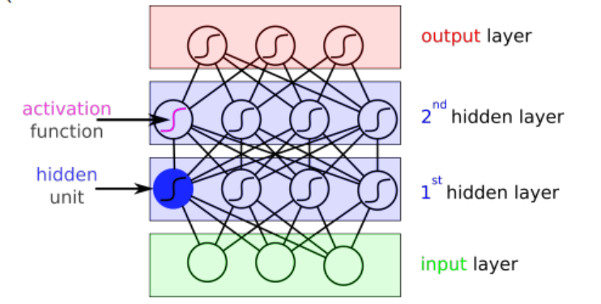

> 每一层内部是线性的，但输出结果先经过一个非线性函数再给到下一层，否则几个线性函数叠在一起还是一个线性函数。

$$
\large
\begin{array}{|}
&w_{lij}&第l层，第i输入，第j输出
\\
neuron&z_{li}^{(n)}&第n样本，第l层，第i分量
\\
logit&\bold a_{li}^{(n)}&a_{li}^{(n)}=\bold W_{l-1}\cdot \bold z_{l-1}^{(n)}
\\
激活函数&h_l&z_{lj}=h_l(a_{lj})
\end{array}
$$

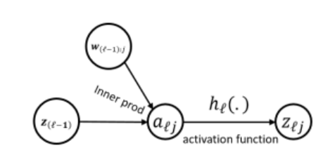

>  正向传播到损失函数的最后一个激活函数一般定义为$h(a)=a$

#### 二、反向传播

以分类问题举例：神经网络对一个样本会给出一个标签，汇集所有标签可以评价损失度(损失函数是交叉熵)。通过第一次评价不断优化矩阵$\bold W$，达到最好的效果。这是一个用梯度下降找最小值的问题。因此需要推导损失度对$\bold W$中各个参数的导数。
$$
\begin{split}\frac{\partial E}{\partial w_{(l-1)ij}}=&\frac{\partial E}{\partial a_{lj}}\cdot\frac{\partial a_{lj}}{\partial w_{(l-1)ij}}\\\doteq&\delta_{lj}\cdot z_{(l-1)i}\end{split}
$$
反向传播得到损失函数对每个参数的梯度值后就可以用梯度下降法更新参数，直到训练完毕

**学习步骤**

* Define the neural network that has some learnable parameters (or weights)
* Iterate over a dataset of inputs
* Process input through the network
* Compute the loss (how far is the output from being correct)
* **Propagate gradients back into the network’s parameters**
* Update the weights of the network, typically using a simple update rule: `weight = weight - learning_rate * gradient`

#### 三、隐藏层

##### （一）、全连接

又称为Linear或Affine层，比如在分类问题中，$\bold a=\bold w^T\bold z+ \bold b$。

一般用在网络倒数几层，准备分类之前。只接受向量形式的数据，==输入到全链接层之前要把高维度的数据“拍扁”到一维==。

##### （二）、CNN

特征提取，用滑动窗口kernel 在图像上“卷积”， 实际只是计算cross relation 
$$
(x*k)(i,j)\approx\hat x(i,j)=\sum_l\sum_mx(i+l)y(j+m)\cdot k(l,m)
$$

* 若输入图像有多个通道，与之对应的kernel也得有这么多通道，==kernel是三维的（如下图中$5\times 5\times 3$）==。

* 一个kernel同时卷积输入图像的C个通道 (in channel)，才能得到1个输出通道。

* 输出通道数 (out channel) = kernel个数


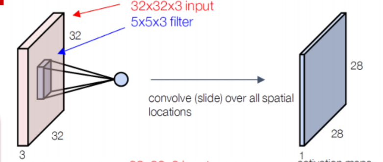

因此，一个卷积层基础参数有3个：

$\begin{array}{}
kernel\ size&3\times3
\\in\ channel& 3
\\out\ channel&6
\end{array}$


##### （三）、CNN: 补偿padding

卷积后图像尺寸会缩小，是否要补偿？
$$
\begin{array}{}
valid&不补偿，缩小就缩小&D'=(D-K)+1
\\same&补到和输入尺寸一致&两端各加P=\lfloor\frac K2\rfloor
\\full&比原来还大了&两边加P=K-1
\end{array}
$$

>  D'——新尺寸，D——旧尺寸，K——kernel大小

##### （四）、CNN: 步长stride

每次卷积相邻几个像素？当步长$S\gt1$时，会缩小图像尺寸 (Down-sampling)
$$
D'=\left\lfloor\frac{D+P-K}{S}\right\rfloor+1
$$

> P——padding大小，S——步长

#####　（五）、CNN: 池pooling

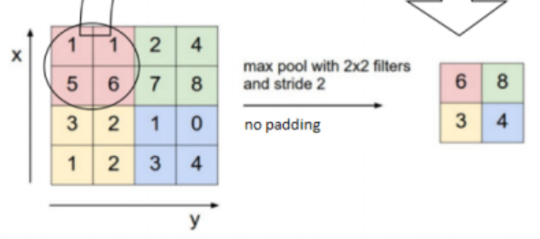

kernel只能对窗口中的像素线性操作，pooling可以引入非线性操作比如max

####　四、其他技巧

##### （一）、Dropout

在每一层输出到下一层前，以概率$p$ 随机将某些结点置零，可以有效防止过拟合

##### （二）、minibatch normalization

给到激活函数之前，把这一层的结果规范到正态分布，避开激活函数两端梯度变化非常弱的区间
$$
y=\frac{x-\bar x}{\sigma_x+\epsilon}\cdot \gamma+\beta
$$

> $\epsilon 是一个极小量，防止算式除零错误$

输入N，L，C的数据时，对每一个C做一次。

* N - batch size / sample size
* L - sequence length
* C - the number of features / channels / filters

##### （三）、Residual Net

==In traditional neural networks, each layer feeds into the next layer. In a network with residual blocks, each layer feeds into the next layer  and directly into the layers about 2–3 hops away.==


**原理: **层数多的网络反而不能很好处理简单的函数关系$\to$ 需要层数少的网络$\to$在深层网络中跳过一些层，得到浅层网络

**如何跳过？**skip the training of few layers using **skip-connections** (residual connections).  

#### 五、 Xavier Glorot 初始化

初始权重是优化步骤的起点，非常关键。然而有以下两个难题：

1. Weight Symmetric: 若两个结点权重完全相同，提取出的特征也必定相同，无法得到不同的学习结果$\to $ 人为加上一些噪音

2. Weight Scale：fan-in过大时，输出与太多输入量有关，输入中稍有变动，输出就迥然不同，使得更新后的权重W剧烈变化，容易overshoot，错过最优的解

$\therefore$ ==初始化权重矩阵时，令$Mean(W)=0, Var(W)=\frac{2}{fan-in+fan-out}$==， 这样可以保留输入信号特征（方差和均值）

> fan-in  = kernel size*in channel
>
> fan-out = ~*out channel

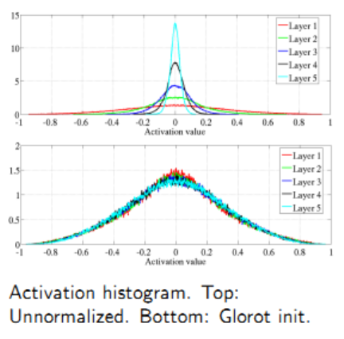

## PyTorch

```python
import torch
```

Tensor 类型和numpy的ndarray一样，但是可以交给GPU运行

#### package: autograd 

核心函数autograd：计算$(v^TJ)^T$，此处的$v$为全1向量时就是在计算Jacobian 矩阵

> 如果输出out是一个标量，out.backward()相当于out.backward(torch.tensor(1.))，

e.g:
$$
\begin{array}{}
x\to &y=x+2\to &z=3y^2\to& out=z.mean\\
\begin{pmatrix}1&1\\1&1\end{pmatrix}&\begin{pmatrix}3&3\\3&3\end{pmatrix}&\begin{pmatrix}27&27\\27&27\end{pmatrix}&27
\end{array}
$$

```python
out.backward()#这条命令一给，就会计算链条上所有变量的梯度
x.grad#直接给出d(out)/dx的梯度值
```

在上例中
$$
{out=\frac14\sum_i3(x_i+2)^2
\\
\frac{\partial out}{\partial x}=\frac{\partial out}{\partial z}\frac{\partial z}{\partial y}\frac{\partial y}{\partial x}=\frac14\cdot3\times2(x_i+2)=\frac32(x_i+2)
\\
\therefore x.grad为\begin{pmatrix}\frac92&\frac92\\\frac92&\frac92\end{pmatrix}}
$$

#### package: nn

```python
import torch.nn as nn
import torch.nn.functional as F
```

## Dimension reduction 降维

非监督学习——聚类：找到隐藏结构$p(z)$和generative transformation $p(x|z)$来拟合$p(x) $

降维：指把多维的数据降到聚类中心，且避免信息损失

#### 一、PCA (Principal Component Analyse)

**原理：**

1. 数据的多个特征往往互相关联$\to$ 找到变换F，使变换后数据的几个特征间协方差为0（没有关联）
2. 方差低的维度包含的信息少$\to$ 直接删除方差低的维度

> 若$X'=X\cdot F$，变换后协方差矩阵为$F^T\Sigma_x F$

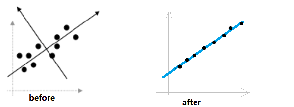

**步骤：**

1. 数据中心化：每一个维度减去平均值 $\large{\tilde x_j=x_j -\bar x_j}$ 

2. 计算协方差矩阵$\large{\Sigma_\tilde {\bold X} =\frac1N\cdot \bold X^T\bold X-\bar{\bold x}\bar{\bold x}^T}$

3. 用特征向量分解decomposition

$$
\begin{array}{}
\large{\Sigma_\tilde x=\Gamma \Lambda\Gamma ^T}
\\
\Lambda =\begin{pmatrix}\lambda_1&&O
\\&\lambda_2
\\O&&\ddots\end{pmatrix}
\\\Gamma是正交阵
\end{array}
$$

$\therefore$==变化后矩阵$\tilde Y=\tilde X\cdot \Gamma$，$\tilde Y$的协方差矩阵$\Sigma_\gamma=\Gamma^T\Sigma_\tilde x\Gamma\triangleq \Lambda$。在$\tilde Y$中，每个维度均线性无关，各维度方差为$\lambda_i$==

4. 删去最末几个$\lambda_i$，$\Gamma$中也相应删去对应的列向量

$$
\Gamma'=\begin{bmatrix}
|&|&|&|
\\
\gamma_1&\gamma_2&\cdots&\textcolor{red}{\not{\gamma_n}}
\\
|&|&|&|
\end{bmatrix}
$$

**求解：**

具体实现中，不需要求对应$\Lambda$的整个$\Gamma$，只需要找到最大的k个$\lambda_i $

1. Power Iteration：找到最大$\lambda$

> $\nu$ 任意一个归一化向量
>
> $\nu\leftarrow\large{\frac{X\cdot\nu}{||X\cdot\nu||}}$，直到收敛

$\nu$最后会收敛到最大特征值$\lambda_1$对应的特征向量。可以通过$X\cdot \nu=\lambda\cdot\nu$ 求出$\lambda $

2. 找到第二大$\lambda  $

$$
\begin{array}{}
X=\Gamma\Lambda\Gamma^T=\sum_i\lambda_i\cdot \gamma_i\cdot \gamma_i^T
\\
X'=X-\lambda_i\gamma_i\gamma_i^T
\end{array}
$$

继续对$X'$使用Power Iteration即可

3. 何时停止？如何知道到第几个$\lambda_i$结束？

$$
\because Tr(\Sigma_x)=\sum_i^d(\Sigma_{xii})
$$

$\therefore$ 所有$\lambda_i$ 的和是已知的。求出前i个$\lambda$，比较$\sum_i^k\lambda_i\ge0.9Tr(\Sigma_x)$即可

==PCA默认原始数据已经非常贴近一条直线，对离群数据敏感==

#### 二、Probabilistic PCA

**1. 建模：**线性回归模型：$X\sim Wz_i+\mu+\epsilon_i\\ z_i\sim \mathcal N(0,\bold I)\\x_i|z_i\sim \mathcal N(\bold W\bold z_i+\overrightarrow\mu,\sigma^2\bold I),\bold W\in\mathbb R^{D\times K}$，默认噪音为$diag(\sigma^2,\sigma^2,\cdots,\sigma^2)$

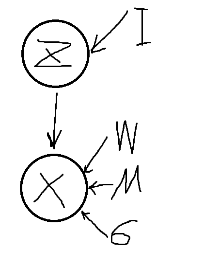

当z一维正态分布，X只有两个分量时，可以图形化表示：

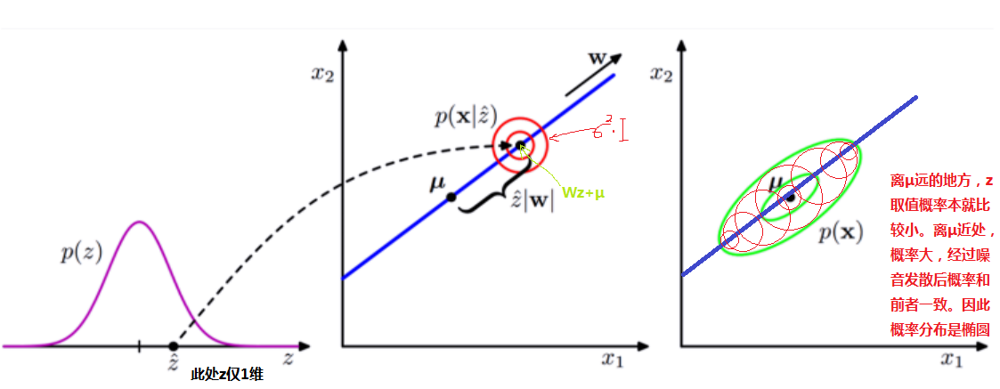

**2. 学习：** 积分除去z，$p(x)=\int p(x|z)\cdot p(z)dz$

$x_i\sim\mathcal N(\mu,\bold W\bold W^T+\sigma^2\cdot \bold I)$

**3. 推理**

观察到序列x，训练出$\mu,\bold W,\sigma^2$，找到对应的z：$p(z|x,\bold W,\mu,\sigma^2)$

由于分布z的维度比观察样本x少，因此实现了降维

==pPCA无需计算$\Sigma_x$ 矩阵，不需要全部数据（只需要likelihood function），因此可以处理缺失值==

??? $p([x_a,x_c]|z,W,\mu,\sigma)=\int p([x_a,x_b,x_c]|z,W,\mu,\sigma)\cdot p(x_b|z,W,\mu,\sigma)dx_b$

**4. pPCA与PCA的关联**
$$
\bold W_{ML}=\bold U_k(\Lambda_k-\sigma^2\bold I)^{\frac12}\bold V
\\当\sigma^2=0时，\bold W_{ML}=\bold U_k\Lambda_k^{\frac12}
\\\bold W\bold W^T=\bold U_k\Lambda_k^{\frac12}\Lambda_k^{\frac12}\bold U_k^T=\bold U_k\Lambda_k\bold U_k^T
$$

####　三、SVD——矩阵因式分解

==矩阵的秩可以理解为数据的维度==

任何实数矩阵$\bold A\in \mathbb R^{n\times d}$都可以分解为$\bold A=\bold U\bold \Sigma\bold V^T=\sum_i^r\sigma_i\cdot \bold u_i\cdot \bold v_i^T$，其中$\bold U,\bold V$均为正交阵（$\bold U\bold U^T=\bold I$）

* U称为left singular vectors, V为right ~
* $\bold \Sigma\in\mathbb R^{r\times r}$ 对角阵，阶数r为矩阵A的秩，==$\therefore r\le d$==，其元素全正且从小到大排列($\sigma_1\ge\sigma_2\ge\cdots\ge0$)

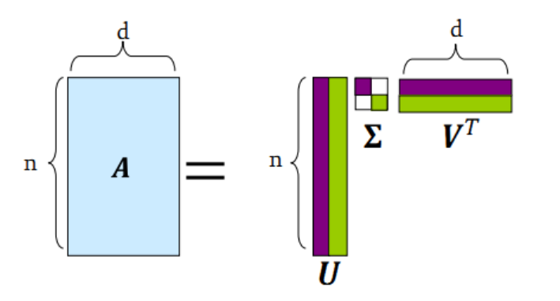

在$\bold \Sigma$的r个元素中，再砍去末尾几个数值小的量，就减少了$\bold \Sigma$的秩，$\bold A\approx\bold B\in\mathbb R^{n\times d}$，根据Frebenius Norm，B是A的最佳近似

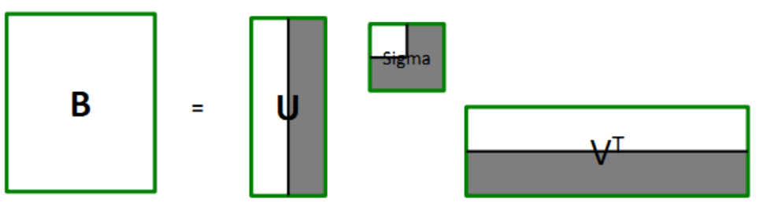

**Projection：** 获得裁剪并投影后的数据$\bold P=\bold U'\cdot \bold \Sigma'=\bold A\cdot \bold V'$  ，矩阵$B\approx A$但仍留在A的坐标系下，仍需要用A的坐标轴来表示（维度没有显式地减少），经过旋转矩阵V后，B转到P矩阵，多余的坐标轴即可删去。

**计算U,V,S**

U是$XX^T$ 的特征向量$\in\mathbb R^{n\times n}$，V是$X^TX$的特征向量$\in\mathbb R^{d\times d}$， $A=U^{(n\times n)}S^{(n\times d)}V^{T(d\times d)}$

> $X\cdot X^T=U\Sigma V(U\Sigma V)^T=U\Sigma\Sigma^TU^T$，同理$X^T\cdot X=V\Sigma^2V$

S为U或V对应的特征值开根号，并从大到小排列

#### 四、矩阵因式分解Factorization

SVD: $R=\underbrace{Q}_{U\cdot\Sigma}\cdot \underbrace {P^T}_{V^T}$

但不适用于稀疏矩阵，因为不能处理缺失数据，表现为：

1. 若在数据缺失位置置零，则SVD会尝试还原这些零，然而在e.g.评分系统中缺失的数据$\neq0$（极低评分）
2. U和V矩阵在数据非常稀疏时仍非常稠密，就不太对劲

$\implies$实际上不是非要让V，U为正交阵
$$
\begin{split}
SSD &= 
min\sum_{i,j}(A_{ij}-[U\Sigma V^T])^2
\\&=\mathop{min}_{P,Q}\sum_{\underbrace{x\in R}_{\Large{只计算\\数据中\\出现的}}}(r_{xi}-\underbrace{q_xp_i^T}_{\large{Q,P不必\\为正交}})^2
\\&\triangleq \mathop{min}_{P,Q} f(P,Q)
\end{split}
$$

##### （一）、Alternating Optimierung

求解上式可用Alternating Optimierung：分别依次求P,Q梯度下降
$$
\begin{split}
&P^{(t+1)}=\mathop{argmin}_{p}f(P,Q^{(t)})
\\&Q^{(t+1)}=\mathop{argmin}_{q}f(P^{(t+1)},Q)
\\&t+=1，直到收敛
\end{split}
$$
> 直到收敛，即 no improvement on the validation loss for a certain amount of training steps

由于计算时Q已经固定，求P最优解可以分割为对每一个$p_i$求最优解再求和
$$
\mathop{min}_{P}f(P,Q^{(t)})=\sum_i^d\mathop{min}_{p_i}\sum_{x\in R}(r_{xi}-q_xp_i^T)^2
$$
如此就将问题简化为一系列常规最小平方和（Ordinary Least Square）优化，

1. 最优值解析解已知$\implies$算得快
2. R中缺失值不用算$\implies$ 算得更快

3. 不保证算出最优解P,Q

##### （二）、Regularization

变化后的维度为k，然而k太大会过拟合。（n个样本，k维就有$n\times k$个参数）
$$
\mathop{min}_{P,Q}\underbrace{\sum_{x\in R}(r_{xi}-q_xp_i^T)^2}_{数据误差项}+\underbrace{\left[\lambda_1\sum_x||p_x||^2+\lambda_2\sum_i||q_i||^2\right]}_{惩罚项}
$$
数据为累加项，当数据充足时，数据误差项占比大，惩罚项可忽略；数据稀疏时，惩罚项起作用，减小权重防止过拟合

**比较L1与L2-Regularization**

L2平均缩小每个维度上的权重；L1会将一些权重置零$\implies$获得稀疏矩阵

原理：最优解永远在凸集的顶点上，L1凸集形状为菱形，因此最优解在菱形的顶点上，意味着某些维度权重为0


#### 五、Autoencoder

PCA / SVD不能拟合沿曲线的一维数据

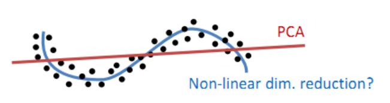

路径图：
$$
\begin{split}
&原图像\longrightarrow \mathop{Encoder}_{权重\bold W_E} \longrightarrow \underbrace{压缩图像}_{Latent\ layer\\L\ll D}\longrightarrow
\mathop{Decoder}_{权重\bold W_D} \longrightarrow 输出
\\&*------------*
\\&\underbrace{f_{解码}\underbrace{f_{编码}(X)}_{投影到低维}}_{重建}\approx X
\end{split}
$$
编码器维度L$\ll$输入图像维度D：迫使模型学习最主要的特征，实现降维；若$L\gt D$则会直接学习一个identity function, 降维失败

* 当Autoencoder为线性，即$f_{enc}/f_{dec}=\bold x\bold W$时，输出$\hat y=xW_1W_2\triangleq x\cdot W$（令W秩为R），则就相当于PCA或SVD

